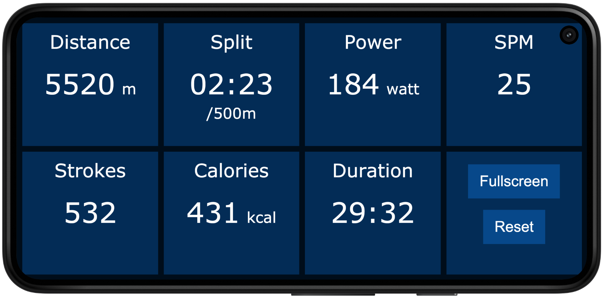

# Open Rowing Monitor

<!-- markdownlint-disable-next-line no-inline-html -->

An open source rowing monitor for rowing exercise machines. It upgrades a rowing machine into a real smart trainer that can be used with training applications and games.

Open Rowing Monitor is a Node.js application that runs on a Raspberry Pi and measures the rotation of the rower's flywheel to calculate rowing specific metrics, such as power, split time, speed, stroke rate, distance and calories.

I currently develop and test it with a [Raspberry Pi 3 Modell B](https://www.raspberrypi.org/products/raspberry-pi-3-model-b/) and a Sportstech WRX700 waterrower. But it should run fine with any rowing machine that uses an air or water resistance mechanism as long as you can add something to measure the speed of the flywheel.
I suspect it works well with DIY rowing machines like the [Openergo](https://openergo.webs.com) too.

## Features

Currently the feature set is pretty basic, I'll add more features in the future, check the [Development Roadmap](doc/backlog.md) if you are curious.

### Rowing Metrics

Open Rowing Monitor implements a physics model to simulate the typical metrics of a rowing boat based on the pull on the handle. The physics model can be tuned to the specifics of a rower by changing some model parameters.

* Stroke detection
* Power (watts)
* Split time (/500m)
* Strokes per Minute
* Calories used (kcal)
* Training Duration

### Web Interface

The web interface visualizes the rowing metrics on any device that can run a browser (i.e. a smartphone that you attach to your rowing machine while training). It uses web sockets to show the rowing status in Realtime. Besides that it does not do much (yet).

<!-- markdownlint-disable-next-line no-inline-html -->
 

### Bluetooth Low Energy (BLE)

Open Rowing Monitor also implements different Bluetooth Low Energy (BLE) protocols so you can use your rowing machine with different fitness applications.

Fitness Machine Service (FTMS) is a standardized GATT protocol for different types of fitness machines. Open Rowing Monitor currently supports the type **FTMS Rower** and simulates the type **FTMS Indoor Bike**.

**FTMS Rower** allows all rower specific metrics (such as stroke rate) to be present, unfortunately not many training applications exist that support this type (the only one I'm aware of is Kinomap but let me know if there are more).

**FTMS Indoor Bike** is widely adopted by training applications for bike training. The simulated Indoor Bike offers metrics such as power and distance to the biking application. So why not use your rowing machine to row up a mountain in Zwift, Bkool, Sufferfest or similar :-)

**Concept2 PM** Open Rowing Monitor also implements part of the Concept2 PM Bluetooth Smart Communication Interface Definition. This is still work in progress and only implements the most common parts of the spec, so it will not work with all applications that support the C2 rowing machines.

## How it all started

I originally started this project, because my rowing machine (Sportstech WRX700) has a very simple computer and I wanted to build something with a clean and simple interface that calculates more realistic metrics. Also, this was a good reason to learn a bit more about Bluetooth and all its specifics.

The original proof of concept version started as a sketch on an Arduino, but when I started adding things like a web frontend and BLE I moved it to the much more powerful Raspberry Pi. Maybe using a Raspberry Pi for this small IoT-project is a bit of an overkill, but it has the capacity for further features such as syncing training data or rowing games. And it has USB-Ports that I can use to charge my phone while rowing :-)

## Further information

This project is already in a very usable stage, but some things are still a bit rough on the edges.

Feel free to leave a message in the [GitHub Discussions](https://github.com/laberning/openrowingmonitor/discussions) if you have any questions or ideas related to this project.

Here are some basic [Installation Instructions](doc/installation.md).

I plan to add more features, here is the [Development Roadmap](doc/backlog.md).

This project uses some great work by others, see the [Attribution here](doc/attribution.md).
