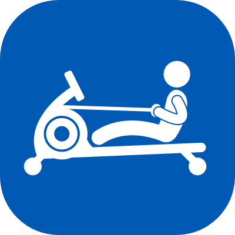

# Open Rowing Monitor

<!-- markdownlint-disable-next-line no-inline-html -->

An open source rowing monitor for rowing exercise machines.

Open Rowing Monitor runs on a Raspberry Pi and measures the rotation of the rower's flywheel to calculate rowing specific metrics such as power, split time, speed, stroke rate, distance and calories.

A web interface visualizes those metrics on any device that can run a browser (i.e. a smartphone that you attach to your rowing machine while training).

Open Rowing Monitor also implements the Bluetooth Low Energy (BLE) protocol for Fitness Machine Service (FTMS). This allows using your rowing machine with any Fitness Application that supports FTMS.

FTMS supports different types of fitness machines. Open Rowing Monitor currently supports the type **FTMS Rower** and simulates the type **FTMS Indoor Bike**.

**FTMS Rower** allows all rower specific metrics (such as stroke rate) to be present, unfortunately not many training applications exist that support this type (the only one I'm aware of is Kinomap but let me know if there are more).

**FTMS Indoor Bike** is widely adopted by training applications for bike training. The simulated Indoor Bike offers metrics such as power and distance to the biking application. So why not use your rowing machine to row up a mountain in Zwift, Bkool, Sufferfest or similar :-)

I originally started this project, because my rowing machine (WRX700) has a very simple computer and I wanted to build something with a clean interface that calculates more realistic metrics. But there is not much that is specific to that rowing machine. It should run fine with any rowing machine that uses an air or water resistance mechanism.

Feel free to contact me if you have any questions about this project. Let me know if you run Open Rowing Machine with a different setup so I can expand the documentation.

This project is already in a very usable stage, but some things are still a bit rough on the edges.

For now, here are some basic [Installation Instructions](doc/installation.md)

Probably I'll add more features in the future, check the [Development Roadmap](doc/backlog.md) if you are curious.

This project uses some great work by others, see the [attribution here](doc/attribution.md).