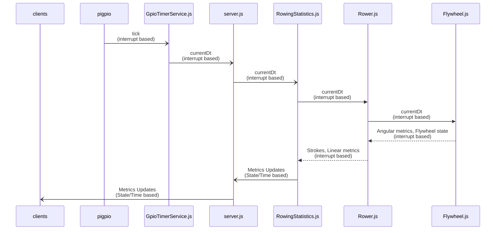
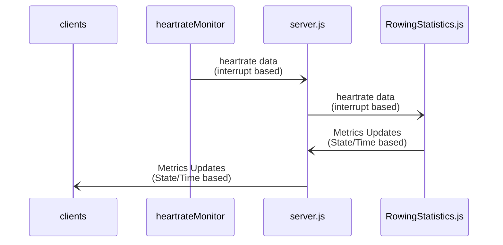
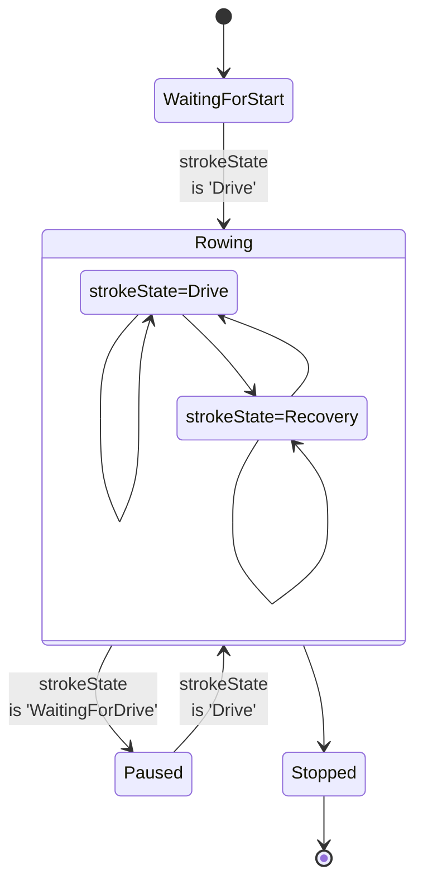
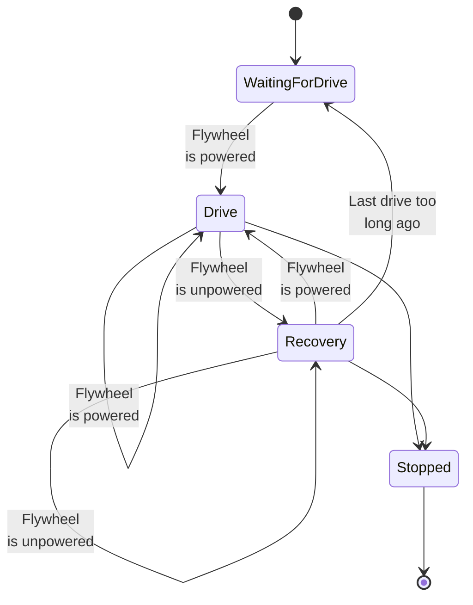

# Open Rowing Monitor architecture

<!-- markdownlint-disable no-inline-html -->
In this document, we describe the architectual construction of Open Rowing Monitor. For the reasons behind the physics, please look at [the Physics behind Open Rowing Monitor](Physics_Of_OpenRowingMonitor.md). In this document we describe the main functional blocks in Open Rowing Monitor, and the major design decissions.

## Platform choice

We have chosen for Raspberry Pi, instead of Arduino, due to the CPU requirements needed for some machines. The Raspberry Pi can easily be bought by regular users and installation of the OS and applications is pretty straightforward. It also allows for easy connection of hardware through the GPIO interface.

We have chosen to use Raspian as OS, as it is easily installed by the user, it provides a well maintained platform with many extensions, and it maintains a 64Bit PREEMPT kernel by default. [Ubuntu Core](https://ubuntu.com/core) provides a a leaner 64-bit low-latency kernel and their Snap-based IoT platform is beautiful, but it also requires a much more complex development and deployment toolchain, which would distract from the core application at the moment.

## Choice for Node.js and JavaScript

The choice has been made to use JavaScript to build te application, as many of the needed components (like GPIO and Bluetooth Low Energy) components are readily available. The choice for a runtime interpreted language is traditionally at odds with the low latency requirements that is close to physical hardware. The performance of the app depends heavily on the performance of node.js, which itself isn't optimized for low-latency and high frequency environments. However, in practice, we haven't run into any situations where CPU-load has proven to be too much or processing has been frustrated by latency, even when using full Theil-Senn quadratic regression models on larger flanks (which is O(n2)).

## Main functional components

We first describe the relation between the main functional components by describing the flow of the key pieces of information: the flywheel and heartrate measurements. We first follow the flow of the flywheel data, which is provided by the interrupt driven `GpioTimerService.js`. The only information retrieved by Open Rowing Monitor is *CurrentDt*: the time between impulses. This data element is transformed in meaningful metrics in the following manner:

The clients (both the webbased screens and periphal bluetooth devices) are updated based on both a set interval and when the stroke or session state changes. Open Rowing Monitor therefore consists out of two subsystems: an solely interruptdriven part that processes flywheel and heartrate interrupts, and the time/state based needs of the clients. It is the responsibility of `RowingStatistics.js` to manage this: it monitors the timers, session state and guarantees that it can present the clients with the freshest data availble.

Secondly, the heartrate data follows the same path, but requires significantly less processing:

### pigpio

`pigpio` is a wrapper around the [pigpio C library](https://github.com/joan2937/pigpio), which is an extreme high frequency monitor of the pigpio port. As the pigpio npm is just a wrapper around the C library, all time measurement is done by the high cyclic C library, making it extremely accurate. It can be configured to ignore too short pulses (thus providing a basis for debounce) and it reports the `tick` (i.e. the number of microseconds since OS bootup) when it concludes the signal is valid. It reporting is detached from its measurement, and we deliberatly use the *Alert* instead of the *Interrupt* as their documentation indicates that both types of messaging provide an identical accuracy of the `tick`, but *Alerts* do provide the functionality of a debounce filter. As the C-implementation of `pigpio` determines the accuracy of the `tick`, this is the only true time critical element of Open Rowing Monitor. Latency in this process will present itself as noise in the measurements of *CurrentDt*.

### GpioTimerService.js

`GpioTimerService.js` is a small independent process, acting as a data handler to the signals from `pigpio`. It translates the *Alerts* with their `tick` into a stream of times between these *Alerts* (which we call *CurrentDt*). The interrupthandler is still triggered to run with extreme low latency as the called `gpio` process will inherit its nice-level, which is extremely time critical. To Open Rowing Monitor it provides a stream of measurements that needed to be handled.

### Server.js

`Server.js` orchestrates all information flows and starts/stops processes when needed. It will:

* Recieve (interrupt based) GPIO timing signals from `GpioTimerService.js` and send them to the `RowingStatistics.js`;
* Recieve (interrupt based) Heartrate measurements and sent them to the `RowingStatistics.js`;
* Recieve the metrics update messages from `RowingStatistics.js` (time-based and state-based updates of metrics) and distribut them to the webclients and blutooth periphials;
* Handle user input (through webinterface and periphials) and instruct `RowingStatistics.js` to act accordingly;
* Handle escalations from `RowingStatistics.js` (like reaching the end of the interval, or seeing the rower has stopped) and instruct the rest of the application, like the `WorkoutRecorder.js` accordingly.

### RowingStatistics.js

`RowingStatistics.js` recieves *currentDt* updates, forwards them to `Rower.js` and subsequently inspects `Rower.js` for the resulting strokestate and associated metrics. Based on this inspection, it updates the finite state machine of the sessionstate and the associated metrics (i.e. linear velocity, linear distance, power, etc.).

#### sessionStates in RowingStatistics.js

`RowingStatistics.js` maintains the following sessionstates:

Please note: the 'Stopped' state isn't directly part of the state machine that is defined in `handleRotationImpulse`, it is a direct consequence of emitting the `intervalTargetReached` message to `Server.js`, where `Server.js` concludes there is no next interval left, and thus `stopTraining()` has to be called (which does set the sessionState to 'Stopped'). This is needed as RowingStatistics shouldn't be aware about the existence of next intervals, as it only deals with the current interval.

#### metrics maintained in RowingStatistics.js

The goal is to translate the linear rowing metrics into meaningful information for the consumers of data updating both session state and the underlying metrics. As `Rower.js` can only provide a limited set of absolute metrics at a time (as most are stroke state dependent) and is unaware of previous strokes and the context of the interval, `RowingStatistics.js` will consume this data, combine it with other datasources like the heartrate and transform it into a consistent and more stable set of metrics useable for presentation. As `RowingStatistics.js` also is the bridge between the interrupt-driven and time/state driven part of the application, it buffers data as well, providing a complete set of metrics regardless of stroke state. Adittionally, `RowingStatistics.js` also smoothens data across strokes to remove eratic behaviour of metrics due to small measurement errors.

In a nutshell:

* `RowingStatistics.js` is the bridge/buffer between the interrupt-drive processing of data and the time/state based reporting of the metrics,
* `RowingStatistics.js` maintains the session state, thus determines whether the rowing machine is 'Rowing', or 'WaitingForDrive', etc.,
* `RowingStatistics.js` applies a moving median filter across strokes to make metrics less volatile and thus better suited for presentation,
* `RowingStatistics.js` calculates derived metrics (like Calories) and trands (like Calories per hour),
* `RowingStatistics.js` gaurds interval and session boundaries, and will chop up the metrics-stream accordingly, where Rower.js will just move on without looking at these artifical boundaries.

In total, this takes full control of the displayed metrics in a specific interval.

### Rower.js

`Rower.js` recieves *currentDt* updates, forwards them to `Flywheel.js` and subsequently inspects `Flywheel.js` for the resulting state and angular metrics, transforming it to a strokestate and linear metrics.

#### strokeStates in Rower.js

`Rower.js` can have the following strokeStates:

Please note: the `Stopped` state is only used for external events (i.e. `RowingStatistics.js` calling the stopMoving() command), which will stop `Rower.js` from processing data. This is a different state than `WaitingForDrive`, which can automatically move into `Drive` by accelerating the flywheel. This is typically used for a forced exact stop of a rowing session (i.e. reaching the end of an interval).

#### Linear metrics in Rower.js

`Rower.js` inspects the flywheel behaviour on each impuls and translates the flywheel state into the strokestate (i.e. 'WaitingForDrive', 'Drive', 'Recovery', 'Stopped') through a finite state machine. Based on the angular metrics (i.e.e drag, angular velocity, angular acceleration) it also calculates the updated associated linear metrics (i.e. linear velocity, linear distance, power, etc.). As most metrics can only be calculated at (specific) phase ends, it will only report the metrics it can claculate. Aside temporal metrics (Linear Velocity, Power, etc.) it also maintains several absolute metrics (like total moving time and total linear distance travelled). It only updates metrics that can be updated meaningful, and it will not resend (potentially stale) data that isn't updated.

### Flywheel.js

`Flywheel.js` recieves *currentDt* updates and translates that into a state of the flywheel and associated angular metrics. It provides a model of the key parameters of the Flywheel, to provide the rest of OpenRowingMonitor with essential physical metrics and state regarding the flywheel, without the need for considering all kinds of parameterisation. Therefore, `Flywheel.js` will provide all metrics in regular physical quantities, abstracting away from the measurement system and the associated parameters, allowing the rest of OpenRowingMonitor to focus on processing that data.

It provides the following types of information:

* the state of the flywheel (i.e. is the flywheel powered, unpowered or even Dwelling)
* temporal metrics (i.e. Angular Velocity, Angular Acceleration, Torque, etc.)
* several absolute metrics (i.e. total elapsed time and total angular distance traveled)
* physical properties of the flywheel, (i.e. the flywheel drag and flywheel inertia)

## Major design decissions

### Staying close to *currentDt*

*currentDt* is defined as the time between impulses, which is the core measurement of any rowing machine. These values tend to range between 0.050 and 0.005 seconds, and are subject to small measurement errors due to vibrations in the rower but also scheduling issues in the Raspberry Pi OS.

Working with small numbers, and using the impulse time to calculate the angular velocity (i.e. dividing the angular distance travelled through currentDt), or even calculating angular acceleration (i.e. dividing angular velocity through currentDt) tends to enlarge these measurement errors. Therefore, whenever possible, calculations are based on the raw currentDt or Robust Regression methods, rather than numerical derived metrics, to prevent chaotic behaviour of OpenRowingMonitor.

### Absolute approach in Rower.js

`Rower.js` could report distance incrementally to `RowingStatistics.js`. However, we chose to report in absolute times and distances, making `Rower.js` in full control of these essential metrics. This way, `Rower.js` can report absolute times and distances, taking full control of the metrics regarding linear movement. This way, these metrics can be calculated temporarily for frequent updates, but calculated definitively when the phase completes. Any derived metrics for specific clients, and smoothing/buffering, is done by `RowingStatistics.js`.

Adittional benefit of this approach is that it makes transitions in intervals more smooth: `RowingStatistics.js` can intersect stroke without causing any pause in metrics (as RowingEngine.js keeps reporting absolutes, intervals and laps become a view on the same data).

## Open issues, Known problems and Regrettable design decissions

### Use of quadratic regression instead of cubic regression

For the determination of angular velocity and angular acceleration we use quadratic regression over the time versus angular distance function. When using the right algorithm, this has the strong benefit of being robust to noise, at the cost of a O(n2) calculation per new datapoint (where n is the flanklength). Quadratic regression would be fitting if the acceleration would be a constant, as the formulae used would align perfectly with this use. Unfortunatly, the nature of the rowing stroke excludes that assumption as the ideal force curve is a heystack, and thus the force on the flywheel varies in time. As an approximation on a smaller interval, quadratic regression has proven to outperform (i.e. less suspect to noise in the signal) both the numerical approach with noise filtering and the linear regression methods.

From a pure mathematical perspective, a higher order polynomial would be more appropriate. A cubic regressor, or even better a fourth order polynomal have shown to be better mathematical approximation of the time versus distance function for a Concept2 RowErg. However, there are some current practical objections against using these more complex methods:

* Higher order polynomials are less stable in nature, and overfitting is a real issue. As this might introduce wild shocks in our metrics, this might be a potential issue for application;
* A key limitation is the available number of datapoints. For the determination of a polynomial of the n-th order, you need at least n+1 datapoints (which in Open Rowing Monitor translates to a `flankLength`). Some rowers, for example the Sportstech WRX700, only deliver 5 to 6 datapoints for the entire drive phase, thus putting explicit limits on the number of datapoints available for such an approximation.
* Calculating a higher order polynomial in a robust way, for example by Theil-Senn regression, is CPU intensive. A quadratic approach requires a O(n2) calculation when a datapoint is added to the flank. Our estimate is that with current known robust polynomial regression methods, a cubic approach requires at least a O(n3) calculation, and a 4th polynomial a O(n4) calculation. With smaller flanks (which determines the n) this has proven to be doable, but for machines which produce a lot of datapoints, and thus have more noise and a typically bigger `flankLength`(like the C2 RowErg and Nordictrack RX-800, both with a 11 `flankLength`), this becomes an issue: we consider completing 103 or even 104 complex calculations within the 5 miliseconds that is available before the next datapoint arrives, impossible.

This doesn't definitively exclude the use of more complex polynomial regression methods: alternative methods for higher polynomials within a datastream could be as CPU intensive as Theil-Senn Quadratic regression now, and their use could be isolated to specific combination of Raspberry hardware and settings. Thus, this will remain an active area of investigation for future versions.
