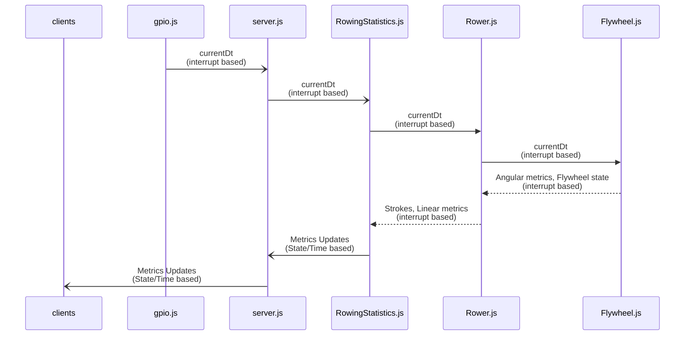
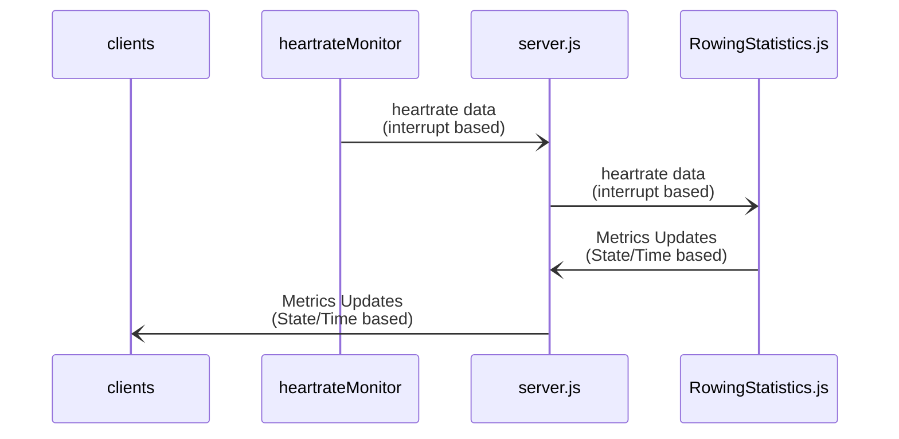
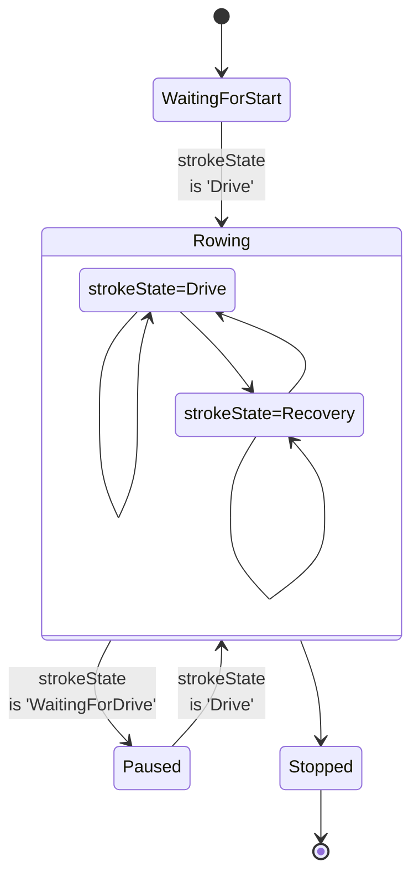
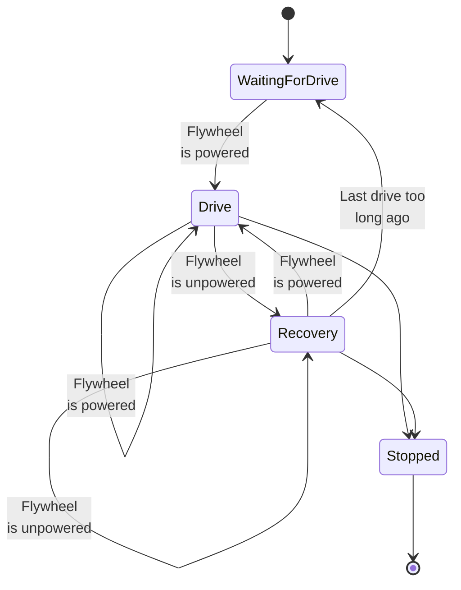

# Open Rowing Monitor architecture

In this document, we describe the architectual construction of Open Rowing Monitor. For the reasons behind the physics, please look at [the Physics behind Open Rowing Monitor](Physics_Of_OpenRowingMonitor.md) and [its practical validation](Engine_Validation.md). In this document we describe the main functional blocks in Open Rowing Monitor, and the major design decissions.

## Platform choice

The choice has been made to use Raspian as OS, as it is easily installed by the user.

## Choice for JavaScript

The choice has been made to use JavaScript to build te application, as many components were readily available.

## Main functional components

We first describe the relation between the main functional components by describing the flow of the key pieces of information: the flywheel and heartrate measurements. We first follow the flow of the flywheel data, which is provided by the inteerupt driven `gpio.js`. The only information retrieved by OpenRowingMonitor is *CurrentDt*: the time between impulses. This data element is transformed in meaningful metrics in the following manner:

The clients (both the webbased screens and periphal bluetooth devices) are updated based on both a set interval and when the stroke or session state changes. OpenRowingMonitor therefore consists out of two subsystems: an solely interruptdriven part that processes flywheel and heartrate interrupts, and the time/state based needs of the clients. It is the responsibility of `RowingStatistics.js` to manage this: it monitors the timers, session state and guarantees that it can present the clients with the freshest data availble.

Secondly, the heartrate data follows the same path, but requires significantly less processing:

### gpio.js

`gpio.js` is a small independent process, acting as an interrupt handler to the signals from the gpio-pin 17. The interrupthandler is the only part of OpenRowingMonitor that should run with extreme low latency as it determines the time between impulses. Latency in this process will present itself as noise in the measurements of *CurrentDt*. To OpenRowingMonitor it provides a stream of measurements that needed to be handled.

### Server.js

`Server.js` orchestrates all information flows and starts/stops processes when needed. It will:

* Recieve (interrupt based) GPIO timing signals from `gpio.js` and send them to the `RowingStatistics.js`
* Recieve (interrupt based) Heartrate measurements and sent them to the `RowingStatistics.js`
* Recieve the metrics update messages from `RowingStatistics.js` (time-based and state-based updates of metrics) and send them to the webclients and blutooth periphials
* Handle user input (through webinterface and periphials) and instruct `RowingStatistics.js` accordingly

### RowingStatistics.js

`RowingStatistics.js` recieves *currentDt* updates, forwards them to `Rower.js` and subsequently inspects `Rower.js` for the resulting state and metrics. Based on this inspection, it updates the finite state machine of the session state and the associated metrics (i.e. linear velocity, linear distance, power, etc.). It maintains the following states:

The goal is to translate these metrics into meaningful information for the consumers of data updating both session state and the underlying metrics. As `Rower.js` can only provide a limited set of absolute metrics at a time (as most are stroke state dependent) and is unaware of previous strokes and the context of the interval, `RowingStatistics.js` will consume this data, combine it with other datasources like the heartrate and transform it into a consistent and more stable set of metrics useable for presentation. As `RowingStatistics.js` also is the bridge between the interrupt-driven and time/state driven part of the application, it buffers data as well, providing a complete set of metrics regardless of stroke state. Adittionally, `RowingStatistics.js` also smoothens data across strokes to remove eratic behaviour of metrics due to small measurement errors.

In a nutshell:

* `RowingStatistics.js` is the bridge/buffer between the interrupt-drive processing of data and the time/state based reporting of the metrics,
* `RowingStatistics.js` maintains the session state, thus determines whether the rowing machine is 'Rowing', or 'WaitingForDrive', etc.,
* `RowingStatistics.js` applies a moving median filter across strokes to make metrics less volatile and thus better suited for presentation,
* `RowingStatistics.js` calculates derived metrics (like Calories) and trands (like Calories per hour),
* `RowingStatistics.js` gaurds interval and session boundaries, and will chop up the metrics-stream accordingly, where Rower.js will just move on without looking at these artifical boundaries.

In total, this takes full control of the displayed metrics in a specific interval.

### Rower.js

`Rower.js` recieves *currentDt* updates, forwards them to `Flywheel.js` and subsequently inspects `Flywheel.js` for the resulting state and angular metrics, transforming it to a rower state and linear metrics. `Rower.js` can have the following states:

`Rower.js` inspects the flywheel behaviour on each impuls and translates the flywheel state into the rower's state (i.e. 'WaitingForDrive', 'Drive', 'Recovery', 'Stopped') through a finite state machine. Based on the angular metrics (i.e.e drag, angular velocity, angular acceleration) it also calculates the updated associated linear metrics (i.e. linear velocity, linear distance, power, etc.). As most metrics can only be calculated at (specific) phase ends, it will only report the metrics it can claculate. Aside temporal metrics (Linear Velocity, Power, etc.) it also maintains several absolute metrics (like total moving time and total linear distance travelled). It only updates metrics that can be updated meaningful, and it will not resend (potentially stale) data that isn't updated.

### Flywheel.js

`Flywheel.js` recieves *currentDt* updates and translates that into a state of the flywheel and associated angular metrics. It provides a model of the key parameters of the Flywheel, to provide the rest of OpenRowingMonitor with essential physical metrics and state regarding the flywheel, without the need for considering all kinds of parameterisation. Therefore, `Flywheel.js` will provide all metrics in regular physical quantities, abstracting away from the measurement system and the associated parameters, allowing the rest of OpenRowingMonitor to focus on processing that data.

It provides the following types of information:

* the state of the flywheel (i.e. is the flywheel powered, unpowered or even Dwelling)
* temporal metrics (i.e. Angular Velocity, Angular Acceleration, Torque, etc.)
* several absolute metrics (i.e. total elapsed time and total angular distance traveled)
* physical properties of the flywheel, (i.e. the flywheel drag and flywheel inertia)

## Major design decissions

### Staying close to *currentDt*

*currentDt* is defined as the time between impulses, which is the core measurement of any rowing machine. These values tend to range between 0.050 and 0.005 seconds, and are subject to small measurement errors due to vibrations in the rower but also scheduling issues in the Raspberry Pi OS.

Working with small numbers, and using the impulse time to calculate the angular velocity (i.e. dividing the angular distance travelled through currentDt), or even calculating angular acceleration (i.e. dividing angular velocity through currentDt) tends to enlarge these measurement errors. Therefore, whenever possible, calculations are based on the raw currentDt or Robust Regression methods, rather than numerical derived metrics, to prevent chaotic behaviour of OpenRowingMonitor.

### Absolute approach in Rower.js

`Rower.js` could report distance incrementally to `RowingStatistics.js`. However, we chose to report in absolute times and distances, making `Rower.js` in full control of these essential metrics. This way, `Rower.js` can report absolute times and distances, taking full control of the metrics regarding linear movement. This way, these metrics can be calculated temporarily for frequent updates, but calculated definitively when the phase completes. Any derived metrics for specific clients, and smoothing/buffering, is done by `RowingStatistics.js`.

Adittional benefit of this approach is that it makes transitions in intervals more smooth: `RowingStatistics.js` can intersect stroke without causing any pause in metrics (as RowingEngine.js keeps reporting absolutes, intervals and laps become a view on the same data).

## Open issues, Known problems and Regrettable design decissions

### Use of Raspbian

Currently, the algorithms can handle a significant level of noise at the cost of the precission of the peaks, but the data might become more reliable and accurate when the noise is removed from the source.

A default Rasbian install does quite a decent job in extracting metrics, but the standard 32-bit kernel isn't optimised for IoT applications with low-latency requirements, like a rowing machine. The low latency (or more precise, less fluctuating latency) is essential to measure the time between impulses, as small measurement errors in these intervals will throw off force-curve calculations by presenting themselves as peaks. Using the 32-bit kernel therefore isn't advised for high-frequency machines (like the Concept2's or NordicTracks).

The 64Bit Raspian lite install provides a PREEMPT kernel out of the box, which is optimised for IoT applications with low-latency requirements. Installation of OpenRowingMonitor is possible and even has been tested very thoroughly, and has show to work well. Setting the GPIO and application priority isn't trivial, as setting it too high migh starve critical OS processes. The recommended practice for Low-Latency IoT to assign each critical process its own CPU has not been tried yet.

An alternative to Rasbian is Ubuntu Core, which has a leaner 64-bit kernel, and where a low-latency kernel is maintained as well. Please note, this is NOT a PREEMPT kernel yet! The IoT approach of Ubuntu, which heavily depends on Snap as main application deployment vehicle, is a change from the current architecture as it would require a containered application. From an install perspective, it would make much more sense to depend on a backend (i.e the hardware measurement and webserver) to be in one Snap, and the Frontend to be in another Snap (as Ubuntu-Frame provides this front-end functionality out of the box, and thus only needs to be configured). There especially are issues with storing settings, which need to be retained even when the Snap gets updated. Therefore, this is a far from trivial approach.

### Use of Node.js

The choice for a runtime interpreted language is traditionally at odds with the low latency requirements that is close to actual hardware. In theory, the performance of the app would heavily depend on the performance of node.js, which isn't optimized for low-latency and high frequency environments. In practice, we haven't run into any situations where CPU-load has proven to be too much, even when using experimental full quadratic Theil-Senn estimations. However, migrating the interrupt handler to C++ might reduce latency variations and thus improve results.

Switching from JavaScript/node.js to a precompiled C++ app completely would be doable, as the codebase is quite compact, but it would add a lot of complexity in deploying Open Rowing Monitor as the C++ code needs to be compiled for the target platform by the end user. In combination with the above, where Snap would do a lot of the heavy lifting to mitigate both platform dependence and application deployment, it might be an interesting approach to investigate.
