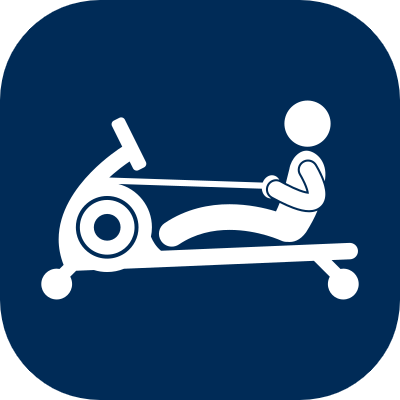
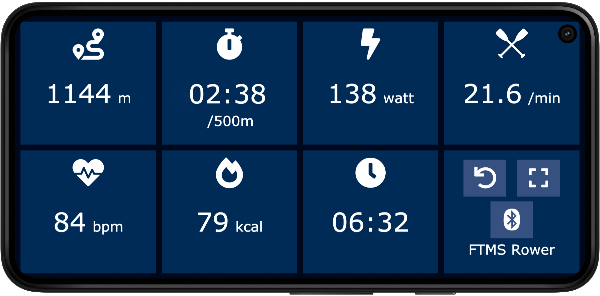

# Open Rowing Monitor

<!-- markdownlint-disable-next-line no-inline-html -->


A free and open source performance monitor for rowing machines. It upgrades a rowing machine into a smart trainer that can be used with training applications and games.

Open Rowing Monitor is a Node.js application that runs on a Raspberry Pi and measures the rotation of the rower's flywheel (or similar) to calculate rowing specific metrics, such as power, split time, speed, stroke rate, distance and calories.

We currently develop and test it with a Sportstech WRX700 water-rower and a NordicTrack RX-800 hybrid magnetic / air-rower. But it should run fine with any rowing machine that uses some kind of damping mechanism, as long as you can add something to measure the speed of the flywheel.
We suspect it works well with DIY rowing machines like the [Openergo](https://openergo.webs.com) too.

## Features

The following items describe most of the current features, more functionality will be added in the future, check the [Development Roadmap](./backlog.md) if you are curious.

### Rowing Metrics

Open Rowing Monitor implements a physics model to simulate the typical metrics of a rowing boat based on the pull on the handle. The physics model can be tuned to the specifics of a rower by changing some model parameters.

* Stroke detection
* Power (watts)
* Split time (/500m)
* Strokes per Minute
* Calories used (kcal)
* Training Duration
* Heart Rate (supports BLE and ANT+ heart rate monitors, ANT+ requires an ANT+ USB stick)

### Web Interface

The web interface visualizes the rowing metrics on any device that can run a web browser (i.e. a smartphone that you attach to your rowing machine while training). It uses web sockets to show the rowing status in realtime. It can also be used to reset the training metrics and to select the BLE Rower.

If you connect a screen to the Raspberry Pi, then this interface can also be directly shown on the device. The installation script can set up a web browser in kiosk mode that runs on the Raspberry Pi.

<!-- markdownlint-disable-next-line no-inline-html -->
<br clear="left">

### Bluetooth Low Energy (BLE)

Open Rowing Monitor also implements different Bluetooth Low Energy (BLE) protocols so you can use your rowing machine with different fitness applications.

Fitness Machine Service (FTMS) is a standardized GATT protocol for different types of fitness machines. Open Rowing Monitor currently supports the type **FTMS Rower** and simulates the type **FTMS Indoor Bike**.

**FTMS Rower:** This is the FTMS profile for rowing machines and supports all rowing specific metrics (such as stroke rate). So far not many training applications for this profile exist, but the market is evolving. I've successfully tested it with [EXR](https://www.exrgame.com), [MyHomeFit](https://myhomefit.de) and [Kinomap](https://www.kinomap.com).

**FTMS Indoor Bike:** This FTMS profile is used by Smart Bike Trainers and widely adopted by training applications for bike training. It does not support rowing specific metrics. But we can present metrics such as power and distance to the biking application and use cadence for stroke rate. So why not use your virtual rowing bike to row up a mountain in [Zwift](https://www.zwift.com), [Bkool](https://www.bkool.com), [The Sufferfest](https://thesufferfest.com) or similar :-)

**Concept2 PM:** Open Rowing Monitor also implements part of the Concept2 PM Bluetooth Smart Communication Interface Definition. This is still work in progress and only implements the most common parts of the spec, so it will not work with all applications that support C2 rowing machines. It currently works with all the samples from [The Erg Arcade](https://ergarcade.com), i.e. you can [row in the clouds](https://ergarcade.github.io/mrdoob-clouds/). This also works very well with [EXR](https://www.exrgame.com).

### Export of Training Sessions

Open Rowing Monitor can create Training Center XML files (TCX). You can upload these files to training platforms like [Strava](https://www.strava.com), [Garmin Connect](https://connect.garmin.com) or [Trainingpeaks](https://trainingpeaks.com) to track your training sessions.

Currently this is a manual step. The installer can set up a network share that contains all training data so it is easy to grab the files from there and upload them to the training platform of your choice.

Open Rowing Monitor can also store the raw measurements of the flywheel into CSV files. These files are great to start your own exploration of your rowing style and also to learn about the specifics of your rowing machine (some Excel files that can help with this are included in the `docs` folder).

## Installation

You will need a Raspberry Pi Zero W, Raspberry Pi Zero 2 W, Raspberry Pi 3 or a Raspberry Pi 4 with a fresh installation of Raspberry Pi OS 10 (Lite) for this. Connect to the device with SSH and initiate the following command to set up all required dependencies and to install Open Rowing Monitor as an automatically starting system service:

```zsh
/bin/bash -c "$(curl -fsSL https://raw.githubusercontent.com/laberning/openrowingmonitor/HEAD/install/install.sh)"
```

Also have a look at the [Detailed Installation Instructions](./installation.md) for more information on the software installation and for instructions on how to connect the rowing machine.

## How it all started

I originally started this project, because my rowing machine (Sportstech WRX700) has a very simple computer and I wanted to build something with a clean and simple interface that calculates more realistic metrics. Also, this was a good reason to learn a bit more about Bluetooth and all its specifics.

The original proof of concept version started as a sketch on an Arduino, but when I started adding things like a web frontend and BLE I moved it to the much more powerful Raspberry Pi. Maybe using a Raspberry Pi for this small IoT-project is a bit of an overkill, but it has the capacity for further features such as syncing training data or rowing games. And it has USB-Ports that I can use to charge my phone while rowing :-)

## Further information

This project is already in a very usable stage, but some things are still a bit rough on the edges.

Feel free to leave a message in the [GitHub Discussions](https://github.com/laberning/openrowingmonitor/discussions) if you have any questions or ideas related to this project.

Check the advanced information on the [Physics behind Open Rowing Monitor](./physics_openrowingmonitor.md).

We plan to add more features, here is the [Development Roadmap](./backlog.md).

This project uses some great work by others, see the [Attribution here](./attribution.md).
