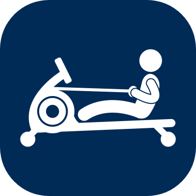
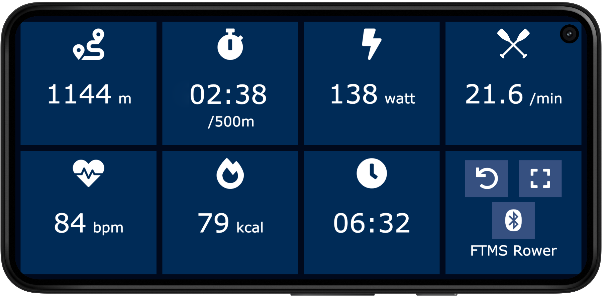
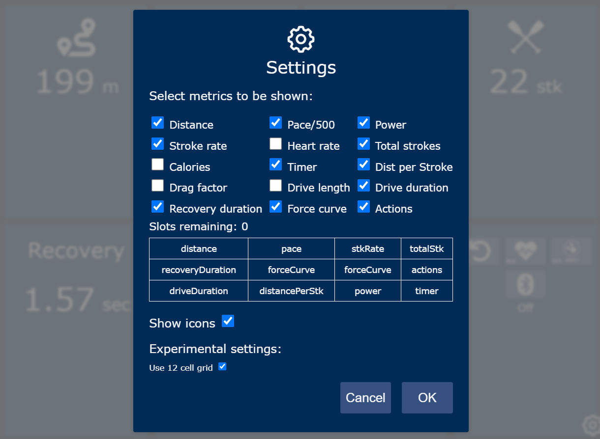

# OpenRowingMonitor

<!-- markdownlint-disable-next-line no-inline-html -->

OpenRowingMonitor is a reliable, free and open source monitor for rowing machines. It allows you to upgrade any rowing machine into a smart trainer that can be used with applications and games, making rowing much more fun and affordable!

It runs on cheap (Raspberry Pi) hardware to calculate rowing metrics, such as power, split time, speed, stroke rate, distance and calories. As it is your data, you can share these metrics with games and analysis in the way you like.

OpenRowingMonitor runs fine on any rowing machine, as long as you can add something to measure the speed of the flywheel, like magnets. It already has been retrofitted to many rowing machines like the [DIY Openergo](https://openergo.webs.com) and many [existing machines that lack a decent monitor](Supported_Rowers.md), and is used by many on a daily basis. If your machine isn't listed, don't worry, adjusting the settings is easy following the [settings adjustment help guide](rower_settings.md) yourself. And in the [GitHub Discussions](https://github.com/JaapvanEkris/openrowingmonitor/discussions) and specifically the [Rower Profile development section](https://github.com/JaapvanEkris/openrowingmonitor/discussions/categories/rower-profile-development) there always are friendly people to help you set up your machine and the settings.

## Features

OpenRowingMonitor provides you with metrics directly, via smartwatches (ANT+), apps and games (bluetooth) and Home Automation (MQTT). You can also export your data to the analysis tool of your choice.

<!-- markdownlint-disable-next-line no-inline-html -->
 

The following items describe most of the current features in more detail.

### Rowing Metrics

OpenRowingMonitor calculates the typical metrics of a rowing machine, where the parameters can be tuned to the specifics of a rower machine by changing the configuration file. We maintain [settings for machines already known to us](Supported_Rowers.md). The underlying software is structurally validated against a Concept2 PM5 in over 300 sessions (totalling over 3 million meters), and results deviate less than 0.1% for every individual rowing session.

OpenRowingMonitor can display the following key metrics on the user interface:

* Distance rowed (meters)
* Training Duration
* Power (watts)
* Pace (/500m)
* Strokes per Minute (SPM)
* Calories used (kcal)
* Total number of strokes
* Heart Rate (supports BLE and ANT+ heart rate monitors, ANT+ requires an ANT+ USB stick)
* Drag factor
* Drive duration (seconds)
* Drive length (meters)
* Recovery duration (seconds)
* Distance per stroke (meters)
* Force curve with Peak power (Newtons)

It also calculates and exports many other key rowing metrics, including Recovery Heart Rate, Average handle force (Newton), Peak handle force (Newton) and the associated handle force curve, handle velocity curve and handle power curve.

### Web Interface

The web interface shows the basic rowing metrics on any device that can run a web browser (i.e. a smartphone that you attach to your rowing machine while training) in realtime. You can set up the user interface as you like, with the metrics you find important:

<!-- markdownlint-disable-next-line no-inline-html -->
 

If you connect a (optional) physical screen directly to the Raspberry Pi, then this interface can also be directly shown on the device. The installation script helps you set this up.

### Device connections via Bluetooth, ANT+ and MQTT

OpenRowingMonitor can receive heartrate data via Bluetooth Low Energy (BLE) and ANT+. But you can also share your rowing metrics with different applications and devices. We support most common industry standards to help you connect to your app and game of choice, OpenRowingMonitor currently supports the following protocols:

* **Concept2 PM**: OpenRowingMonitor can simulate a Concept2 PM5, which is compatible with most rowing apps. This implements the most common parts of the specificarion, so it might not work with all applications. It is known to work with [EXR](https://www.exrgame.com) (preferred method), [ErgZone](https://Erg.Zone), [Kinomap](https://www.kinomap.com) and all the samples from [The Erg Arcade](https://ergarcade.com).

* **FTMS Rower**: This is the FTMS profile for rowing machines and supports all rowing specific metrics (such as stroke rate). We've successfully tested it with [EXR](https://www.exrgame.com), [Peloton](https://www.onepeloton.com/app), [MyHomeFit](https://myhomefit.de) and [Kinomap](https://www.kinomap.com).

* **ANT+ FE-C**: OpenRowingMonitor can broadcast rowing metrics via ANT+ FE-C, which can be received by several series of Garmin smartwatches like the Epix/Fenix series, which then can calculate metrics like training load etc..

* **FTMS Indoor Bike**: This FTMS profile is used by Smart Bike Trainers and widely adopted by bike training apps. It does not support rowing specific metrics, but it can present metrics such as power and distance to the biking application and use cadence for stroke rate. So why not use your virtual rowing bike to row up a mountain in [Zwift](https://www.zwift.com), [Bkool](https://www.bkool.com), [The Sufferfest](https://thesufferfest.com) or similar :-)

* **BLE Cycling Power Profile**: This Bluetooth simulates a bike, which allows you to connect the rower to a bike activity on your (mostly Garmin) sportwatch. It will translate the rowing metrics to the appropriate fields. This profile is only supported by specific watches, so it might provide a solution.

* **BLE Cycling Speed and Cadence Profile**: used for older Garmin Forerunner and Garmin Venu watches and similar types, again simulating a bike activity.

* **MQTT**: this IoT protocol allows you to broadcast metrics for logging or real-time display, but also allows for integration with Home Automation systems like [Home Assistant](https://www.home-assistant.io/), [Domoticz](https://www.domoticz.com/) and Alexa Voice control via [HABridge](https://github.com/bwssytems/ha-bridge).

> [!NOTE]
> Use of ANT+ requires adding an ANT+ USB-stick to your Raspberry Pi.

### Export of Training Sessions

OpenRowingMonitor is based on the idea your metrics should be easily accessible for further analysis on data platforms. Automatic uploading your sessions to [RowsAndAll](https://rowsandall.com/), [Intervals.icu](https://intervals.icu/) and [Strava](https://www.strava.com) is an integrated feature. For other platforms this is currently a manual step, see [the integration manual](Integrations.md). To allow the data upload, OpenRowingMonitor can create the following file types:

* **RowingData** files, which are comma-separated files with all metrics OpenRowingMonitor can produce. These can be used with [RowingData](https://pypi.org/project/rowingdata/) to display your results locally, or uploaded to [RowsAndAll](https://rowsandall.com/) for a webbased analysis (including dynamic in-stroke metrics). The csv-files can also be processed manually in Excel, allowing your own custom analysis;

* **Garmin FIT files**: These are binary files that contain the most interesting metrics of a rowing session. Most modern training analysis tools will accept a FIT-file. You can upload these files to training platforms like [Strava](https://www.strava.com), [Garmin Connect](https://connect.garmin.com), [Intervals.icu](https://intervals.icu/), [RowsAndAll](https://rowsandall.com/) or [Trainingpeaks](https://trainingpeaks.com) to track your training sessions;

* **Training Center XML files (TCX)**: These are legacy XML-files that contain the most essential metrics of a rowing session. Most training analysis tools will still accept a tcx-file (although FIT usually is recommended). You can upload these files to training platforms like [Strava](https://www.strava.com), [Garmin Connect](https://connect.garmin.com), [Intervals.icu](https://intervals.icu/), [RowsAndAll](https://rowsandall.com/) or [Trainingpeaks](https://trainingpeaks.com) to track your training sessions;

The OpenRowingMonitor installer can also set up a network share that contains all training data so it is easy to grab the files from there and manually upload them to the training platform of your choice.

## Installation

You will need a Raspberry Pi Zero 2 W, Raspberry Pi 3, Raspberry Pi 4 with a fresh installation of Raspberry Pi OS Lite for this (the 64Bit kernel is recommended). Connect to the device with SSH and just follow the [Detailed Installation Instructions](installation.md) and you'll get a working monitor. This guide will help you install the software and explain how to connect the rowing machine. If you can follow the guide, it will work. If you run into issues, you can always [drop a question in the GitHub Discussions](https://github.com/JaapvanEkris/openrowingmonitor/discussions), and there always is someone to help you.

> [!IMPORTANT]
> Due to architecture differences, both the Raspberry Pi Zero W (see [this discussion for more information](https://github.com/JaapvanEkris/openrowingmonitor/discussions/33)) and Raspberry Pi 5 (see [this discussion for more information](https://github.com/JaapvanEkris/openrowingmonitor/issues/52)) will **not** work.
<!-- MD028/no-blanks-blockquote -->
> [!TIP]
> Don't have a Raspberry Pi, but do have an ESP32 lying about? No problem, our sister project ported [OpenRowingMonitor for the ESP32](https://github.com/Abasz/ESPRowingMonitor), which works well (although it is a bit less accurate due to platform limitations).

## Further information

This project is in a very stable stage, as it is used daily by many rowers. The engine is structurally validated against the Concept2 PM5. OpenRowingMonitor usually is tested extensively for weeks before being released to mainstream users. However, it might contain some things that are still a bit rough on the edges.

This is a larger team effort and OpenRowingMonitor had much direct and indirect support by many people during the years, see the [Attribution to these people here](attribution.md). You can see its development throughout the years [here in the Release notes](Release_Notes.md). Our work is never done, so more functionality will be added in the future, so check the [Development Roadmap](backlog.md) if you are curious.

Contributions to improve OpenRowingMonitor further are always welcome! To get an idea how this all works, you can read the [Architecture description](Architecture.md), the [Physics of OpenRowingMonitor (for advanced readers)](physics_openrowingmonitor.md) and [Contributing Guidelines](CONTRIBUTING.md) how you can help us improve this project.

Feel free to leave a message in the [GitHub Discussions](https://github.com/JaapvanEkris/openrowingmonitor/discussions) if you have any questions or ideas related to this project.
