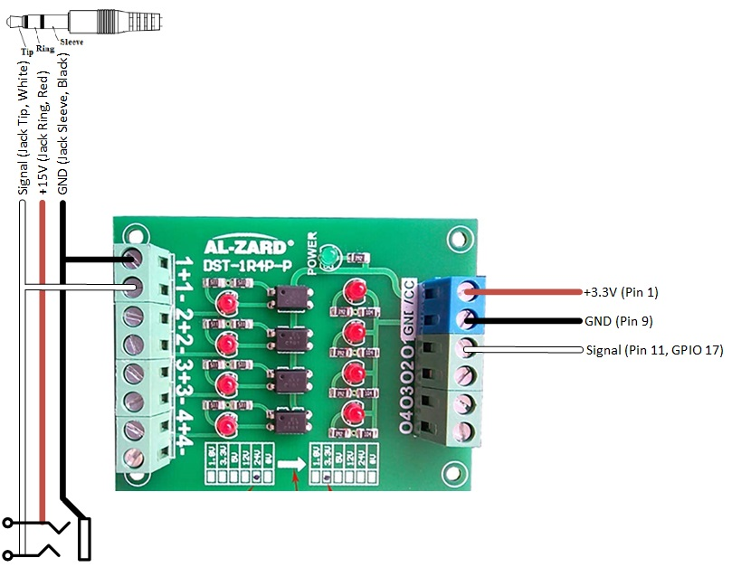

# Hardware set up of Open Rowing Monitor on a Concept 2 RowErg

This guide roughly explains how to set up the hardware.

## Hardware setup

After the software installation, basically all that's left to do is hook up your sensor to the Raspberry Pi. However, the signal from a Concept 2 RowErg is a 15 Volt sinoid, which would destroy the Raspberry Pi's 3.3 Volts circuits. To isolate the circuits, we add an optocoupler in an non-destructive way, by rerouting the signal. Below is the wiring schematic of the Al-Zard DST-1R4P-P:


*Optocoupler wiring to the Raspberry Pi*

On the left side, both the jack-plug and the jack-bus are 2.5mm, allowing the PM5 jackplug to be inserted and looped through if needed (allowing ORM to work side-by-side of the PM5). On the right, the connections to the Raspberry Pi are made.

To get a stable reading you should add a pull-up resistor to that pin. I prefer to use the internal resistor of the Raspberry Pi to keep the wiring simple but of course you can also go with an external circuit.

The internal pull-up can be enabled as described [here](https://www.raspberrypi.org/documentation/configuration/config-txt/gpio.md). So its as simple as adding the following to `/boot/config.txt` and then rebooting the device.

``` Properties
# configure GPIO 17 as input and enable the pull-up resistor
gpio=17=pu,ip
```

## Rower Settings

You should now adjust the rower specific parameters in `config/config.js` to suit your rowing machine. For the Concept 2 RowErg, there is a set of predefined parameters ready to use. So it suffices to add

``` Properties
rowerSettings: Concept2_RowErg
```

to your `config/config.js` file. You can also look at `config/default.config.js` to see what other configuration parameters are available.
