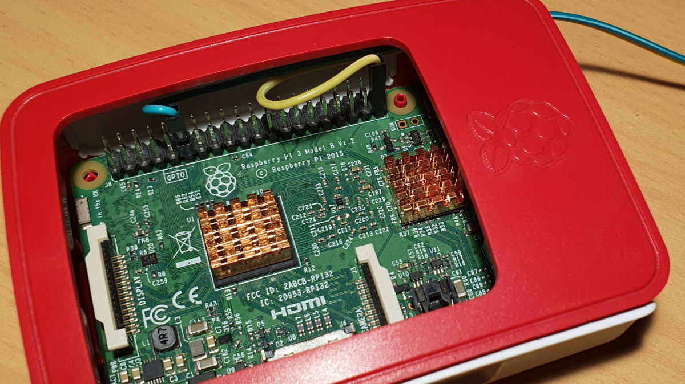
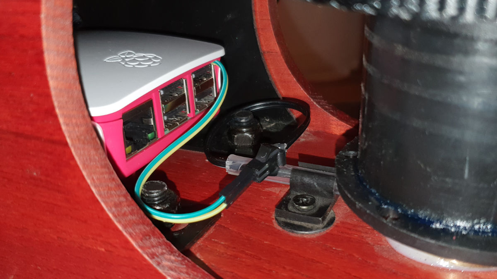

# Set up of Open Rowing Monitor

This guide roughly explains how to set up the rowing software and hardware.

## Requirements

* A Raspberry Pi that supports Bluetooth Low Energy. Probably this also runs on other devices.
  * Raspberry Pi Zero W or WH
  * Raspberry Pi Zero 2 W or WH
  * Raspberry Pi 3 Model A+, B or B+
  * Raspberry Pi 4 Model B
* An SD Card, any size above 4GB should be fine
* A rowing machine (obviously) with some way to measure the rotation of the flywheel
  * with a build in reed sensor that you can directly connect to the GPIO pins of the Raspberry Pi
  * if your machine doesn't have a sensor, it should be easy to build something similar (magnetically or optical)
* Some Dupont cables to connect the GPIO pins to the sensor

## Software Installation

### Initialization of the Raspberry Pi

* Install **Raspberry Pi OS Lite** on the SD Card i.e. with the [Raspberry Pi Imager](https://www.raspberrypi.org/software). Here, Raspberry Pi OS Lite 64 Bit is recommended as it is better suited for real-time environments. Please note that on a Raspberry Pi Zero or Zero 2, you need to increase the swap-size to 1024 otherwise the installation will fail (see [this manual how to do this](https://pimylifeup.com/raspberry-pi-swap-file/));
* Configure the network connection and enable SSH, if you use the Raspberry Pi Imager, you can automatically do this while writing the SD Card, just press `Ctrl-Shift-X`(see [here](https://www.raspberrypi.org/blog/raspberry-pi-imager-update-to-v1-6/) for a description), otherwise follow the instructions below
* Connect the device to your network ([headless](https://www.raspberrypi.org/documentation/configuration/wireless/headless.md) or via [command line](https://www.raspberrypi.org/documentation/configuration/wireless/wireless-cli.md))
* Enable [SSH](https://www.raspberrypi.org/documentation/remote-access/ssh/README.md)
* Tune the OS if needed [by following our performance improvement guide](Improving_Raspberry_Performance.md)

### Installation of the Open Rowing Monitor

Connect to the device with SSH and initiate the following command to set up all required dependencies and to install Open Rowing Monitor as an automatically starting system service:

```zsh
/bin/bash -c "$(curl -fsSL https://raw.githubusercontent.com/JaapvanEkris/openrowingmonitor/v1beta_updates/install/install.sh)"
```

### Check if OpenRowingMonitor runs without issue

Next, check you need to do is to check the status of the Open Rowing Monitor service, which you can do with the command:

  ```zsh
  sudo systemctl status openrowingmonitor
  ```

Which typically results in the following response (with some additional logging):

  ```zsh
  ● openrowingmonitor.service - Open Rowing Monitor
       Loaded: loaded (/lib/systemd/system/openrowingmonitor.service; enabled; vendor preset: enabled)
       Active: active (running) since Sun 2022-09-04 10:27:31 CEST; 12h ago
     Main PID: 755 (npm start)
        Tasks: 48 (limit: 8986)
          CPU: 6min 48.869s
       CGroup: /system.slice/openrowingmonitor.service
               ├─755 npm start
               ├─808 sh /tmp/start-6f31a085.sh
               ├─809 node app/server.js
               ├─866 /usr/bin/node ./app/gpio/GpioTimerService.js
               └─872 /usr/bin/node ./app/ble/CentralService.js
  ```

Please check if there are no errors reported.

Please note that the process identification numbers will differ.

You can also look at the the log output of the OpenRowingMonitor-service by putting the following in the command-line:

  ```zsh
  sudo journalctl -u openrowingmonitor
  ```

This allows you to see the current state of the rower. Typically this will show:

  ```zsh
  Sep 12 20:37:45 roeimachine systemd[1]: Started Open Rowing Monitor.
  Sep 12 20:38:03 roeimachine npm[751]: > openrowingmonitor@0.9.0 start
  Sep 12 20:38:03 roeimachine npm[751]: > node app/server.js
  Sep 12 20:38:06 roeimachine npm[802]: ==== Open Rowing Monitor 0.9.0 ====
  Sep 12 20:38:06 roeimachine npm[802]: Setting priority for the main server thread to -5
  Sep 12 20:38:06 roeimachine npm[802]: Session settings: distance limit none meters, time limit none seconds
  Sep 12 20:38:06 roeimachine npm[802]: bluetooth profile: Concept2 PM5
  Sep 12 20:38:06 roeimachine npm[802]: webserver running on port 80
  Sep 12 20:38:06 roeimachine npm[862]: Setting priority for the Gpio-service to -7
  Sep 12 20:38:09 roeimachine npm[802]: websocket client connected
  ```

Please check if there are no errors reported. The above snippet shows that OpenRowingMonitor is running, and that bluetooth and the webserver are alive, and that the webclient has connected.

### Check if OpenRowingMonitor screen runs without issue (if installed)

Next, check you need to do is to check the status of the Open Rowing Monitor service, which you can do with the command:

  ```zsh
  sudo systemctl status webbrowserkiosk
  ```

Which typically results in the following response (with some additional logging):

  ```zsh
● webbrowserkiosk.service - X11 Web Browser Kiosk
     Loaded: loaded (/lib/systemd/system/webbrowserkiosk.service; enabled; vendor preset: enabled)
     Active: active (running) since Wed 2024-01-31 23:46:27 CET; 11h ago
   Main PID: 746 (xinit)
      Tasks: 82 (limit: 8755)
        CPU: 2min 50.292s
     CGroup: /system.slice/webbrowserkiosk.service
             ├─746 xinit /opt/openrowingmonitor/install/webbrowserkiosk.sh -- -nocursor
             ├─747 /usr/lib/xorg/Xorg :0 -nocursor
             ├─769 sh /opt/openrowingmonitor/install/webbrowserkiosk.sh
             ├─774 /usr/bin/openbox --startup /usr/lib/aarch64-linux-gnu/openbox-autostart OPENBOX
             ├─777 /usr/lib/chromium-browser/chromium-browser --enable-pinch --disable-infobars --disable-features=AudioServiceSandbox --kiosk --noerrdialogs --ignore-certificate-errors --disable-session-crashed-bubble --disable-pinch ->
             ├─804 /usr/lib/chromium-browser/chrome_crashpad_handler --monitor-self --monitor-self-annotation=ptype=crashpad-handler --database=/home/pi/.config/chromium/Crash Reports --annotation=channel=Built on Debian , running on De>
             ├─806 /usr/lib/chromium-browser/chrome_crashpad_handler --no-periodic-tasks --monitor-self-annotation=ptype=crashpad-handler --database=/home/pi/.config/chromium/Crash Reports --annotation=channel=Built on Debian , running >
             ├─810 /usr/lib/chromium-browser/chromium-browser --type=zygote --no-zygote-sandbox --crashpad-handler-pid=0 --enable-crash-reporter=,Built on Debian , running on Debian 11 --noerrdialogs --change-stack-guard-on-fork=enable
             ├─811 /usr/lib/chromium-browser/chromium-browser --type=zygote --crashpad-handler-pid=0 --enable-crash-reporter=,Built on Debian , running on Debian 11 --noerrdialogs --change-stack-guard-on-fork=enable
             ├─820 /usr/lib/chromium-browser/chromium-browser --type=zygote --crashpad-handler-pid=0 --enable-crash-reporter=,Built on Debian , running on Debian 11 --noerrdialogs --change-stack-guard-on-fork=enable
             ├─845 /usr/lib/chromium-browser/chromium-browser --type=gpu-process --enable-low-end-device-mode --ozone-platform=x11 --crashpad-handler-pid=0 --enable-crash-reporter=,Built on Debian , running on Debian 11 --noerrdialogs ->
             ├─850 /usr/lib/chromium-browser/chromium-browser --type=utility --utility-sub-type=network.mojom.NetworkService --lang=en-US --service-sandbox-type=none --ignore-certificate-errors --ignore-certificate-errors --crashpad-han>
             ├─858 /usr/lib/chromium-browser/chromium-browser --type=utility --utility-sub-type=storage.mojom.StorageService --lang=en-US --service-sandbox-type=utility --ignore-certificate-errors --ignore-certificate-errors --crashpad->
             ├─877 /usr/lib/chromium-browser/chromium-browser --type=broker
             └─884 /usr/lib/chromium-browser/chromium-browser --type=renderer --crashpad-handler-pid=0 --enable-crash-reporter=,Built on Debian , running on Debian 11 --noerrdialogs --change-stack-guard-on-fork=enable --first-renderer-p>
  ```

Please check if there are no errors reported.

Please note that the process identification numbers will differ.

### To use BLE and open the Web-Server on port 80

#### Running Open Rowing Monitor without root permissions (optional)

The default installation will run Open Rowing Monitor with root permissions. You can also run it as normal user by issueing the following command:

```zsh
sudo setcap cap_net_bind_service,cap_net_raw=+eip $(eval readlink -f `which node`)
```

#### To access ANT+ USB sticks

Create a file `/etc/udev/rules.d/51-garmin-usb.rules` with the following content:

```zsh
ATTRS{idVendor}=="0fcf", ATTRS{idProduct}=="1008", MODE="0666"
ATTRS{idVendor}=="0fcf", ATTRS{idProduct}=="1009", MODE="0666"
```

## Hardware Installation

Basically all that's left to do is hook up your sensor to the GPIO pins of the Raspberry Pi and configure the rowing machine specific parameters of the software.

Open Rowing Monitor reads the sensor signal from GPIO port 17 and expects it to pull on GND if the sensor is closed. To get a stable reading you should add a pull-up resistor to that pin. I prefer to use the internal resistor of the Raspberry Pi to keep the wiring simple but of course you can also go with an external circuit.

<!-- markdownlint-disable-next-line no-inline-html -->
<br clear="left">

The internal pull-up can be enabled as described [here](https://www.raspberrypi.org/documentation/configuration/config-txt/gpio.md). So its as simple as adding the following to `/boot/config.txt` and then rebooting the device.

``` Properties
# configure GPIO 17 as input and enable the pull-up resistor
gpio=17=pu,ip
```

How to connect this to your rowing machine is specific to your device. You need some kind of mechanism to convert the rotation of the flywheel into impulses. Some rowers have a reed sensor for this built-in, so hooking it up is as simple as connecting the cables. Such a sensor has one or more magnets on the wheel and each one gives an impulse when it passes the sensor. For a specific hardware-setup, please look at:

* [Concept 2 RowErg](hardware_setup_Concept2_RowErg.md)
* [Sportstech WRX700](hardware_setup_WRX700.md)

If your machine isn't listed, you can still follow this generic manual for hardware setup, and [adjust the software settings following the settings adjustment guide](rower_settings.md).

<!-- markdownlint-disable-next-line no-inline-html -->
<br clear="left">

If you do not have and does not have something like this or if the sensor is not accessible, you can still build something similar quite easily. Some ideas on what to use:

* Reed sensor (i.e. of an old bike tachometer)
* HAL effect sensor
* PAS sensor (i.e. from an E-bike)
* Optical chopper wheel

## Rower Settings

You should now adjust the rower specific parameters in `config/config.js` to suit your rowing machine. You should select a specific rower from the `rowerProfiles.js`, or create your own settings following this [guide for creating the rower specific settings](rower_settings.md). Also have a look at `config/default.config.js` to see what additional config parameters are available to suit your needs.

Once all parameters are set, look at the the log output of the OpenRowingMonitor-service by putting the following in the command-line:

  ```zsh
  sudo journalctl -u openrowingmonitor
  ```

This allows you to see the current state of the rower. Typically this will show:

  ```zsh
  Sep 12 20:37:45 roeimachine systemd[1]: Started Open Rowing Monitor.
  Sep 12 20:38:03 roeimachine npm[751]: > openrowingmonitor@0.9.0 start
  Sep 12 20:38:03 roeimachine npm[751]: > node app/server.js
  Sep 12 20:38:06 roeimachine npm[802]: ==== Open Rowing Monitor 0.9.0 ====
  Sep 12 20:38:06 roeimachine npm[802]: Setting priority for the main server thread to -5
  Sep 12 20:38:06 roeimachine npm[802]: Session settings: distance limit none meters, time limit none seconds
  Sep 12 20:38:06 roeimachine npm[802]: bluetooth profile: Concept2 PM5
  Sep 12 20:38:06 roeimachine npm[802]: webserver running on port 80
  Sep 12 20:38:06 roeimachine npm[862]: Setting priority for the Gpio-service to -7
  Sep 12 20:38:09 roeimachine npm[802]: websocket client connected
  ```

Please check if there are no errors reported, especially for configuration parameters. OpenRowingMonitor will report if it detects abnormal or missing parameters.

### Setting up Strava upload

Part of the specific parameters in `config/config.js` are the Strava settings. To use this, you have to create a Strava API Application as described [here](https://developers.strava.com/docs/getting-started/#account) and use the corresponding values. When creating your Strava API application, set the "Authorization Callback Domain" to the IP address of your Raspberry Pi.

Once you get your Strava credentials, you can add them in `config/config.js`:

```js
stravaClientId: "StravaClientID",
stravaClientSecret: "client_secret_string_from_the_Strava_API",
```

## Updating OpenRowingMonitor to a new version

Open Rowing Monitor does not provide proper releases (yet), but you can update to the latest development version with this command:

```zsh
updateopenrowingmonitor.sh
```
