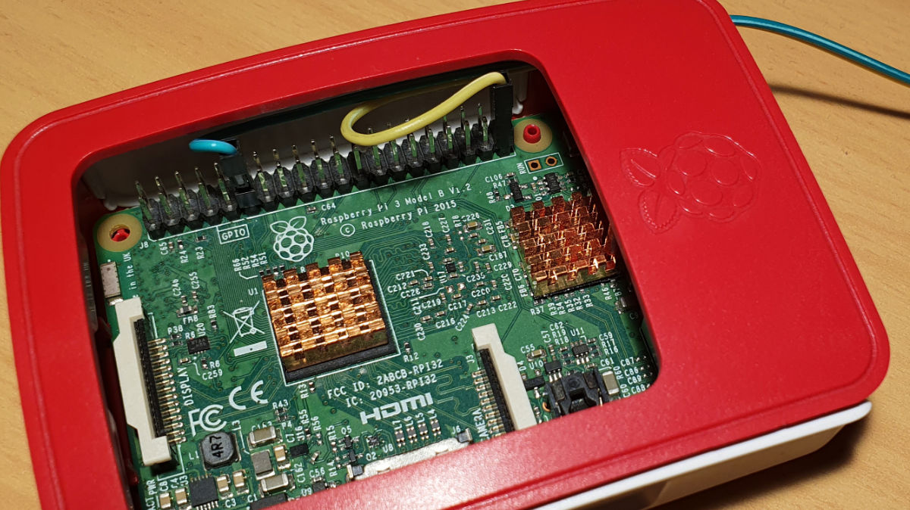
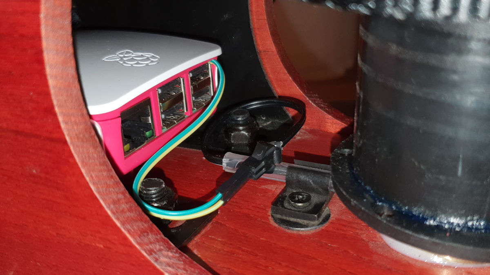
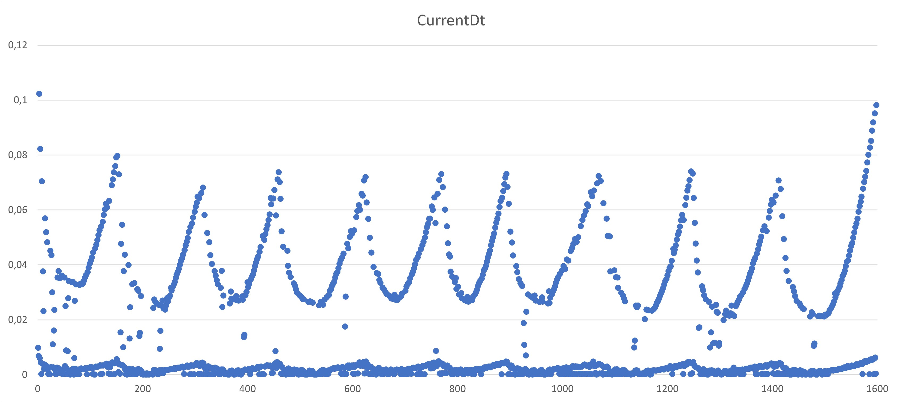

# Set up of OpenRowingMonitor

<!-- markdownlint-disable no-inline-html -->
This guide explains how to set up the rowing software and hardware. In this manual, we cover the following topics:

- [Requirements](#requirements)
- [Installing OpenRowingMonitor on your Raspberry Pi](#software-installation)
- [Physically connecting your rower to your Raspberry Pi](#hardware-installation)
- [Configuration of OpenRowingMonitor](#rower-settings)
- [Updating OpenRowingMonitor](#updating-openrowingmonitor-to-a-new-version)

If you can follow this guide, you will get OpenRowingMonitor to work. If you run into issues, you can always [drop a question in the GitHub Discussions](https://github.com/JaapvanEkris/openrowingmonitor/discussions), and there always is someone to help you.

## Requirements

- A Raspberry Pi that supports Bluetooth Low Energy.
  - Raspberry Pi Zero 2 W or WH
  - Raspberry Pi 3 Model A+, B or B+
  - Raspberry Pi 4 Model B
- An SD Card, any size above 4GB should be fine
- A rowing machine (obviously) with some way to measure the rotation of the flywheel
  - with a build in reed sensor that you can directly connect to the GPIO pins of the Raspberry Pi
  - if your machine doesn't have a sensor, it should be easy to build something similar (magnetically or optical)
- Some Dupont cables to connect the GPIO pins to the sensor
- Optionally, an ANT+ USB stick

The cheapest solution is a headless Raspberry Pi Zero 2W (roughly $15), the most expensive is a Raspberry Pi 4 Model B with a 7' tocuh screen in an ABS case (roughly $180). The choice is really yours, but for some data intensive machines (air based rowers with 4 or more magnets) do much better with a Raspberry Pi 4.

> [!NOTE]
> Due to architectual differences, OpenRowingMonitor will **NOT** work on a Raspberry Pi Zero or a Raspberry Pi 5

## Software Installation

### Initialization of the Raspberry Pi

<!-- pigpio availibility problems in Trixie -->
- Install **Raspberry Pi OS Lite (Legacy 64-bit)** on the SD Card i.e. with the [Raspberry Pi Imager](https://www.raspberrypi.org/software). This can be done by selecting "Raspberry Pi OS (other)" in the imager and then selecting "Raspberry Pi OS Lite (Legacy) 64-bit". The Legacy version is based on Debian 12 (Bookworm) and is required for compatibility - the current version of Raspberry Pi OS (based on Debian 13 Trixie) is not yet supported.
- In the Raspbverry Pi Imager, configure the network connection and enable SSH. In the Raspberry Pi Imager, you can automatically do this while writing the SD Card, just press `Ctrl-Shift-X`(see [here](https://www.raspberrypi.org/blog/raspberry-pi-imager-update-to-v1-6/) for a description), otherwise follow the instructions below
- Connect the device to your network ([headless](https://www.raspberrypi.org/documentation/configuration/wireless/headless.md) or via [command line](https://www.raspberrypi.org/documentation/configuration/wireless/wireless-cli.md))
- Enable [SSH](https://www.raspberrypi.org/documentation/remote-access/ssh/README.md)
- Tune the OS if needed [by following our performance improvement guide](Improving_Raspberry_Performance.md)

> [!NOTE]
> On a Raspberry Pi Zero 2W, you need to increase the swap-size to 1024 otherwise the installation of OpenRowingMonitor (i.e. the next step) will fail (see [this manual how to do this](https://pimylifeup.com/raspberry-pi-swap-file/));

### Installation of the OpenRowingMonitor software

Connect to the device with SSH and initiate the following command to set up all required dependencies and to install OpenRowingMonitor as an automatically starting system service:

```zsh
sudo /bin/bash -c "$(curl -fsSL https://raw.githubusercontent.com/jaapvanekris/openrowingmonitor/HEAD/install/install.sh)"
```

Just answer the questions from the script and OpenRowingMonitor will be installed for you completely.

> [!TIP]
> Might this install process fail for some reason, you can start it again withoug issue and it will continue where it left off. Especially during installation of npm packages, this is known to happen due to network issues.

<!-- markdownlint-disable-next-line no-inline-html -->
<details>

<!-- markdownlint-disable-next-line no-inline-html -->
<summary>Installing alternative branches</summary>

Sometimes you need some functionality that isn't released in our stable 'main' branch yet, so one of our developers advises you to install an experimental branch. Please do not install an experimental branch unless you known what you are doing and you are told explicitly by any of our developers, as some branches may not even be functional without warning. Installing an alternative branch can be done via:

```zsh
wget https://raw.githubusercontent.com/jaapvanekris/openrowingmonitor/HEAD/install/install.sh
```

Followed by opening the downloaded file in a text editor (nano in this case):

```zsh
sudo nano install.sh
```

Here, look for the line

```zsh
BRANCH="main"
```

And change the name of the branch into one of your choosing. Save the file. You can now install the branch by running

```zsh
sudo /bin/bash ./install.sh
```

Just answer the questions from the script and OpenRowingMonitor will be installed for you completely.

<!-- markdownlint-disable-next-line no-inline-html -->
</details>

### Check if OpenRowingMonitor runs without issue

Next, check you need to do is to check the status of the OpenRowingMonitor service, which you can do with the command:

```zsh
sudo systemctl status openrowingmonitor
```

Which typically results in the following response (with some additional logging):

```zsh
● openrowingmonitor.service - Open Rowing Monitor
     Loaded: loaded (/lib/systemd/system/openrowingmonitor.service; enabled; vendor preset: enabled)
     Active: active (running) since Sun 2022-09-04 10:27:31 CEST; 12h ago
   Main PID: 755 (npm start)
      Tasks: 48 (limit: 8986)
        CPU: 6min 48.869s
     CGroup: /system.slice/openrowingmonitor.service
             ├─755 npm start
             ├─808 sh /tmp/start-6f31a085.sh
             ├─809 node app/server.js
             ├─866 /usr/bin/node ./app/gpio/GpioTimerService.js
             └─872 /usr/bin/node ./app/ble/CentralService.js
```

Please check if there are no errors reported.

Please note that the process identification numbers will differ.

You can also look at the the log output of the OpenRowingMonitor-service by putting the following in the command-line:

```zsh
sudo journalctl -u openrowingmonitor
```

This allows you to see the current state of the rower. Typically this will show:

```zsh
Sep 12 20:37:45 roeimachine systemd[1]: Started Open Rowing Monitor.
Sep 12 20:38:03 roeimachine npm[751]: > openrowingmonitor@0.9.0 start
Sep 12 20:38:03 roeimachine npm[751]: > node app/server.js
Sep 12 20:38:06 roeimachine npm[802]: ==== Open Rowing Monitor 0.9.0 ====
Sep 12 20:38:06 roeimachine npm[802]: Setting priority for the main server thread to -5
Sep 12 20:38:06 roeimachine npm[802]: Session settings: distance limit none meters, time limit none seconds
Sep 12 20:38:06 roeimachine npm[802]: bluetooth profile: Concept2 PM5
Sep 12 20:38:06 roeimachine npm[802]: webserver running on port 80
Sep 12 20:38:06 roeimachine npm[862]: Setting priority for the Gpio-service to -7
Sep 12 20:38:09 roeimachine npm[802]: websocket client connected
```

Please check if there are no errors reported. The above snippet shows that OpenRowingMonitor is running, and that bluetooth and the webserver are alive, and that the webclient has connected.

### Check if OpenRowingMonitor screen runs without issue (if installed)

Next, check you need to do is to check the status of the OpenRowingMonitor service, which you can do with the command:

```zsh
sudo systemctl status webbrowserkiosk
```

Which typically results in the following response (with some additional logging):

```zsh
● webbrowserkiosk.service - X11 Web Browser Kiosk
     Loaded: loaded (/lib/systemd/system/webbrowserkiosk.service; enabled; vendor preset: enabled)
     Active: active (running) since Wed 2024-01-31 23:46:27 CET; 11h ago
   Main PID: 746 (xinit)
      Tasks: 82 (limit: 8755)
        CPU: 2min 50.292s
     CGroup: /system.slice/webbrowserkiosk.service
             ├─746 xinit /opt/openrowingmonitor/install/webbrowserkiosk.sh -- -nocursor
             ├─747 /usr/lib/xorg/Xorg :0 -nocursor
             ├─769 sh /opt/openrowingmonitor/install/webbrowserkiosk.sh
             ├─774 /usr/bin/openbox --startup /usr/lib/aarch64-linux-gnu/openbox-autostart OPENBOX
             ├─777 /usr/lib/chromium-browser/chromium-browser --enable-pinch --disable-infobars --disable-features=AudioServiceSandbox --kiosk --noerrdialogs --ignore-certificate-errors --disable-session-crashed-bubble --disable-pinch ->
             ├─804 /usr/lib/chromium-browser/chrome_crashpad_handler --monitor-self --monitor-self-annotation=ptype=crashpad-handler --database=/home/pi/.config/chromium/Crash Reports --annotation=channel=Built on Debian , running on De>
             ├─806 /usr/lib/chromium-browser/chrome_crashpad_handler --no-periodic-tasks --monitor-self-annotation=ptype=crashpad-handler --database=/home/pi/.config/chromium/Crash Reports --annotation=channel=Built on Debian , running >
             ├─810 /usr/lib/chromium-browser/chromium-browser --type=zygote --no-zygote-sandbox --crashpad-handler-pid=0 --enable-crash-reporter=,Built on Debian , running on Debian 11 --noerrdialogs --change-stack-guard-on-fork=enable
             ├─811 /usr/lib/chromium-browser/chromium-browser --type=zygote --crashpad-handler-pid=0 --enable-crash-reporter=,Built on Debian , running on Debian 11 --noerrdialogs --change-stack-guard-on-fork=enable
             ├─820 /usr/lib/chromium-browser/chromium-browser --type=zygote --crashpad-handler-pid=0 --enable-crash-reporter=,Built on Debian , running on Debian 11 --noerrdialogs --change-stack-guard-on-fork=enable
             ├─845 /usr/lib/chromium-browser/chromium-browser --type=gpu-process --enable-low-end-device-mode --ozone-platform=x11 --crashpad-handler-pid=0 --enable-crash-reporter=,Built on Debian , running on Debian 11 --noerrdialogs ->
             ├─850 /usr/lib/chromium-browser/chromium-browser --type=utility --utility-sub-type=network.mojom.NetworkService --lang=en-US --service-sandbox-type=none --ignore-certificate-errors --ignore-certificate-errors --crashpad-han>
             ├─858 /usr/lib/chromium-browser/chromium-browser --type=utility --utility-sub-type=storage.mojom.StorageService --lang=en-US --service-sandbox-type=utility --ignore-certificate-errors --ignore-certificate-errors --crashpad->
             ├─877 /usr/lib/chromium-browser/chromium-browser --type=broker
             └─884 /usr/lib/chromium-browser/chromium-browser --type=renderer --crashpad-handler-pid=0 --enable-crash-reporter=,Built on Debian , running on Debian 11 --noerrdialogs --change-stack-guard-on-fork=enable --first-renderer-p>
```

Please check if there are no errors reported.

Please note that the process identification numbers will differ.

### To use BLE and open the Web-Server on port 80

#### Running OpenRowingMonitor without root permissions (optional)

The default installation will run OpenRowingMonitor with root permissions. You can also run it as normal user by issueing the following command:

```zsh
sudo setcap cap_net_bind_service,cap_net_raw=+eip $(eval readlink -f `which node`)
```

#### To access ANT+ USB sticks

Create a file `/etc/udev/rules.d/51-garmin-usb.rules` with the following content:

```zsh
ATTRS{idVendor}=="0fcf", ATTRS{idProduct}=="1008", MODE="0666"
ATTRS{idVendor}=="0fcf", ATTRS{idProduct}=="1009", MODE="0666"
```

## Hardware Installation

Next step is is to hook up your sensor to the GPIO pins of the Raspberry Pi. Please check the [supported rower list](Supported_Rowers.md) if your machine requires additional electrical or mechanical modification. Some machines' sensors are placed wrong, so this might be corrected. Ideally, it reads the velocity of the flywheel (or anything directly connected to it).

OpenRowingMonitor reads the sensor signal from GPIO port 17 (as set by the `gpioPin` setting in `config.js`) and expects it to pull on GND if the sensor is closed. So your wiring probably looks like this:

<br clear="left">

To get a stable reading you should add a pull-up resistor to that pin. It is advised to use the internal resistor of the Raspberry Pi to keep the wiring simple but of course you can also go with an external circuit. The internal pull-up can be enabled as described [here](https://www.raspberrypi.org/documentation/configuration/config-txt/gpio.md). So its as simple as adding the following to `/boot/config.txt` and then rebooting the device.

``` Properties
# configure GPIO 17 as input and enable the pull-up resistor
gpio=17=pu,ip
```

How to connect this to your rowing machine physically is specific to your device. You need some kind of mechanism to convert the rotation of the flywheel into impulses. Some rowers have a reed sensor for this built-in, so hooking it up is as simple as connecting the cables. Such a sensor has one or more magnets on the wheel and each one gives an impulse when it passes the sensor.

<br clear="left">

There are some manuals covering a specific hardware-setup using the existing sensors, so please look at when relevant:

- [Concept 2 RowErg](hardware_setup_Concept2_RowErg.md)
- [Sportstech WRX700](hardware_setup_WRX700.md)

If you do not have and does not have something like this or if the sensor is not accessible, you can still build something similar quite easily. Some ideas on what to use:

- Reed sensor (i.e. of an old bike tachometer)
- HAL effect sensor
- PAS sensor (i.e. from an E-bike)
- Optical chopper wheel

From there on, please make sure to also follow the [setup guide for unknown rowing machines (and adjust settings)](rower_settings.md) to get the right parameters to get your setup working.

## Rower Settings

Last step is to configure the rowing machine specific parameters of the software. To do this, you should now adjust the rower specific parameters in `config/config.js` to suit your rowing machine and your personal needs. You can also have a look at `config/default.config.js` to see what additional config parameters are available. To open the configuration, you can do

```zsh
sudo nano /opt/openrowingmonitor/config/config.js
```

> [!TIP]
> This essentially is a JSON structure, which is quite sensitive to missing or extra commas. Unless it is the last property in a list (i.e. before a closing curly brace), always end a property with a comma.

### Setting up the hardware and OS configuration

A key element is how the app behaves on the operating system itself.

#### Application settings

OpenRowingMonitor essentially consists of two major threads: the gpio-thread, reading data from the flywheel, and the general application thread. In the settings, you can set their priorities individually. This is the Linux NICE level: minimum setting is +19 (least agressive), theoretical maximum setting is -20 (most agressive). The lower the NICE-number, the more priority it will claim, at the expense of other functions of the operating system.

Most critical is the `gpioPriority`. This determines the system level priority of the thread that measures the rotation speed of the flywheel. This might improve the precision of the measurements (especially on rowers with a fast spinning flywheel). This is normally set to a NICE-level of 0 (normal OS priority). On a well-configured system, the level of noise in the GPIO-thread can be identified by looking at the reported Goodness of Fit from the drag calculation: the better the fit, the lower the noise level. Setting the NICE-level below -1 on a non-PREEMPT kernel might cause the app to crash. Going beyond -7 on a PREEMPT kernel seems to kill the timing of the gpio-thread as it interferes with the kernel timekeeping. On a dedicated Raspberry Pi 4, best results for a Concept2 RowErg (100 datapoints per second) were attained by using a NICE-level of -6.

The NICE-level of the general application is determined by the `appPriority` setting. This maanges the system level priority of the thread that processes the flywheel and HR data. Although this process is not time critical per se, it could get caught up in Linux housekeeping tasks, preventing it to process data in a timely manner. Again, setting this below -1 on a non-PREEMPT kernel might cause the app to crash. Going beyond -5 on a PREEMPT kernel seems to kill the timing of the app, and best results on a Raspberry Pi 4 with a Concept 2 RowErg were attained at NICE-level -1.

#### GPIO settings

The setting `gpioPin` defines the GPIO Pin that is used to read the sensor data from the rowing machine. Please refer to the [official Rapberry Pi documentation](https://www.raspberrypi.org/documentation/usage/gpio) for the pin layout of the device you are using. If you want to use the internal pull-up resistor of the Raspberry Pi (and you should) you should also configure the pin for that in /boot/config.txt, i.e. 'gpio=17=pu,ip' (see the [official Raspberry Pi documentation](https://www.raspberrypi.org/documentation/configuration/config-txt/gpio.md)).

The setting `gpioPollingInterval` determines the GPIO polling interval: this is the interval at which the GPIO is inspected for state changes on the gpioPin, in microseconds (us). Valid values are 1 (i.e. 1,000,000 samples per second), 2 (i.e. 500,000 per second), 4 (i.e. 250,000 per second), 5 (i.e. 200,000 per second) and 10 (i.e. 100,000 per second). A high sample rate will burden your CPU more. Normal value is 5us, but a Raspberry Pi 4 can handle a polling interval of 1 us, which results in a 16% CPU load.

The setting `gpioTriggeredFlank` determines what flank is used for detecting a magnet. Valid values are

- 'Up' for the upward flank, i.e. the GPIO is triggered when the magnet enters the sensors' range (i.e. first there was no magnet detected, followed by a detected magnet);
- 'Down' for the downward flank, i.e. the GPIO is triggered when the magnet leaves the sensors' range (i.e. first there was magnet detected, followed by no detected magnet);
- 'Both' for both flanks. This option is quite unique, as this requires a strong symmetry in the signal. Normally the magnets provide short pulses, followed by long periods of no magnet being detected. Only very specific machines can use this option.

In practice, it shouldn't matter much which of the two flanks you detect, although in the presence of [debounce](https://github.com/JaapvanEkris/openrowingmonitor/blob/main/docs/rower_settings.md#fixing-switch-bounce), a specific flank might provide better filtering capabilities or is more reliable to detect.

The setting `gpioMinimumPulseLength` is related: it determines the minumum pulse length (i.e. a magnet should be present) in nanoseconds before OpenRowingMonitor considers it a valid signal. Shorter pulses typically are caused by ghost readings of the same magnet twice or more. Normal value is 50 us, but for some rowers, values up to 500 us are known to work. Increasing this value reduces ghost readings due to bouncing reed switches etc., which typically are detected as very short measurements in the raw logs.



Making this too long results in missed impulses. Both too long and too short impulses can be detected in the raw logs easily by imprting that log into a spreadsheet and plot the pulsetime.

### Setting up the rowing machine connected

Please check the [list of known configurations](Supported_Rowers.md), as for many machines the configuration is already listed in the `/opt/openrowingmonitor/config/rowerProfiles.js` file. If this is the case, copy its name, and add it to the config as follows:

```js
rowerSettings: rowerProfiles.Concept2_RowErg
```

If your machine isn't listed, you are adviced to follow the [setup guide for unknown rowing machines (and adjust settings)](rower_settings.md) as it goes into much more depth about installing OpenRowingMonitor on an unknown machine.

### Setting up data aquisition and reporting parameters

#### General data reporting settings

OpenRowingMonitor calculates metrics once, and then distributes the same metrics to all consumers (i.e. BLE, ANT+ devices, but also the weinterface and recorders). This impleas that data are always consistent across all recordings and visualisations.

A key element is the number of stroke phases (i.e. Drives and Recoveries) that used to smoothen the data displayed on your screens (i.e. the monitor, but also bluetooth devices, etc.) and recorded data, which is set via the `numOfPhasesForAveragingScreenData` parameter. This is a matter of personal preference: some people prefer a very responsive screen, others like a more stable data presentation. A nice smooth experience is found at 6 stroke phases (i.e. 3 complete strokes). A much more volatile (but more accurate and responsive) is found around 3. The minimum is 2, but for recreational rowers that might feel much too restless to be useful.

#### Setting up your heart rate sensor

The parameter `heartRateMode` determines the heart rate monitor mode at startup. From the monitor or webinterface, you can change this on the spot as well. This setting has the following modes:

- BLE: Use Bluetooth Low Energy to connect Heart Rate Monitor. It will connect to the first device found;
- ANT: Use Ant+ to connect Heart Rate Monitor. This requires an optional ANT+ stick. This will also connect to the first ANT+ HRM monitor found.
- OFF: turns of Heart Rate Monitor discovery

#### Configuration of the main screen/webinterface

OpenRowingMonitor will always refresh the monitor and webinterface when it detects a drive, recovery or new interval. The parameter `webUpdateInterval` determines the interval for updating all web clients (i.e. the monitor and other users) in miliseconds in between these events. It is advised is to update at least once per second (1000 ms), to make sure the timer moves nice and smoothly. Around 100 ms results in a very smooth update experience for distance as well, and values below 80 ms will be ignored. Please note that a smaller value will use more network and cpu ressources.

#### Setting up Bluetooth reporting

Bloothooth Low Energy has several parameters. Most important one is `bluetoothMode` which will determine the Bluetooth Low Energy Profile that is broadcasted to external peripherals and apps at startup. From the monitor or webinterface, you can change this on the spot as well. This setting has the following modes:

- OFF: Turns Bluetooth advertisement off
- PM5: in this mode OpenRowingMonitor emulates a this emulates a part of the Concept2 PM Bluetooth Smart Communication Interface Definition. This is still work in progress and only implements the most common parts of the spec, so it is not guaranteed to work with all applications that support C2 rowing machines. Our interface currently can only report metrics, but can't recieve commands and session parameters from the app yet. It is known to work with [EXR](https://www.exrgame.com) and all the samples from [The Erg Arcade](https://ergarcade.com), for example you can [row in the clouds](https://ergarcade.github.io/mrdoob-clouds/).
- FTMS: This is the FTMS profile for rowing machines and supports all rowing specific metrics (such as stroke rate). We've successfully tested it with [EXR](https://www.exrgame.com) (preferred method), [MyHomeFit](https://myhomefit.de) and [Kinomap](https://www.kinomap.com).
- FTMSBIKE: This FTMS profile is used by Smart Bike Trainers and widely adopted by training applications for bike training. It does not support rowing specific metrics. But it can present metrics such as power and distance to the biking application and use cadence for stroke rate.(please note: the speed and power are still aimed for rowing, NOT for a bike!) This is known to work with [Zwift](https://www.zwift.com), [Bkool](https://www.bkool.com), [The Sufferfest](https://thesufferfest.com) or similar.
- CPS: The BLE Cycling Power Profile simulates a bike which allows you to connect the rower to a bike activity on your (mostly newer Garmin) sportwatch. It will translate the rowing metrics to the appropriate fields. This profile is only supported by specific watches, so it might provide a solution.
- CSC: The BLE Cycling Speed and Cadence Profile simulates a bike for older Garmin (Forerunner and Venu) watches and similar types, again simulating a bike activity.

> [!NOTE]
> For the CSC profile, you need to set the wheel circumference on your watch to 10mm to make this work well.

There are some additional parameters for tuning your settings for speific BLE profiles:

- `ftmsRowerPeripheralName` sets the name that is used to announce the FTMS Rower via Bluetooth Low Energy (BLE). Some rowing training applications expect that the rowing device is announced with a certain name, so changing this sometimes helps.
- `ftmsBikePeripheralName` defines the name that is used to announce the FTMS Bike via Bluetooth Low Energy (BLE). Most bike training applications are fine with any device name.
- `ftmsUpdateInterval` determines the interval between updates of the `FTMS` and `FTMS` protocol BLE devices, in miliseconds. Advised is to update at least once per second (default value), as consumers expect this interval. Some apps, like EXR like a more frequent interval of 200 ms to better sync the stroke.
- `pm5UpdateInterval` determines the interval between updates of the `PM5` protocol BLE device, in miliseconds. Advised is to update at least once per second (default value), as consumers expect this interval. Some apps, like EXR like a more frequent interval of 200 ms to better sync the stroke.

#### Setting up ANT+

The parameter `antPlusMode` determines if ANT+ is activated at startup. From the monitor or webinterface, you can change this on the spot as well.

- FE: OpenRowingMonitor will broadcast rowing metrics via ANT+ Fitness Equipment (ANT+ FE-C), which can be recieved by the more expensive series of Garmin smartwatches like the Epix/Fenix series, which then can calculate metrics like training load etc..
- OFF: Turns ANT+ advertisement off.

### Setting up recording parameters

These are turned off by default. To see how you turn them on and how to configure them, see our [integrations page](Integrations.md).

### Setting up a user profile

### Setting up integrations to Strava, intervals.icu and RowsAndAll.com

These are turned off by default. To see how you turn them on and how to configure them, see our [integrations page](Integrations.md).

### Checking the configuration

Once all parameters are set, restart OpenRowingMonitor and look at the the log output of the OpenRowingMonitor-service by putting the following in the command-line:

```zsh
sudo systemctl restart openrowingmonitor 
sudo journalctl -u openrowingmonitor
```

This allows you to see the current state of the rower. Typically this will show:

```zsh
Sep 12 20:37:45 roeimachine systemd[1]: Started Open Rowing Monitor.
Sep 12 20:38:03 roeimachine npm[751]: > openrowingmonitor@0.9.0 start
Sep 12 20:38:03 roeimachine npm[751]: > node app/server.js
Sep 12 20:38:06 roeimachine npm[802]: ==== Open Rowing Monitor 0.9.0 ====
Sep 12 20:38:06 roeimachine npm[802]: Setting priority for the main server thread to -5
Sep 12 20:38:06 roeimachine npm[802]: Session settings: distance limit none meters, time limit none seconds
Sep 12 20:38:06 roeimachine npm[802]: bluetooth profile: Concept2 PM5
Sep 12 20:38:06 roeimachine npm[802]: webserver running on port 80
Sep 12 20:38:06 roeimachine npm[862]: Setting priority for the Gpio-service to -7
Sep 12 20:38:09 roeimachine npm[802]: websocket client connected
```

Please check if there are no errors reported, especially for configuration parameters. OpenRowingMonitor will report if it detects abnormal or missing parameters.

## Updating OpenRowingMonitor to a new version

OpenRowingMonitor does not provide proper releases (yet), but you can update to the latest development version with this command:

```zsh
updateopenrowingmonitor.sh
```
