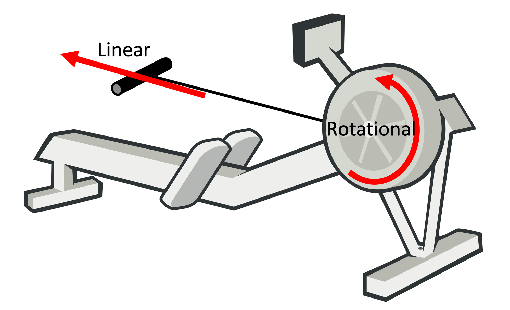
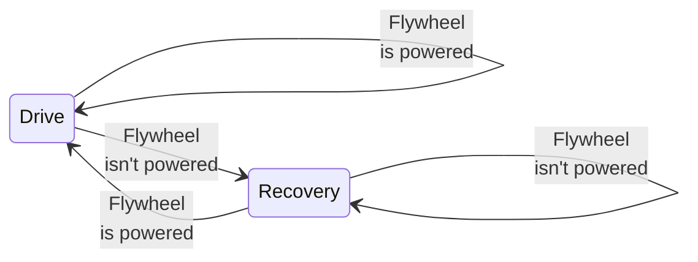
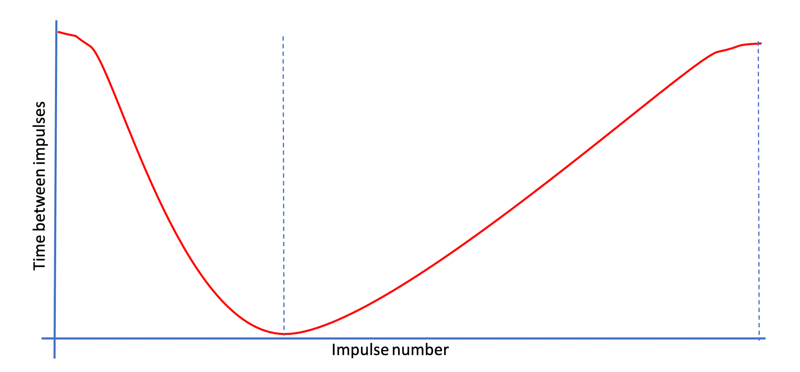
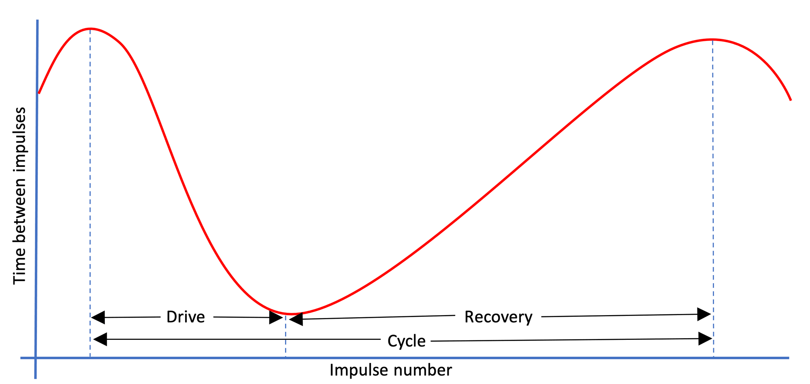
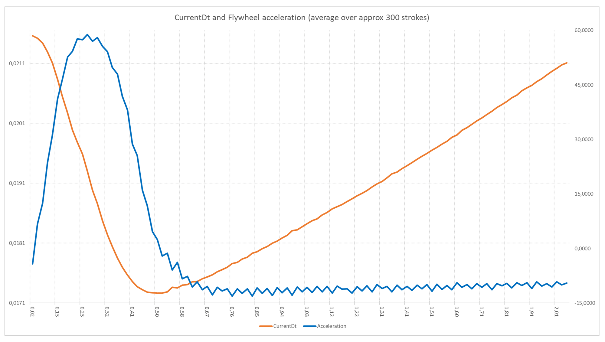
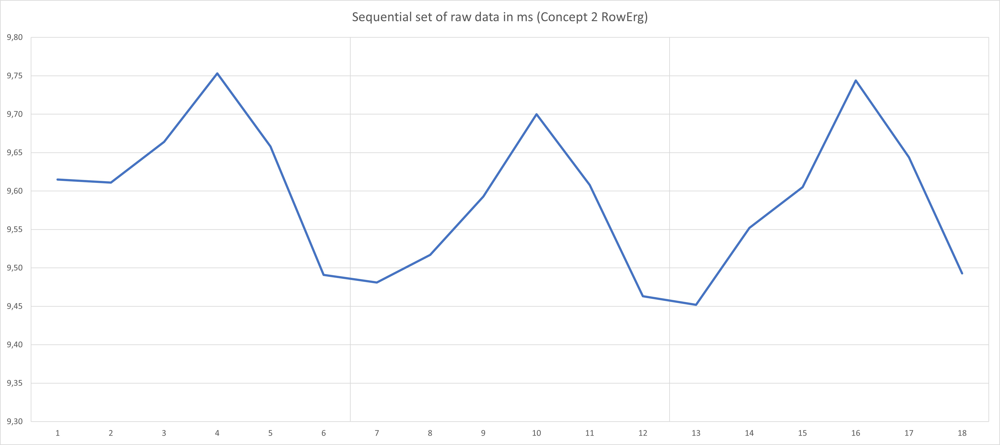

# The physics behind Open Rowing Monitor

<!-- markdownlint-disable no-inline-html -->
In this document we explain the physics behind the Open Rowing Monitor, to allow for independent review and software maintenance. This work wouldn't have been possible without some solid physics, described by some people with real knowledge of the subject matter. Please note that any errors in our implementation probably is on us, not them. When appropriate, we link to these sources. When possible, we also link to the source code to allow further investigation and keep the link with the actual implementation.

Please note that this text is used as a rationale for design decissions of the physics used in Open Rowing Monitor. So it is of interest for people maintaining the code (as it explains why we do things the way we do) and for academics to verify or improve our solution. For these academics, we conclude with a section of open design issues as they might provide avenues of future research. If you are interested in just using Open Rowing Monitor as-is, this might not be the text you are looking for.

## Basic concepts

Before we analyze the physics of a rowing engine, we first need to define the basic concepts. First we identify the key physical systems at play, then we define the key phases in the rowing stroke.

### Physical systems in a rower

A rowing machine effectively has two fundamental movements:

* a **linear** movement (the rowing person moving up and down the rail, or a boat moving forward) and
* a **rotational** movement where the energy that the rower inputs in the system is absorbed through a flywheel (either a solid one, or a liquid one) [[1]](#1).

Physically these movements are related, as they are connected by a chain or belt, allowing the rowing person to move the flywheel. This is shown in the following figure:

A basic view of an indoor rower's energy systems

The linear and rotational speeds are related: the stronger/faster you pull in the linear direction, the faster the flywheel will rotate. The rotation of the flywheel simulates the effect of a boat in the water: after the stroke, the boat will continue to glide only be dampened by the drag of the boat, so does the flywheel.

There are several types of rowers:

* **Water resistance**, where rowing harder will increase the resistance

* **Air resistance**: where rowing harder will increase the resistance

* **Magnetic resistance**: where the resistance is constant

There are also hybrid rowers, which combine air resistance and magnetic resistance. The differences in physical behavior can be significant, for example a magnetic rower has a constant resistance while a air rower's resistance is dependent on the flywheel's speed. We suspect that on a water rower behaves slightly different from an air rower, as the rotated water mass changes shape when the rotational velocity changes. Currently for Open Rowing Monitor, we consider that the key principle is similar enough for all these rowers (some mass is made to spin and drag brings its speed down) to treat them all as an air rower as a first approximation. However, we are still investigating how to adapt for these specific machines.

### Phases in the rowing stroke

What seperates rowing from many other sports is its discontinous nature: for example, in Cycling the force constantly shifts between left and right leg, but remains relatively constant throughout the rotation. In rowing, a stroke begins with a powerful *Drive* phase, which is followed by an unpowered *Recovery*. Visually, it can be depicted as follows:

Basic phases of a rowing stroke

On an indoor rower, the rowing cycle will always start with a stroke, followed by a recovery. We define them as follows:

* The **Drive phase**, where the rower pulls on the handle

* The **Recovery Phase**, where the rower returns to his starting position

Combined, we define a *Drive* followed by a *Recovery* a **Stroke**. In the calculation of several metrics, the requirement is that it should include *a* *Drive* and *a* *Recovery*, but order isn't a strict requirement for some metrics [[2]](#2). We define such combination of a *Drive* and *Recovery* without perticular order a **Cycle**, which allows us to calculate these metrics twice per *stroke*.

## Leading design principles of the rowing engine

As described in [the architecture](Architecture.md), the rowing engine is the core of Open Rowing Monitor and consists of three major parts:

* `engine/Flywheel.js`, which determines rotational metrics,

* `engine/Rower.js`, which transforms rotational metrics in a rowing state and linear metrics,

* `engine/RowingStatistics.js`, which manages session state, session metrics and optimizes metrics for presentation.

Although the physics is well-understood and even well-described publicly (see [[1]](#1),[[2]](#2),[[3]](#3) and [[4]](#4)), applying these formulae in a practical solution for multiple rowers delivering reliable results is quite challenging. Especially small errors, noise, tends to produce visible effects on the recorded metrics. Therefore, in our design of the physics engine, we obey the following principles (see also [the architecture document](Architecture.md)):

* stay as close to the original data as possible (thus depend on direct measurements as much as possible) instead of heavily depend on derived data. This means that there are two absolute values we try to stay close to as much as possible: the **time between an impulse** and the **Number of Impulses**, where we consider **Number of Impulses** most reliable, and **time between an impulse** reliable but containing noise (the origin and meaning of these metrics, as well the effects of this approach are explained later);

* use robust calculations wherever possible (i.e. not depend on a single measurements, extrapolations, derivation, etc.) to reduce effects of measurement errors. A typical issue is the role of *CurrentDt*, which is often used as a divisor with small numers as &Delta;t, increasing the effect of measurement errors in most metrics. When we do need to calculate a derived function, we choose to use a robust linear regression method to reduce the impact of noise and than use the function to calculate the derived function;

* Be as close to the results of the Concept2 when possible and realistic, as they are considered the golden standard in indoor rowing metrics.

## Relevant rotational metrics

Typically, actual measurements are done in the rotational part of the rower, on the flywheel. We explicitly assume that Open Rowing Monitor measures the flywheel movement (directly or indirectly). Some rowing machines are known to measure the movement of the driving axle and thus the velocity and direction of the handle, and not the driven flywheel. This type of measurement blocks access to the physical behaviour of the flywheel (especially acceleration and coast down behaviour), thus making most of the physics engine irrelevant. Open Rowing Monitor can handle some of these rowing machines by fixing specific parameters, but as this measurement approach excludes any meaningful measurement, we will exclude it in the further description.

In a typical rowing machine, there is a magnetic reed sensor or optical sensor that will measure time between either magnets or reflective stripes on the flywheel or impellor, which gives an **Impulse** each time a magnet or stripe passes. For example, when the flywheel rotates on a NordicTrack RX800, the passing of a magnet on the flywheel triggers a reed-switch, that delivers a pulse to our Raspberry Pi.

Depending on the **number of impulse providers** (i.e. the number of magnets or stripes), the number of impulses per rotation increases, increasing the resolution of the measurement. As described in [the architecture](Architecture.md), Open Rowing Monitor's `GpioTimerService.js` measures the time between two subsequent impulses and reports as a *currentDt* value. The constant stream of *currentDt* values is the basis for all our angular calculations, which are typically performed in the `pushValue()` function of `engine/Flywheel.js`.

Open Rowing Monitor needs to keep track of several metrics about the flywheel and its state, including:

* The **Angular Distance** of the flywheel in Radians (denoted with &theta;): in essence the distance the flywheel has traveled (i.e. the number of Radians the flywheel has rotated) since the start of the session;

* The **Time since start** of the flywheel in seconds (denoted with t): in essence the time the flywheel has been spinning since the start of the session;

* The **Angular Velocity** of the flywheel in Radians \* s-1 (denoted with &omega;): in essence the number of (partial) rotations of the flywheel per second;

* The **Angular Acceleration** of the flywheel in Radians \* s-2 (denoted with &alpha;): the acceleration/deceleration of the flywheel;

* The **flywheel inertia** of the flywheel in kg \* m2 (denoted with I): the resistance of the flywheel to acceleration/deceleration;

* The *estimated* **drag factor** of the flywheel in N \* m \* s2 (denoted with k): the level of (air/water/magnet) drag encountered by the flywheel, as a result of a damper setting.

* The **Torque** of the flywheel in kg \* m2 \* s-2 (denoted with &tau;): the momentum of force on the flywheel.

* Detecting power on the flywheel: whether there is a force on the flywheel.

Being limited to the time between impulses, *currentDt*, as only measurement means we can't measure any of these metrics directly, and that we have to accept some deviations in these measurements as they are reported in discrete intervals.

Additionally, small mechanical deviations, vibrations in the chassis (due to tiny unbalance in the flywheel) and latency inside the software stack can lead to small deviations the measurement of *currentDt*. Dealing with these deviations is an dominant issue, especially because we have to deal with a wide range machines. Aside from implementing noise reduction, we also focus on using robust calculations: calculations that don't deliver radically different results when a small measurement error is introduced in the measurement of *currentDt*. We typically avoid things like direct deriviations based on single values, as directly deriving over small values of *currentDt* with small errors typically produce huge deviations in the resulting estimate. As an alternative, we use (robust) regression over multiple values, and use the deriviations of the resulting function instead. We do this at the cost of reducing the accuracy of the data, as this approach tends to dampen real occuring peaks in the stroke data. However, this inaccuracy with respect to the perfect theoretical model is needed to prevent estimates to become too unstable for practical use or which can only be used with heavy smoothing later on in the process (typically smoothing across strokes by `engine/RowingStatistics.js`).

### Determining the "Time since start" of the flywheel

This can easily be measured by summarising the **time between an impulse**. Noise has little to no impact to this metric as on average the noise cancels out.

### Determining the "Angular Position" of the flywheel

As the impulse-givers are evenly spread over the flywheel, this can be robustly measured by counting the total number of impulses, **Number of Impulses**, and multiply it with the **angular displacement** between two **impulses** (i.e. ${2&pi; \over number of impulse providers on the flywheel}$).

In theory, there are two threats here:

* Potentially missed impulses due to sticking sensors or too short intervals for the Raspberry Pi to detect them. So far, this hasn't happened.
* Ghost impulses, typically caused by **bounce** effects of the sensor where the same magnet is seen twice by the sensor. The best resolution is a better mechanical construction of magnets and sensors or adjust the **debounce filter**.

### Determining the "Angular Velocity" and "Angular Acceleration" of the flywheel

The traditional approach [[1]](#1), [[8]](#8), [[13]](#13) suggeste a numerical approach to Angular Velocity &omega;:

$$ &omega; = {&Delta;&theta; \over &Delta;t} $$

This formula is dependent on &Delta;t, which is suspect to noise, making this numerical approach to the calculation of &omega; volatile. From a more robust perspective, we approach &omega; as the the first derivative of the function between *time since start* and the angular position &theta;, where we use a robust regression algorithm to determine the function and thus the first derivative.

The traditional numerical approach [[1]](#1), [[8]](#8), [[13]](#13) Angular Acceleration &alpha; would be:

$$ &alpha; = {&Delta;&omega; \over &Delta;t} $$

Again, the presence of &Delta;t would make this alculation of &alpha; volatile. From a more robust perspective, we approach &alpha; as the the second derivative of the function between *time since start* and the angular position &theta;, where we use a robust regression algorithm to determine the function and thus the second derivative.

Summarizing, both Angular Velocity &omega; and Angular Acceleration &alpha; are determined through the same regression algorithm based on the derivatives of the function between *time since start* and the angular position &theta;, where the first derivative of the function represents the Angular Velocity &omega; and the second derivative represents the Angular Acceleration &alpha;.

### Determining the "drag factor" of the flywheel

In the recovery phase, the only force exerted on the flywheel is the (air-/water-/magnetic-)resistance. Thus we can calculate the *drag factor of the flywheel* based on deceleration through the recovery phase [[1]](#1). This calculation is performed in the `markRecoveryPhaseCompleted()` function of `engine/Flywheel.js`. There are several approaches described in literature [[1]](#1), which Open Rowing Monitor extends to deliver a reliable and practically applicable approach.

A first numerical approach is presented by through [[1]](#1) in formula 7.2a:

$$ k = - I \* {&Delta;&omega; \over &Delta;t} * {1 \over &Delta;&omega;^2} $$

Where the resulting k should be averaged across the rotations of the flywheel. The downside of this approach is that it introduces &Delta;t in the divider of the drag calculation, making this calculation potentially volatile, especially in the presence of systematic errors in the flywheel construction (as is the case with Concept2 Model D and later). Our practical experience based on testing confirms this volatility. An alternative numerical approach is presented by through [[1]](#1) in formula 7.2b:

$$ k = -I \* {&Delta;({1 \over &omega;}) \over &Delta;t} $$

Where this is calculated across the entire recovery phase. Again, the presence of &Delta;t in the divider potentially introduces a type of undesired volatility. Testing has shown that even when &Delta;t is chosen to span the entire recovery phase, reducing the effect of single values of *CurrentDt*, the calculated drag factor is more stable but still is too unstable to be used as both the &omega;'s used in this calculation still depend on single values of *CurrentDt*. Additionally, small errors in detection of the drive or recovery phase would change &omega; dramatically, throwing off the drag calculation significantly (see also [this elaboration](physics_openrowingmonitor.md#use-of-simplified-power-calculation)). Therefore, such an approach typically requires averaging across strokes to prevent drag poisoning (i.e. a single bad measurement of *currentDt* throwing off the drag factor significantly, and thus throwing off all dependent linear metrics significantly), which still lacks robustness of results as drag tends to fluctuate throughout a session.

To make this calculation more robust, we again turn to regression methods (as suggested by [[7]](#7)).  We can transform formula 7.2 to the definition of the slope of a line, by doing the following:

$$ { k \over I } = {&Delta;({1 \over &omega;}) \over &Delta;t} $$

Thus k/I represents the slope of the graph depicted by *time since start* on the *x*-axis and ${1 \over &omega;}$ on the *y*-axis, during the recovery phase of the stroke. However, this formula can be simplified further, as the angular velocity &omega; is determined by:

$$ &omega; = {({2&pi; \over Impulses Per Rotation}) \over currentDt} $$

thus making:

$$ { k \over I } = {&Delta;({1 \over {({2&pi; \over Impulses Per Rotation}) \over currentDt}}) \over &Delta;t} $$

removing the division, results in

$$ { k \over I } = {&Delta;(currentDt \* {Impulses Per Rotation \over 2&pi;}) \over &Delta;t} $$

Since we are multiplying *currentDt* with a constant factor (i.e. ${Impulses Per Rotation \over 2&pi;}$), we can further simplify the formula by moving this multiplication outside the slope-calculation. Effectively, making the formula:

$$ {k \* 2&pi; \over I \* Impulses Per Rotation} = {&Delta;currentDt \over &Delta;t} $$

As the left-hand of the equation only contains constants and the dragfactor, and the right-hand a division of two delta's, we can use regression to calculate the drag. As the slope of the line *currentDt* over *time since start* is equal to ${k \* 2&pi; \over I \* Impulses Per Rotation}$, the drag thus can be determined through

$$ k = slope \* {I \* Impulses Per Rotation \over 2&pi;} $$

As this formula shows, the drag factor is effectively determined by the slope of the line created by *time since start* on the *x*-axis and the corresponding *CurrentDt* on the *y*-axis, for each recovery phase.

This slope can be determined through linear regression (see [[5]](#5) and [[6]](#6)) for the collection of datapoints for a specific recovery phase. This approach also brings this calculation as close as possible to the raw data, and doesn't use individual *currentDt*'s as a divider, which are explicit design goals to reduce data volatility. For determining the slope, we use the linear Theil-Sen Estimator, which is sufficiently robust against noise, especially when filtering on low R2. On a Concept2, the typical R2 is around 0.96 (low drag) to 0.99 (high drag) for steady state rowing. The approach of using r2 has the benefit of completely relying on metrics contained in the algorithm itself for quality control: the algorithm itself signals a bad fit due to too much noise in the calculation. Additionally, as the drag does not change much from stroke to stroke, a running weighed average across several strokes is used, where the R2 is used as its weight. This has the benefit of favouring better fitting curves over less optimal fitting curves (despite all being above the R2 threshold set). Practical experiments show that this approach outperforms any other noise dampening filter.

### Determining the "Torque" of the flywheel

The torque &tau; on the flywheel can be determined based on formula 8.1 [[1]](#1):

$$ &tau; = I \* ({&Delta;&omega; \over &Delta;t}) + D $$

As ${&Delta;&omega; \over &Delta;t}$ = &alpha; and D = k \* &omega;2 (formula 3.4, [[1]](#1)), we can simplify this further by:

$$ &tau; = I \* &alpha; + k \* &omega;^2 $$

As &alpha; and &omega; have been derived in a robust manner, and there are no alternative more robust approaches to determining instant &tau; that allows for handle force curves, we consider this the best attainable result. Testing shows that the results are quite useable.

## Detecting the stroke phase

One of the key elements of rowing is detecting the stroke phases and thus calculate the associated metrics for that phase. Assuming that `engine/Flywheel.js` has determined whether there is a force present on the flywheel, `engine/Rower.js` can now transform this information into the phase of the rowing stroke. On an indoor rower, the rowing cycle will always start with a drive, followed by a recovery. This results in the follwing phases:

* The **Drive phase**, where the rower pulls on the handle, some force on the flywheel is excerted and the flywheel is accelerating or at least not decelerating in accordance with the drag;

* The **Recovery Phase**, where the rower returns to his starting position and the flywheel decelerates as the drag on the flywheel is slowing it down;

As the rowing cycle always follows this fixed schema, Open Rowing Monitor models it as a finite state machine (implemented in `handleRotationImpulse` in `engine/Rower.js`).

Finite state machine of rowing cycle

From the perspective of Open Rowing Monitor, there only is a stream of *CurrentDt*'s, which should form the basis of this detection:

The following picture shows the time between impulses through time:

example currentDt Measurements of a flywheel

Open Rowing Monitor combines two types of force detection, which work independently: *basic force detection* and *advanced stroke detection*. Both can detect a stroke accuratly, and the combination has proven its use.

In `engine/Flywheel.js`, two functions provide force detection, which use the following criteria before attempting a stroke phase transition:

* `isPowered()`: which indicates a force is present, suggesting a drive phase. This is true when the slope of a series of *flankLength* times between impulses is below the **minumumRecoverySlope** (i.e. accelerating, as is the case in the measurements in above figure before the dotted line) AND the handleforce is above **minumumForceBeforeStroke** (i.e. the torque &tau; is above a certain threshold);

* `isUnpowered()`: which indicates that there is no force present, suggesting a recovery phase. This is true when the slope of a series of *flankLength* times between impulses is above the **minumumRecoverySlope** (i.e. decelerating, as is the case in the measurements in above figure after the dotted line) where the goodness of fit of that slope exceeds the **minimumStrokeQuality** OR the handleforce is below **minumumForceBeforeStroke** (i.e. the torque &tau; is below a certain threshold)

The choice for the logical relations between the two types of force detection is based on testing: where a sudden presence of force on a flywheel (i.e. the start of a drive) is quite easily and consistently detected, its abscence has proven to be more difficult. In practice, the beginning of a drive is easily recognised as strong leg muscles excert much force onto the flywheel in a very short period of time, leading to an easily recognisable (large) torque &tau; and a sudden decrease in currentDt's. The end of the drive is more difficult to assess, as the dragforce of the flywheel increases with its speed, and the weaker arm muscles have taken over, making the transition to the recovery much harder to detect. In theory, in the end of the drive phase the drag force might be bigger than the force from the arms, resulting in an overall negative torque.

In the remainder of this paragraph, we describe the underlying physics of both these force detection methods.

### Basic force detection through currentDt slope

One of the key indicator is the acceleration/decelleration of the flywheel. Looking at a simple visualisation of the rowing stroke, we try to achieve the following:

Impulses, impulse lengths and rowing cycle phases

Here we plot the *currentDt* against its sequence number. So, a high *currentDt* means a long time between impulses (so a low *angular velocity*), and a low *currentDt* means that there is a short time between impulses (so a high *angular velocity*).

Here, it is clear that the flywheel first accelerates (i.e. the time between impulses become smaller), suggesting a powered flywheel. Next it decelerates (i.e. the time between impulses become bigger), which suggests an unpowered flywheel. This pattern is typical for the rowing motion.

The simple force detection uses this approach by looking at the slope of *currentDt* over time. Given that the *Angular Displacement* between impulses is fixed, we can deduct some things simply from looking at the subsequent *time between impulses*, *currentDt*. When the *currentDt* shortens, *Angular Velocity* is increasing, and thus the flywheel is accelerating (i.e. we are in the drive phase of the rowing cycle). When times between subsequent impulses become longer, the *Angular Velocity* is decreasing and thus the flywheel is decelerating (i.e. we are the recovery phase of the rowing cycle). As a rough but very robust approximation, a descending (negative) slope indicates a powered flywheel, an (positive) ascending slope indicates an unpowered flywheel. This approach seems to be similar to the implementation used by industry leaders like Concept2. Concept2 are generally considered the golden standard when it comes to metrics, and they state (see [this Concept2 FAQ](https://www.concept2.com/service/software/ergdata/faqs):

> Drive time is measured by the amount of time the flywheel is accelerating. Note: It is possible that the athlete may pull on the handle and not accelerate the flywheel due to no energy being put into it and therefore no effective effort. This portion of the handle pull is not measured.

A more nuanced, but more vulnerable, approach is to compare the slope of this function with the typical slope encountered during the recovery phase of the stroke (which routinely is determined during the drag calculation). When the flywheel is unpowered, the slope will be close to the recovery slope, and otherwise it is powered. This is a more accurate, but more vulnerable, approach, as small deviations could lead to missed strokes. It is noted that practical testing has shown that this works reliably for many machines.

In Open Rowing Monitor, the settings allow for using the more robust ascending/descending approach (by setting *minumumRecoverySlope* to 0), for a more accurate approach (by setting *minumumRecoverySlope* to a static value) or even a dynamic approach (by setting *autoAdjustRecoverySlope* to true)

### Advanced force detection through torque &tau;

The more advanced, but more vulnerable approach depends on the calculated torque. When looking at *CurrentDt* and Torque over time, we get the following picture:

Average currentDt (red) and Acceleration (blue) of a single stroke on a rowing machine

In this graph, we plot *currentDt* and Torque against the time in the stroke. As soon as the Torque of the flywheel becomes below the 0, the *currentDt* begins to lengthen again (i.e. the flywheel is decelerating). As indicated earlier, this is the trigger for the basic force detection algorithm (i.e. when *minumumRecoverySlope*  is set to 0): when the *currentDt* starts to lengthen, the drive-phase is considered complete.

However, from the acceleration/deceleration curve it is also clear that despite the deceleration, there is still a force present: the Torque-curve hasn't reached its stable minimum despite crossing 0. This is due to the pull still continuing through the arms: the net force is negative due to a part drive-phase (the arm-movement) delivering weaker forces than the drag-forces of the flywheel. Despite being weaker than the other forces on the flywheel, the rower is still working. In this specific example, at around 0.52 sec the rower's force was weaker than all drag-forces combined. However, only at 0,67 seconds (thus approx. 150 ms later) the net force reaches its stable bottom: the only force present is the drag from the flywheel. Getting closer to this moment is a goal.

We do this by setting a minimum Torque (through setting *minumumForceBeforeStroke*) before a Drive phase can be initiated.

#### A note about detection accuracy

Open Rowing Monitor only will get impulses at discrete points in time. As Open Rowing Monitor doesn't measure torque on the flywheel directly, it can't determine where the flywheel exactly accelerates/decelerates as there is no continous measurement. Open Rowing Monitor can only detect a change in the times across several impulses, but it can't detect the exact time of torque change. In essence, at best we only can conclude that the torque has changes somewhere near a specific impulse, but we can't be certain about where the acceleration exactly has taken place and we can only estimate how big the force must have been.

## Relevant linear metrics

Knowing that *Time since start*, Angular Velocity &omega;, Angular Acceleration &alpha;, flywheel Torque &tau; and dragfactor k have been determined in a robust manner by `engine/Flywheel.js`, `engine/Rower.js` can now transform these key rotational metrics in linear metrics. This is done in the `handleRotationImpulse()` function of `engine/Rower.js`, where based on the flywheel state, the relevant metrics are calculated. The following metrics need to be determined:

* The estimated **power produced** by the rower (in Watts, denoted with P): the power the rower produced during the stroke;

* The estimated **Linear Velocity** of the boat (in Meters/Second, denoted with u): the speed at which the boat is expected to travel;

* The estimated **Linear Distance** of the boat (in Meters, denoted with s): the distance the boat is expected to travel;

* The estimated **Drive length** (in meters): the estimated distance travelled by the handle during the drive phase;

* The estimated **speed of the handle** (in m/s): the speed the handle/chain/belt of the rower;

* The estimated **force on the handle** (in Newtons): the force excerted on the handle/chain/belt of the rower;

* The estimated **power on the handle** (in Watts): the power on the handle/chain/belt of the rower;

### Power produced

As the only source for adding energy to the rotational part of the rower is the linear part of the rower, the power calculation is the key calculation to translate between rotational and linear metrics.

We can calculate the energy added to the flywheel through [[1]](#1), formula 8.2:

$$ &Delta;E = I \* ({&Delta;&omega; \over &Delta;t}) \* &Delta;&theta; + k \* &omega;^2 \* &Delta;&theta; $$

The power then becomes [[1]](#1), formula 8.3:

$$ P = {&Delta;E \over &Delta;t} $$

Combining these formulae, makes

$$ P = I \* ({&Delta;&omega; \over &Delta;t}) \* &omega; + k \* &omega;^3 $$

Although this is an easy technical implementable algorithm by calculating a running sum of this function (see [[3]](#3), and more specifically [[4]](#4)). However, the presence of the many small &omega;'s makes the outcome of this calculation quite volatile, even despite the robust underlying calculation for &omega;. Calculating this across the stroke might be an option, but the presence of &Delta;&omega; would make the power calculation highly dependent on both accurate stroke detection and the accurate determination of instantanous &omega;.

An alternative approach is given in [[1]](#1), [[2]](#2) and [[3]](#3), which describe that power on a Concept 2 is determined through ([[1]](#1) formula 9.1), which proposes:

$$ \overline{P} = k \* \overline{\omega}^3 $$

Where $\overline{P}$ is the average power and $\overline{\omega}$ is the average angular velocity during the stroke. Here, the average speed can be determined in a robust manner (i.e. ${&Delta;&theta; \over &Delta;t}$ for sufficiently large &Delta;t).

Dave Venrooy indicates that this formula is accurate with a 5% margin [[3]](#3). Testing this on live data confirms this behavior. Academic research on the accuracy of the Concept 2 RowErg PM5's power measurements [[15]](#15) shows that:

* It seems that Concept 2 is also using this simplified formula, or something quite similar, in the PM5;

* For stable steady state rowing, the results of this approach are quite reliable;

* For unstable rowing, the power calcuation is not reliable. The article seems to suggest that this is caused by ommitting the element of ${I \* ({&Delta;&omega; \over &Delta;t}) \* &omega;}$, essentially assuming that &Delta;&omega; is near zero across strokes. This is problematic at moments of deliberate acceleration across strokes (like starts and sprints), where &Delta;&omega; can be very significant, and at unstable rowing, where there also can be a sigificant &Delta;&omega; present across strokes.

Still, we currently choose to use $\overline{P}$ = k \* $\overline{&omega;}$3 for all power calculations, for several reasons:

* Despite its flaws, Concept 2's PM5 is widely regarded as the golden standard in rowing. For us, we rather stay close to this golden standard than make a change without the guarantee of delivering more accurate and robust results than Concept 2's PM5;

* The simpler algorithm removes any dependence on instantaneous angular velocities &omega; at the flanks of the stroke from the power calculation and subsequent linear calculations. This makes the power calculation (and thus any subsequent calculations that are based on it) more robust against "unexpected" behavior of the rowing machine. There are several underlying causes for the need to remove this dependence:
  * First of all, measurement errors in *CurrentDt* could introduce variations in &Delta;&omega; across the cycle and thus in all dependent linear metrics;
  * Secondly, water rowers are known to experience cavitation effects at the end of the Drive Phase when used with sub-optimal technique, leading to extremely volatile results;
  * Last, the determination of &Delta;&omega; across a stroke heavily depends on a very repeatable stroke detection that minimizes &Delta;&omega; to 0 during a stable series of stroke in steady state rowing. Such a repeatable stroke detection across the many types of rowing machines in itself is difficult to achieve;

* As the *flywheelinertia* I is mostly guessed based on its effects on the Power outcome anyway (as most users aren't willing to take their rower apart for callibration purposses), a systematic error wouldn't matter much in most practical applications as it is corrected during the callibration of a monitor: the *flywheelinertia* will simply be modified to get to the correct power in the display.

* It allows the user to removing/disabling all instantaneous angular velocities from linear metric calculations (i.e. only using average angular velocity calculated over the entire phase, which doesn't depend on a single measurement) by setting *autoAdjustDragFactor* to "false". This makes Open Rowing Monitor a viable option for rowers with noisy data or otherwise unstable/unreliable individual measurements;

* Given the stability of the measurements, it might be a realistic option for users to remove the filter in the presentation layer completely by setting *numOfPhasesForAveragingScreenData* to 2, making the monitor much more responsive to user actions.

Given these advantages and that in practice it won't have a practical implications for users, we have chosen to use the robust implementation. It should be noted that this definition is also robust against missed strokes: a missed drive or recovery phase will lump two strokes together, but as the Average Angular Velocity $\overline{&omega;}$ will average out across these strokes, it will not be affected in practice.

### Linear Velocity

In [[1]](#1) and [[2]](#2), it is described that power on a Concept 2 is determined through (formula 9.1):

$$ \overline{P} = k \* \overline{\omega}^3 = c \* \overline{u}^3 $$

Where c is a constant (2.8 according to [[1]](#1)), $\overline{\omega}$ the average angular velocity and $\overline{u}$ is the average linear velocity, making this formula the essential pivot between rotational and linear velocity and distance.

However, in [[1]](#1) and [[2]](#2), it is suggested that power on a Concept 2 might be determined through (formula 9.4, [[1]](#1)):

$$ \overline{P} = 4.31 \* \overline{u}^{2.75} $$

Based on a simple experiment, downloading the exported data of several rowing sessions from Concept 2's logbook, and comparing the reported velocity and power, it can easily be determined that $\overline{P}$ = 2.8 \* $\overline{u}$3 offers a much better fit with the data than $\overline{P}$ = 4.31 \* $\overline{u}$2.75 provides. Therefore, we choose to use formula 9.1. Baed on this, we thus adopt formula 9.1 (from [[1]](#1)) for the calculation of linear velocity u:

$$ \overline{u} = ({k \over C})^{1/3} * \overline{\omega} $$

As both k and $\overline{\omega}$ can change from cycle to cycle, this calculation should be performed for each cycle. It should be noted that this formula is also robust against missed strokes: a missed drive or recovery phase will lump two strokes together, but as the Average Angular Velocity $\overline{\omega}$ will average out across these strokes. Although missing strokes is undesired behaviour in itself, this approach will isolate linear velocity calculations from errors in the stroke detection in practice.

### Linear distance

[[1]](#1)'s formula 9.3 provides a formula for linear distance:

$$ s = ({k \over C})^{1/3} * &theta; $$

Here, as k can slightly change from cycle to cycle, this calculation should be performed at least once for each cycle. As &theta; isn't dependent on stroke state and changes constantly, it could be recalculated continously throughout the stroke, providing the user with direct feedback of his stroke. It should be noted that this formula is also robust against missed strokes: a missed drive or recovery phase will lump two strokes together, but as the angular displacement &theta; is stroke independent, it will not be affected by it at all. Although missing strokes is undesired behaviour, this approach isolates linear distance calculations from errors in the stroke detection in practice.

### Drive length

Given the distance travelled by the handle can be calculated from angular distance &theta; traveled by the sprocket during the Drive Phase. During the drive, the angular distance travelled by the flywheel is identical to the angular distance &theta; travelled by the flywheel during the drive phase. Thus  

$$ s_{Handle} = \text{number of rotations of the flywheel} \* \text{circumference of the sprocket} $$

As the number of rotations of the flywheel = ${\theta \over 2\pi}$ and the circumference of the sprocket = r * 2&pi;, where r is the radius of the sprocket that is connected to the flywheel, we can translate this formula into:

$$ s_{Handle} = {\theta \over 2\pi} * r * 2\pi $$

Which can be simplified into:

$$ s_{Handle} = &theta; * r $$

Where r is the radius of the sprocket in meters and &theta; the angular distance travelled by the flywheel during the drive.

### Handle Velocity

As the distance travelled by the handle is ${u_{Handle} = &theta; * r}$, we can decuct:

$$ u_{Handle} = &omega; \* r $$

Here, &omega; can be the instantanous or average angular velocity of the flyhweel in Radians, and r is the radius of the sprocket (in meters).

### Handle Force

From theory [[12]](#12)) and practical application [[7]](#7), we know the handle force is equal to:

$$ F_{Handle} = {&tau; \over r} $$

Where r is the radius of the sprocket in meters.

### Handle Power

From theory [[13]](#13)), we know that the handle Power is

$$ P_{Handle} = &tau; * &omega; $$

## A mathematical perspective on key metrics

### Noise Filtering algorithms applied

For noise filtering, we use a moving median filter, which has the benefit of removing outliers completely. This is more robust than the moving average, where the effect of outliers is reduced, but not removed.

### Linear regression algorithms applied for slope determination

There are several different linear regression methods [[9]](#9). We have several requirements on the algorithm:

* it has to delviver results in near-real-time scenarios in a datastream;

* if possible, it has to be robust to outliers: an outlier shouldn't skew the results too much [[10]](#10).

Ordinary Least Squares is by far the most efficient and can easily be applied to datastreams. However, it isn't robust. From a robustness perspective, most promissing methods are [least absolute deviations](https://en.wikipedia.org/wiki/Least_absolute_deviations), the [Theil–Sen estimator](https://en.wikipedia.org/wiki/Theil%E2%80%93Sen_estimator) and the [LASSO technique](https://en.wikipedia.org/wiki/Lasso_(statistics)). Most of these methods, except the Theil–Sen estimator, do not have a near-real-time solution. In the description of the linear regression methods, we describe the most promissing ones.

#### Ordinary Least Squares (OLS)

Ordinary Least Squares regression (see [[5]](#5)) and [[6]](#6)) produces results that are generally acceptable and the O(N) performance is well-suited for near-real-time calculations. When implemented in a datastream, the addition of a new datapoint is O(1), and the calculation of a slope also is O(1). When using a high-pass filter on the r2 to disregard any unreliably approximated data, it can also be used to produce reliable results. See `engine/utils/OLSLinearSeries.js` for more information about the implementation.

#### Theil–Sen estimator (Linear TS)

Although the Theil–Sen estimator has a O(N log(N)) solution available, however we could not find a readily available solution. We did manage to develop a solution that has a O(N) impact during the addition of an additional datapoint in a datastream with a fixed length window, and O(log(N)) impact when determining the slope.

#### Incomplete Theil–Sen estimator (Inc Linear TS)

There also is an Incomplete Theis-Sen estimator for Linear Regression [[11]](#11), which is O(1) for the addition of new datapoints in a datastream with a fixed length window, and O(log(N)) for the determination of the slope. Our tests on real-life data show that in several cases the Incomplete Theil-Sen delivers more robust results than the full Theil-Sen estimator.

#### Quadratic Theil–Sen estimator (Quadratic TS)

The Theil–Sen estimator can be expanded to apply to Quadratic functions, where the implementation is O(N2). Based on a Lagrange interpolation, we can calculate the coefficients of the formula quite effectively, resulting in a robust estimation more fitting the data. See `engine/utils/FullTSQuadraticSeries.js` for more information about the background of the implementation.

### Choices for the specific algorithms

#### Regression algorithm used for drag calculation

For the drag-factor calculation (and the closely related recovery slope detection), we observe three things:

* The number of datapoints in the recovery phase isn't known in advance, and is subject to significant change due to variations in recovery time (i.e. sprints), making the Incomplete Theil–Sen estimator incapable of calculating their slopes in the stream as the efficient implementations require a fixed window. OLS has a O(1) complexity for continous datastreams, and has proven to be sufficiently robust for most practical use. Using the Linear Theil-sen estimator results in a near O(N) calculation at the start of the *Drive* phase (where N is the length of the recovery in datapoints). The Quadratic Theil-sen estimator results in a O(N2) calculation at the start of the *Drive* phase. Given the number of datapoints often encountered (a recoveryphase on a Concept 2 contains around 200 datapoints), this is a significant CPU-load that could disrupt the application;

* In non-time critical replays of earlier recorded rowing sessions, both the Incomplete Theil–Sen estimator performed worse than OLS: OLS with a high pass filter on r2 resulted in a much more stable dragfactor than the Incomplete Theil–Sen estimator did. The Theil–Sen estimator, in combination with a filter on r2 has shown to be even a bit more robust than OLS. This suggests that the OLS algorithm combined with a requirement for a sufficiently high r2 handles the outliers sufficiently to prevent drag poisoning and thus provide a stable dragfactor for all calculations. The Linear Theil-Sen estimator outperfomed OLS by a small margin, but noticeably improved stroke detection where OLS could not regardless of parameterisation.

* Applying Quadratic OLS regression does not improve its results when compared to Linear OLS regression or Linear TS. For the drag (and thus recovery slope) calculation, the Linear Theil-Sen estimator has a slightly better performance then OLS, while keeping CPU-load acceptable for a data-intensive rowing machine (Concept 2, 12 datapoints flank, 200 datapoints in the recovery). A Quadratic theil-Sen based drag calculation has shown to be too CPU-intensive. For the stroke detection itself, OLS and Linear Theil-Sen deliver the same results, while OLS is less CPU intensive.

Therefore, we choose to apply the Linear Theil-Sen estimator for the calculation of the dragfactor and the related recovery slope detection, and use OLS for the stroke detection.

#### Regression algorithm used for Angular velocity and Angular Acceleration

We determine the Angular Velocity &omega; and Angular Acceleration &alpha; based on the relation between &theta; and time. First of all, we observe that we use both the first derived function (i.e. &omega;) and the second derived function (i.e. &alpha;), making a quadratic or even a cubic regression algorithm more appropriate, as a liniear regressor would make the second derived function trivial. Practical testing has confirmed that Quadratic Theil-Senn outperformed all Linear Regression methods in terms of robustness and responsiveness. Based on extensive testing with multiple simulated rowing machines, Full Quadratic Theil-Senn has proven to deliver the best results and thus is selected to determine &omega; and &alpha;.

## Open Issues, Known problems and Regrettable design decissions

### Use of simplified power calculation

The power calculation is the bridge connecting the linear and rotational energy systems of an ergometer. However, from a robustness perspective, we optimised this formula. The complete formula for power throughout a stroke can be deduced from formulae 8.2 and 8.3 [[1]](#1), which lead to:

$$ P = I \* ({&Delta;&omega; \over &Delta;t}) \* &omega; + k \* &omega;^3 $$

A simplified formula is provided by [[1]](#1) (formula 9.1), [[2]](#2) and [[3]](#3):

$$ \overline{P} = k \* \overline{\omega}^3 $$

Open Rowing Monitor uses the latter simplified version. As shown by academic research [[15]](#15), this is sufficiently reliable and accurate providing that that &omega; doesn't vary much across subsequent strokes. When there is a significant acceleration or decelleration of the flywheel across subsequent strokes (at the start, during acceleration in sprints or due to stroke-by-stroke variation), the reported/calculated power starts to deviate from the externally applied power.

Currently, this is an accepted issue, as the simplified formula has the huge benefit of being much more robust against errors in both the *CurrentDt*/&omega; measurement and the stroke detection algorithm. As Concept 2 seems to have taken shortcut in a thoroughly matured product [[15]](#15), we are not inclined to change this quickly. Especially as the robustness of both the &omega; calculation and stroke phase detection varies across types of rowing machines, it is an improvement that should be handled with extreme caution.

### Use of Quadratic Theil-Senn regression for determining &alpha; and &omega; based on time and &theta;

Abandoning the numerical approach for a regression based approach has resulted with a huge improvement in metric robustness. So far, we were able to implement Quadratic Theil-Senn regression and get reliable and robust results. Currently, the use of Quadratic Theil-Senn regression represents a huge improvement from both the traditional numerical approach (as taken by [[1]](#1) and [[4]](#4)) used by earlier approaches of Open Rowing Monitor.

The (implied) underlying assumption underpinning the use of Quadratic Theil-Senn regression approach is that the Angular Accelration &alpha; is constant, or near constant by approximation in the flank under measurment. In essence, quadratic Theil-Senn regression would be fitting if the acceleration would be a constant, and the relation of &theta;, &alpha; and &omega; thus would be captured in &theta; = 1/2 \* &alpha; \* t2 + &omega; \* t. We do realize that in rowing the Angular Accelration &alpha;, by nature of the rowing stroke, will vary based on the position in the Drive phase: the ideal force curve is a heystack, thus the force on the flywheel varies in time.

As the number of datapoints in a *Flanklength* in the relation to the total number of datapoints in a stroke is relatively small, we use quadratic Theil-Senn regression as an approximation on a smaller interval. In tests, quadratic regression has proven to outperform (i.e. less suspect to noise in the signal) both the numerical approach with noise filtering and the linear regression methods. When using the right efficient algorithm, this has the strong benefit of being robust to noise, at the cost of a O(n2) calculation per new datapoint (where n is the flanklength). Looking at the resulting fit of the Quadratic Theil-Sen estimator, we see that it consistently is above 0.98, which is an extremely good fit given the noise in the Concept 2 RowErg data. Therefore, we consider this is a sufficiently decent approximation while maintaining an sufficiently efficient algorithm to be able to process all data in the datastream in time.

Although the determination of angular velocity &omega; and angular acceleration &alpha; based on Quadratic Theil-Senn regression over the time versus angular distance &theta; works decently, we realize it does not respect the true dynamic nature of angular acceleration &alpha;. From a pure mathematical perspective, a higher order polynomial would be more appropriate. A cubic regressor, or even better a fourth order polynomal have shown to be better mathematical approximation of the time versus distance function for a Concept2 RowErg. We can inmagine there are better suited third polynomal (cubic) approaches available that can robustly calculate &alpha; and &omega; as a function of time, based on the relation between time and &theta;. However, getting these to work in a datastream with very tight limitations on CPU-time and memory across many configurations is quite challenging.

However, there are some current practical objections against using these more complex methods:

* Higher order polynomials are less stable in nature, and overfitting is a real issue. As the displacement of magets can present itself as a sinoid-like curve (as the Concept 2 RowErg shows), 3rd or higher polynomials are inclined to follow that curve. As this might introduce wild shocks in our metrics, this might be a potential issue for application;
* A key limitation is the available number of datapoints. For the determination of a polynomial of the n-th order, you need at least n+1 datapoints (which in Open Rowing Monitor translates to a `flankLength`). Some rowers, for example the Sportstech WRX700, only deliver 5 to 6 datapoints for the entire drive phase, thus putting explicit limits on the number of datapoints available for such an approximation.
* Calculating a higher order polynomial in a robust way, for example by Theil-Senn regression, is CPU intensive. A quadratic approach requires a O(n2) calculation when a new datapoint is added to the sliding window (i.e. the flank). Our estimate is that with current known robust polynomial regression methods, a cubic approach requires at least a O(n3) calculation, and a 4th polynomial a O(n4) calculation. With smaller flanks (which determines the n) this has proven to be doable, but for machines which produce a lot of datapoints, and thus have more noise and a typically bigger `flankLength` (like the C2 RowErg and Nordictrack RX-800, both with a 12 `flankLength`), this becomes an issue: we consider completing 103 or even 104 complex calculations within the 5 miliseconds that is available before the next datapoint arrives, impossible.

We also observe specific practical issues, which could result in structurally overfitting the dataset, nihilating its noise reduction effect. As the following sample of three rotations of a Concept2 flywheel shows, due to production tolerances or deliberate design constructs, there are **systematic** errors in the data due to magnet placement or magnet polarity. This results in systematic issues in the datastream:

Deviation of the Concept 2 RowErg

Fitting a quadratic curve with at least two full rotations of data (in this case, 12 datapoints) seems to reduce the noise to very acceptable levels. In our view, fitting a third-degree polynomial would result in a better fit with these systematic errors, but resulting in a much less robust signal.

We also observe that in several areas the theoretical best approach did not deliver the best practical result (i.e. a "better" algorithm delivered a more noisy result for &alpha; and &omega;). Therefore, this avenue isn't investigated yet, but will remain a continuing area of improvement.

This doesn't definitively exclude the use of more complex polynomial regression methods: alternative methods for higher polynomials within a datastream could be as CPU intensive as Theil-Senn Quadratic regression now, and their use could be isolated to specific combination of Raspberry hardware and settings. Thus, this will remain an active area of investigation for future versions.

### Use of Quadratic Theil-Senn regression and a weighed average filter for determining &alpha; and &omega;

For a specific flank, our quadratic regression algorithm calculates a single &alpha; for the entire flank and the individual &omega;'s for each point on that flank. The flank acts like a sliding window: on each new datapoint the window slides one datapoint, and thus recalculates the critical parameters. Thus, as a datapoint will be part of several flank calculations, we obtain several &alpha;'s and &omega;'s that are valid approximations for that specific datapoint. Once the datapoint slides out of the sliding window, there are *flankLength* number of approximations for &omega; and &alpha;. A key question is how to combine these multiple approximations &alpha; and &omega; into a single true value for these parameters.

To obtain the most stable result, a median of all valid values for &alpha; and &omega; can be used to calculate the definitive approximation of &alpha; and &omega; for that specific datapoint. Although this approach has proven very robust, and even necessary to prevent noise from disturbing powercurves, it is very conservative. For example, when compared to Concept 2's results, the powercurves have the same shape, but the peak values are considerable lower. It also has the downside of producing "blocky" force cuves.

Using a weighed averager resulted in slightly more stable results and resulted in smoother force curves. The weight is based on the r2: better fitting curves will result in a heiger weigt in the calculation, thus preferring approximations that are a better fit with the data. This approach resulted in smoother (less blocky) force curves while retaining the responsiveness of the force curve.

Reducing extreme values while maintaining the true data responsiveness is a subject for further improvement.

## References

<a id="1">[1]</a> Anu Dudhia, "The Physics of ErgoMeters" <http://eodg.atm.ox.ac.uk/user/dudhia/rowing/physics/ergometer.html>

<a id="2">[2]</a> Marinus van Holst, "Behind the Ergometer Display"

<a id="3">[3]</a> Dave Vernooy, "Open Source Ergometer ErgWare" <https://dvernooy.github.io/projects/ergware/>

<a id="4">[4]</a> Dave Vernooy, ErgWare source code <https://github.com/dvernooy/ErgWare/blob/master/v0.5/main/main.ino>

<a id="5">[5]</a> Wikipedia, "Simple Linear Regression" <https://en.wikipedia.org/wiki/Simple_linear_regression>

<a id="6">[6]</a> University of Colorado, "Simple Linear Regression" <https://www.colorado.edu/amath/sites/default/files/attached-files/ch12_0.pdf>

<a id="7">[7]</a> Nomath, "Fan blade Physics and a Peek inside C2's Black Box" <https://www.c2forum.com/viewtopic.php?f=7&t=194719>

<a id="8">[8]</a> Glenn Elert, The Physics Hypertextbook, "Rotational Kinematics" <https://physics.info/rotational-kinematics/>

<a id="9">[9]</a> Wikipedia, "Linear regression" <https://en.wikipedia.org/wiki/Linear_regression>

<a id="10">[10]</a> Wikipedia, "Robust regression" <https://en.wikipedia.org/wiki/Robust_regression>

<a id="11">[11]</a> Incomplete Theil-Sen Regression <https://www.fon.hum.uva.nl/praat/manual/theil_regression.html>

<a id="12">[12]</a> Glenn Elert, The Physics Hypertextbook, "Rotational Dynamics" <https://physics.info/rotational-dynamics/>

<a id="13">[13]</a> Glenn Elert, The Physics Hypertextbook, "Rotational Energy" <https://physics.info/rotational-energy/>

<a id="14">[14]</a> Dave Vernooy, ErgWare source code V0.6 <https://github.com/dvernooy/ErgWare/blob/master/v0.6/Standard_version/source/main.c>

<a id="15">[15]</a> Gunnar Treff, Lennart Mentz, Benjamin Mayer and Kay Winkert, "Initial Evaluation of the Concept-2 Rowing Ergometer's Accuracy Using a Motorized Test Rig" <https://www.researchgate.net/publication/358107352_Initial_Evaluation_of_the_Concept-2_Rowing_Ergometer%27s_Accuracy_Using_a_Motorized_Test_Rig>
