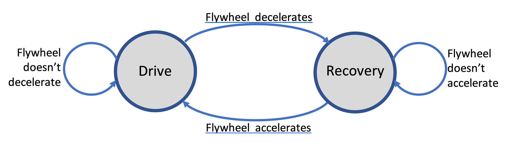

# The physics behind Open Rowing Monitor

<!-- markdownlint-disable no-inline-html -->
In this document we explain the physics behind the OpenRowing Monitor, to allow for independent review and software maintenance. This work wouldn't have been possible without some solid physics, described by some people with real knowledge of the subject matter. Please note that any errors in our implementation probably is on us, not them. When appropriate, we link to these sources. When possible, we also link to the source code.

## Leading principles

The physics engine is the core of Open Rowing Monitor. In our design of the physics engine, we try to:

* stay as close to the original data as possible (thus depend on direct measurements as much as possible) instead of depending on derived data. This means that there are two absolute values we try to stay close to as much as possible: the **time between an impulse** and the **Number of Impulses** (their origin and meaning is later explained);

* use robust calculations wherever possible (i.e. not depend on a single measurements, extrapolations or derivative functions, etc.) to reduce effects of measurement errors.

## Phases, properties and concepts in the rowing cycle

Before we analyze the physics of a rowing engine, we first need to define the basic concepts.

<!-- markdownlint-disable-next-line no-emphasis-as-header -->
*A basic view of an indoor rower*

A rowing machine effectively has two fundamental movements: a **linear** (the rower moving up and down, or a boat moving forward) and a **rotational** where the energy that the rower inputs in the system is absorbed through a flywheel (either a solid one, or a liquid one).

The linear and rotational speeds are related: the stronger/faster you pull in the linear direction, the faster the flywheel will rotate. The rotation of the flywheel simulates the effect of a boat in the water: after the stroke, the boat will continue to glide only be dampened by the drag of the boat, so does the flywheel.

There are several types of rowers:

* **Water resistance**, where rowing harder will increase the resistance

* **Air resistance**: where rowing harder will increase the resistance

* **Magnetic resistance**: where the resistance is constant

There are also hybrid rowers, which combine air resistance and magnetic resistance. The differences in physical behavior can be significant, for example a magnetic rower has a constant resistance while a air/water rower's resistance is dependent on the flywheel's speed. As the key principle is the same for all these rowers (some mass is made to spin and drag brings its speed down), we treat them the same.

Typically, measurements are done in the rotational part of the rower, on the flywheel. There is a reed sensor or optical sensor that will measure time between either magnets or reflective stripes, which gives an **Impulse** each time a magnet or stripe passes. Depending on the **number of impulse providers** (i.e. the number of magnets or stripes), the number of impulses per rotation increases, increasing the resolution of the measurement. By measuring the **time between impulses**, deductions about speed and acceleration of the flywheel can be made, and thus the effort of the rower.

## What a rowing machine actually measures

As mentioned above, most rowers depend on measuring the **time between impulses**, triggered by some impulse giver (magnet or light) on the flywheel. For example, when the flywheel rotates on a NordicTrack RX800, the passing of a magnet on the flywheel triggers a reed-switch, that delivers a pulse to our Raspberry Pi. We measure the time between two subsequent impulses and call this *currentDt*: the time between two impulses. *currentDt* is the basis for all our calculations.

The following picture shows the time between impulses through time:

*Measurements of flywheel*

Here, it is clear that the flywheel first accelerates and then decelerates, which is typical for rowing.

Using *currentDt* means we can't measure anything directly aside from *angular displacement*, and that we have to accept some noise in measurements. For example, as we don't measure torque on the flywheel directly, we can't determine where the flywheel exactly accelerates/decelerates, we can only detect a change in the times between impulses. In essence, we only can conclude that an acceleration has taken place somewhere near a specific impulse, but we can't be certain about where the acceleration exactly has taken place and we can only estimate how big the force must have been. Additionally, small vibrations in the chassis due to tiny unbalance in the flywheel can lead to small deviations in measurements. This kind of noise in our measurement can make many subsequent derived calculation on this measurement too volatile, This is why we explicitly distinguish between *measurements* and *estimates* based on these measurements, to clearly indicate their potential volatility.

Dealing with noise is an dominant issue, especially because we have to deal with many types of machines. Aside from implementing a lot of noise reduction, we also focus on using robust calculations: calculations that don't deliver radically different results when a small measurement error is introduced in the measurement of *currentDt*. We typically avoid things like derived functions when possible, as deriving over small values of *currentDt* typically produce huge deviations in the resulting estimate. We sometimes even do this at the cost of inaccuracy with respect to the perfect theoretical model, as long as the deviation is systematic in one direction, to prevent estimates to become too unstable for practical use.

## The rowing cycle and detecting the stroke and recovery phase

On an indoor rower, the rowing cycle will always start with a stroke, followed by a recovery. Looking at a stroke, our monitor gets the following data from its sensor:

*Impulses, impulse lengths and rowing cycle phases*

Here, we plot the *currentDt* (time between impulses) against its sequence number. So, a high *currentDt* means a long time between impulses (so a low *angular velocity*), and a low *currentDt* means that there is a short time between impulses (so a high *angular velocity*). As this figure also shows, we split the rowing cycle in two distinct phases:

* The **Drive phase**, where the rower pulls on the handle

* The **Recovery Phase**, where the rower returns to his starting position

As the rowing cycle always follows this fixed schema, Open Rowing Monitor models it as a finite state machine (implemented in `handleRotationImpulse` in `engine/RowingEngine.js`).

*Finite state machine of rowing cycle*

### Basic stroke detection

Given that the *Angular Displacement* between impulses is fixed, we can deduct some things simply from looking at the subsequent *time between impulses*, *currentDt*. When the *currentDt* shortens, *Angular Velocity* is increasing, and thus the flywheel is accelerating (i.e. we are in the drive phase of the rowing cycle). When times between subsequent impulses become longer, the *Angular Velocity* is decreasing and thus the flywheel is decelerating (i.e. we are the recovery phase of the rowing cycle). This is the robust implementation of a stroke (implemented in MovingFlankDetector's implementation of isFlywheelPowered and isFlywheelUnpowered for naturalDeceleration = 0 in `engine/MovingFlankDetector.js`), which is similar to the implementation used by industry leaders like Concept2. Concept2 are generally considered the golden standard when it comes to metrics, and they state (see [this Concept2 FAQ](https://www.concept2.com/service/software/ergdata/faqs): 'Drive time is measured by the amount of time the flywheel is accelerating. Note: It is possible that the athlete may pull on the handle and not accelerate the flywheel due to no energy being put into it and therefore no effective effort. This portion of the handle pull is not measured.')

### Advanced stroke detection

Looking at the average curve of an actual rowing machine (this example is based on averaging 300 strokes), we see the following:

*Average currentDt (red) and Acceleration (blue) of a single stroke on a rowing machine*

In this graph, we plot *currentDt* against the time in the stroke, averaged over 300 strokes. As *currentDt* is (reversely) related to angular velocity, we can calculate the angular acceleration/deceleration. In essence, as soon as the acceleration becomes below the 0, the currentDt begins to lengthen again (i.e. the flywheel is decelerating). As indicated earlier, this is the trigger for the robust stroke detection algorithm (i.e. the one used when naturalDeceleration is set to 0): when the *currentDt* starts to lengthen, the drive-phase is considered complete.

However, from the acceleration/deceleration curve it is also clear that despite the deceleration, there is still a force present: the deceleration-curve hasn't reached its stable minimum despite crossing 0. This is due to the pull still continuing through the arms: the net force is negative due to a part drive-phase (the arm-movement) delivering weaker forces than the drag-forces of the flywheel. Despite being weaker than the other forces on the flywheel, the rower is still working. In this specific example, at around 0.52 sec the rower's force was weaker than all drag-forces combined. However, only at 0,67 seconds (thus approx. 150 ms later) the net force reaches its stable bottom: the only force present is the drag from the flywheel. Getting closer to this moment is a goal.

By specifying the expected natural deceleration of the flywheel (naturalDeceleration, which in this case is around 8 Rad/S^2) in the configuration of the rower, the stroke starts earlier and ends later (implemented in MovingFlankDetector's implementation of isFlywheelPowered and isFlywheelUnpowered for naturalDeceleration < 0 in `engine/MovingFlankDetector.js`). Please note: as several derived metrics depend on the length of the drive phase or the exact timing of that moment (like the drag factor when calculated dynamically), these are likely to change when this setting is changed. For a more in-depth explanation, see [here for more details](physics_openrowingmonitor.md#a-closer-look-at-the-effects-of-the-various-drive-and-recovery-phase-detection).

Testing shows that setting a value close to the natural deceleration provides more accurate results very reliably. However, some rowers might contain a lot of noise in their data, making this approach infeasible (hence the fallback option of naturalDeceleration = 0)

This approach is a better approximation than the acceleration/deceleration approach, but still is not perfect. For example, drag-force of the the rower presented in the above graph slowly reduces. This is expected, as the drag-force is speed dependent. For a pure air-rower, the best theoretical approach would be to see if the drag-force is the only force present by calculating the expected drag-force using the current speed and the drag factor (making the stroke detection completely independent on speed). Testing has shown that this approach is too prone to errors, as it requires another derivation with respect to *currentDt*, making it too volatile. Above this, hybrid rower behave differently as well: dependent on the speed, the balance shifts between the speed-dependent air-resistance drag-force and the speed-independent magnetic resistance force. To make the solution robust and broadly applicable, this approach has been abandoned.

## Key physical metrics during the rowing cycle

There are several key metrics that underpin the performance measurement of a rowing stroke. Here, we distinguish the following concepts:

* The **Angular Displacement** of the flywheel in Radians: in essence the distance the flywheel has traveled (i.e. the number of Radians the flywheel has rotated). As the impulse-givers are evenly spread over the flywheel, the **angular displacement** between two **impulses** is 2π/(*number of impulse providers on the flywheel*). This can easily be measured by counting the number of impulses;

* The **Angular Velocity** of the flywheel in Radians/second: in essence the number of (partial) rotations of the flywheel per second. As the *Angular Displacement* is fixed for a specific rowing machine, the *Angular Velocity* is (*angular displacement between impulses*) / (time between impulses);

* The **Angular Acceleration** of the flywheel (in Radians/second^2): the acceleration/deceleration of the flywheel;

* The *estimated* **Linear Distance** of the boat (in Meters): the distance the boat is expected to travel;

* *estimated* **Linear Velocity** of the boat (in Meters/Second): the speed at which the boat is expected to travel.

## Measurements during the recovery phase

Although not the first phase in a cycle, it is an important phase as it deducts specific information about the flywheel properties [[1]](#1). During the recovery-phase, we can *measure* the number of impulses and the length of each impulse. Some things we can easily *estimate* with a decent accuracy based on the data at the end of the recovery phase:

* The length of time between the start and end of the recovery phase

* The angular displacement between the start and end of the recovery
    phase

* The angular velocity at the beginning and end of the recovery phase

In the recovery phase, the only force exerted on the flywheel is the (air/water/magnetic)resistance. Thus we can calculate the Drag factor of the Flywheel based on the entire phase.

As [[1]](#1) describes in formula 7.2, which is also experimentally verified by Nomath on a Concept 2 [[5]](#5):

> 

Or in more readable form:

> 

Looking at the linear speed, we use the following formula [[1]](#1), formula 9.3:

> 

Or in more readable form:

> 

Looking at the linear speed, we use the following formula [[1]](#1), formula 9.2:

> 

Or in more readable form:

> 

## Measurements during the drive phase

During the drive-phase, we again can *measure* the number of impulses and the length of each impulse. Some things we can easily *estimate* with a decent accuracy based on the data at the end of the drive phase:

* The length of time between the start and end of the drive phase

* The angular displacement between the start and end of the drive phase

* The angular velocity at the beginning and end of the drive phase

Looking at the linear speed, we use the following formula [[1]](#1), formula 9.3:

> 

Or in more readable form:

> 

Looking at the linear speed, we use the following formula [[1]](#1), formula 9.2:

> 

Or in more readable form:

> 

## Power calculation

In the drive phase, the rower also puts a force on the flywheel, making it accelerate.

We can calculate the energy added to the flywheel through [[1]](#1), formula 8.2:

> 

Or in more readable form for each measured displacement:

> 
> 

Where

> 

The power then becomes

> 

Although this is an easy implementable algorithm by calculating a running sum of this function (see [[3]](#3), and more specifically [[4]](#4)). However, the presence of the many Angular Velocities makes the outcome of this calculation quite volatile. The angulate velocity is measured through the formula:

> 

As *currentDt* tends to be small (typically much smaller than 1, typically between 0,1 and 0,0015 seconds), small errors tend to increase the Angular Velocity significantly, enlarging the effect of an error and potentially causing this volatility. An approach is to use a running average on the presentation layer (in `RowingStatistics.js`). However, when this is bypassed, data shows significant spikes of 20Watts in quite stable cycles due to small changes in the data.

An alternative approach is given by [[3]](#3), which proposes

> 

Where P is the average power and ω is the average speed during the stroke. Here, the average speed can be determined in a robust manner (i.e. Angular Displacement of the Drive Phase / DriveLength).

As Dave Venrooy indicates this is accurate with a 5% margin. Testing this on live data confirms this behavior (tested with a *autoAdjustDragFactor* = true, to maximize noise-effects), with three added observations:

* The robust algorithm is structurally below the more precise measurement when it comes to total power produced in a 30 minutes or 15 minutes row on a RX800 with any damper setting;

* The robust algorithm is indeed much less volatile: the spikes found in the more precise algorithm are much bigger than the ones found in the robust algorithm

* A test with *numOfPhasesForAveragingScreenData* = 1 (practically bypassing the running average in the presentation layer) combined with the robust algorithm shows that the monitor is a bit more responsive but doesn't fluctuate unexpectedly.

As the *flywheelinertia* is mostly guessed based on its effects on the Power outcome anyway (as nobody is willing to take his rower apart for this), the 5% error wouldn't matter much anyway: the *flywheelinertia* will simply become 5% more to get to the same power in the display. Therefore, we choose to use the simpler more robust algorithm, as it has some advantages:

* In essence the instantaneous angular velocities at the flanks are removed from the power measurement, making it more robust against "unexpected" behavior of the rowers (like the cavitation-like effects found in LiquidFlywheel Rowers). Regardless of settings, only instantaneous angular velocities that affect displayed data are the start and begin of each phase;

* Setting *autoAdjustDragFactor* to "false" effectively removes/disables all calculations with instantaneous angular velocities (only average velocity is calculated over the entire phase, which typically is not on a single measurement), making Open Rowing Monitor an option for rowers with noisy data or otherwise unstable/unreliable measurements;

* Given the stability of the measurements, it might be a realistic option for users to remove the filter in the presentation layer completely by setting *numOfPhasesForAveragingScreenData* to 1, making the monitor much more responsive to user actions.

Given these advantages and that in practice it won't have a practical implications for users, we have chosen to use the robust implementation.

## Additional considerations for the frequency of the metrics calculations

There are some additional options for the frequency of metric calculations:

* An option would be to update the metrics only updated at the end of stroke, which is once every 2 to 3 seconds. This is undesirable as a typical stroke takes around 2.5 seconds to complete and covers around 10 meters. It is very desirable to update typical end-criteria for trainings that change quite quickly (i.e. absolute distance, elapsed time) more frequently than that;

* We additionally update the metrics (when dependent on the stroke dependent parameters, like stroke length) both at the end of the Drive and Recovery Phases, as Marinus van Holst [[2]](#2) suggests that both are valid perspectives on the stroke. This allows for a recalculation of these metrics twice per stroke;

* To allow for a very frequent update of the monitor, and allow for testing for typical end-criteria for trainings that change quite quickly (i.e. absolute distance, elapsed time), we calculate these for each new *currentDt*;

* As we can only calculate the drag factor at the end of the recovery phase, we can only (retrospectively) apply it to the realized linear distance of that same recovery phase. Therefore, we we need to report absolute time and distance from the `RowingEngine` in `engine/RowingEngine.js`);

## A closer look at the effects of the various Drive and Recovery phase detection

In this section, we will answer the question whether Concept2 made a big error in their stroke detection, and thus that using *naturalDeceleration* is set to 0 is inferior to actually setting it to a different value. The short answer is that Concept2 has made a perfectly acceptable tradeoff between reliability of the stroke detection and precision of some metrics.

Effectively, Open Rowing Monitor can use two different methods of stroke detection. When *naturalDeceleration* is set to 0, it will detect an acceleration/deceleration directly based on *currentDt*, similar to Concept2. When *naturalDeceleration* is set to a negative number, it will consider that number as the minimum level of deceleration (in Rad/S^2). The later is more volatile, as described above, but some consider this desirable when possible.

Our practical experiments show that assuming the recovery-phase started too early doesn't affect measurements per se. In theory, the calculation of speed and power do not depend directly on phase detection, they do depend on the total number of impulses and the drag factor. It is in fact the automatic update of the drag factor that is dependent on the correct detection of the stroke. The drag factor can be pinned down if needed by setting *autoAdjustDragFactor* to "false". If set to true, it might affect measurements of both distance and power, where we will discuss the knock-on effects.

### Effects on the automatically calculated drag factor

The most important measurement that is affected by stroke detection errors is the calculation of the drag factor.

Our robust implementation of the drag factor is:

> 

Looking at the effect of erroneously starting the recovery early and ending it late, it affects two variables:

* Recovery length will *systematically* become too long (approx. 200 ms from our experiments)

* The Angular Velocity will *systematically* become too high as the flywheel already starts to decelerate at the end of the drive phase, which we mistakenly consider the start of the recovery (in our tests this was approx. 83,2 Rad/sec instead of 82,7 Rad/sec). A similar thing can happen at the begin of the recovery phase when the rower doesn't have an explosive Drive.

Example calculations based on several tests show that this results in a systematically too high estimate of the drag factor. As these errors are systematic, it is safe to assume these will be fixed by the calibration of the power and distance corrections (i.e. the estimate of the *FlywheelInertia* and the *MagicConstant*). Thus, as long as the user calibrates the rower to provide credible data for his setting of *naturalDeceleration*, there will be no issues.

Please note that this does imply that changing the *naturalDeceleration* when the *autoAdjustDragFactor* is set to true (thus drag is automatically calculated) will require a recalibration of the power and distance measurements.

### Knock-on Effects on the Power calculation

Question is what the effect of this deviation of the drag factor is on the power calculation. The power is calculated as follows:

> 

Here, the drag factor is affected upwards. Here the average speed is determined by measuring the angular displacement and divided by the time, being affected in the following manner:

* Time spend in the Drive phase is *systematically* too short

* Angular displacement in the Drive phase will *systematically* be too short

These effects do not cancel out: in essence the flywheel decelerates at the end of the drive phase, which we mistakenly include in the recovery phase. This means that on average, the average speed is systematically too high: it misses some slower speed at the end of the drive. As all factors of the power calculation are systematically overestimating, the result will be a systematic overestimation.

Again, this is a systematic (overestimation) of the power, which will be systematically corrected by the Inertia setting.

## References

<a id="1">[1]</a> Anu Dudhia, "The Physics of ErgoMeters" <http://eodg.atm.ox.ac.uk/user/dudhia/rowing/physics/ergometer.html>

<a id="2">[2]</a> Marinus van Holst, "Behind the Ergometer Display"

<a id="3">[3]</a> Dave Vernooy, "Open Source Ergometer ErgWare" <https://dvernooy.github.io/projects/ergware/>

<a id="4">[4]</a> <https://github.com/dvernooy/ErgWare/blob/master/v0.5/main/main.ino>

<a id="5">[5]</a> Fan blade Physics and a Peek inside C2's Black Box, Nomath <https://www.c2forum.com/viewtopic.php?f=7&t=194719>
