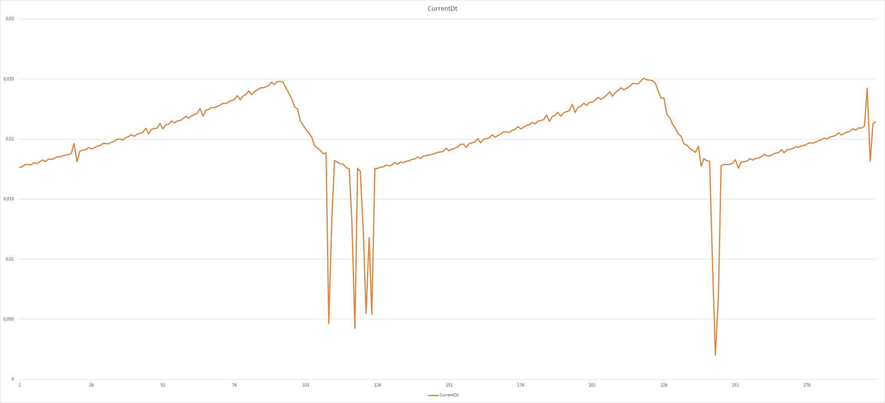
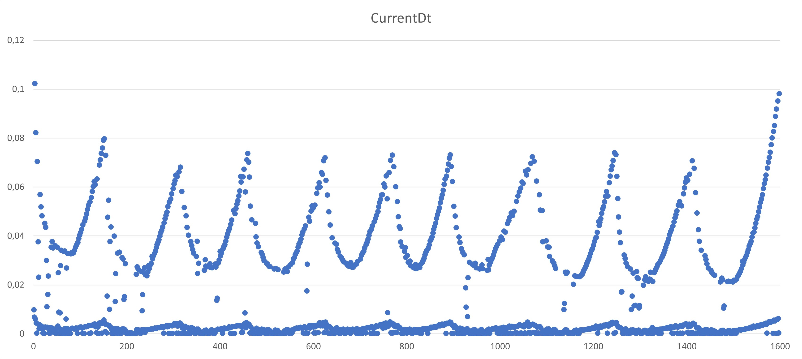
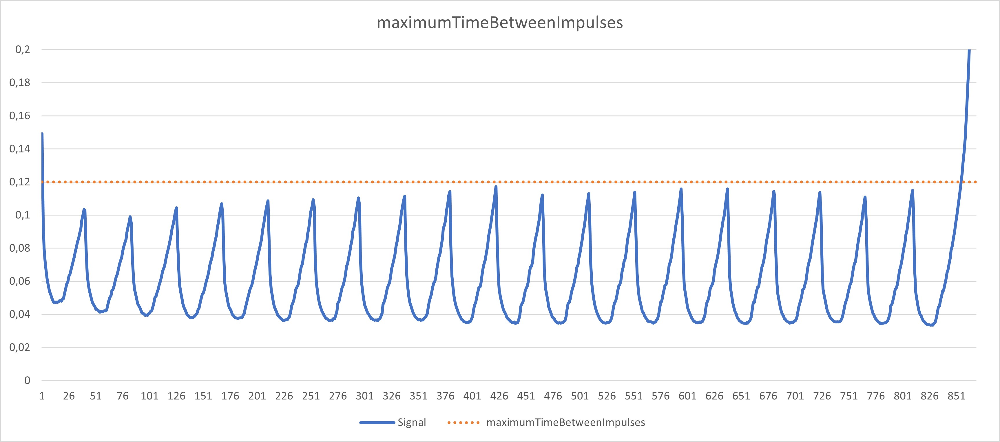

# Guide for rower specific settings

<!-- markdownlint-disable no-inline-html -->
This guide helps you to adjust the rowing monitor specifically for a new type of rower or even for your specific use, when the supported rowers don't suffice (you can [find a list of supported rowers here](Supported_Rowers.md)). In this manual, we will guide you through the settings needed to get your machine working. This is a work in progress, and please get in touch through the [GitHub Discussions](https://github.com/JaapvanEkris/openrowingmonitor/discussions) when you run into problems.

In this manual, we cover the following topics:

* Why have specific settings in the first place

* Check that Open Rowing Monitor works

* Making sure the hardware is connected correctly and works as intended

* Setting up a more detailed logging for a better insight into Open Rowing Monitor

* Setting GPIO parameters to get a clean signal (general settings)

* Critical parameters you must change or review for noise reduction

* Critical parameters you must change or review for stroke detection

* What reliable stroke detection should look like in the logs

* Settings required to get the basic metrics right

* Settings you COULD change for a new rower

* Settings you can tweak

* Sending in a rower profile to us

## Why we need rower specific settings

No rowing machine is the same, and some physical construction parameters are important for OpenRowingMonitor to be known to be able to understand your rowing stroke. By far, the easiest way to configure your rower is to select your rower profile from `config/rowerProfiles.js` and put its name in `config/config.js` (i.e. `rowerSettings: rowerProfiles.Concept2_RowErg`). The rowers mentioned there are maintained by us for OpenRowingMonitor and we also structurally test OpenRowingMonitor with samples of these machines and updates setings when needed. For you as a user, this has the benefit that updates in our software are automatically implemented, including updating the settings. So if you make a rower profile for your machine, please send the profile and some raw data (explained below) to us as well so we can maintain it for you.

If you want something special, or if your rower isn't in there, this guide will help you set it up. Please note that determining these settings is quite labor-intensive, and typically some hard rowing is involved. As said, if you find suitable settings for a new type of rower, please send in the data and settings, so we can add it to OpenRowingMonitor and make other users happy as well.

## Check that Open Rowing Monitor works

First check you need to do is to check the status of the Open Rowing Monitor service, which you can do with the command:

  ```zsh
  sudo systemctl status openrowingmonitor
  ```

Which typically results in the following response (with some additional logging):

  ```zsh
  ● openrowingmonitor.service - Open Rowing Monitor
       Loaded: loaded (/lib/systemd/system/openrowingmonitor.service; enabled; vendor preset: enabled)
       Active: active (running) since Sun 2022-09-04 10:27:31 CEST; 12h ago
     Main PID: 755 (npm start)
        Tasks: 48 (limit: 8986)
          CPU: 6min 48.869s
       CGroup: /system.slice/openrowingmonitor.service
               ├─755 npm start
               ├─808 sh /tmp/start-6f31a085.sh
               ├─809 node app/server.js
               ├─866 /usr/bin/node ./app/gpio/GpioTimerService.js
               └─872 /usr/bin/node ./app/ble/CentralService.js
  ```

Please note that the process identification numbers will differ.

## Making sure the hardware is connected correctly and works as intended

Because any system follows the mantra "Garbage in is garbage out", we first make sure that the signals Open Rowing Monitor recieves are decent. First we check the physical properties, then the electrical properties and last we check the quality of the incoming signal.

**Please check and fix any mechanical/electrical/quality issues before proceeding, as the subsequent steps depend on a signal with decent quality!!**

### Checking the physical properties of the rower

One thing to check is what the original sensor actually measures. You can physically look in the rower, but most manuals also include an exploded view of all parts in the machine. There you need to look at the placement of the sensor and the magnets. Most air-rowers measure the flywheel speed, but most water-rowers measure the handle speed and direction. Open Rowing Monitor is best suited for handling a spinning flywheel or water impellor, or anything directly attached to that. If your machine measures the impellor or flywheel directly, please note the number of magnets per rotation, as you need that parameter later on. So when you encounter a handle-connected machine and it is possible and within your comfort zone, try to add sensors to the flywheel or impellor as it results in much better metrics.

If you are uncomfortable modifying you machine, you can still make OpenRowingMonitor work, but with a loss of data quality. Where a flywheel or impellor can give information about the force and speeds created, the alternative can not. So you end up with a fixed distance per stroke, but you can connect to tools like EXR and the like. By setting *autoAdjustDragFactor* to false, *autoAdjustRecoverySlope* to false, *minumumRecoverySlope* to 0, *minimumStrokeQuality* to 0.01 and other parameters like dragFactor to a realistic well-choosen value (to make the metrics look plausible), OpenRowingMonitor will essentially calculate distance based on impulses encountered. Although not ideal for metrics, this can result in a working solution. Please note that the distance per stroke is essentially fixed, so many more advanced metrics are not relevant and stroke detection might be a bit vulnerable.

### Checking the electrical properties of the rower

Before you physically connect anything to anything else, **check the electric properties of the rower** you are connecting to. Skipping this might destroy your Raspberry Pi as some rowers are known to exceed the Raspberry Pi electrical properties. For example, a Concept 2 RowErg provides 15V signals to the monitor, which will destroy the GPIO-ports. Other rowers provide signals aren't directly detectable by the raspberry Pi. For example, the Concept 2 Model C provides 0.2V pulses, thus staying below the detectable 1.8V treshold that the Raspberry Pi uses. Using a scope or a voltmeter is highly recommended. Please observe that the maximum input a Raspberry Pi GPIO pin can handle is 3.3V and 0.5A, and it will switch at 1.8V (see [this overview of the Raspberry Pi electrical properties](https://raspberrypi.stackexchange.com/questions/3209/what-are-the-min-max-voltage-current-values-the-gpio-pins-can-handle)). In our [GitHub Discussions](https://github.com/laberning/openrowingmonitor/discussions) there are some people who are brilliant with electrical connections, so don't be affraid to ask for help there. When you have a working solution, please report it so that we can include it in the documentation, allowing us to help others.

### Checking signal and measurement quality

Next, when the electric connection has been made, we need to look if the data is recieved well and has sufficient quality to be used. You can change `config/config.js` by

  ```zsh
  sudo nano /opt/openrowingmonitor/config/config.js
  ```

Here, you can change the setting for **createRawDataFiles** by setting/adding the following BEFORE the rowerSettings element (so outside the rowerSettings scope):

 ```js
 createRawDataFiles: true,
 ```

You can use the following commands on the command line to restart after a config change (to activate new settings):

  ```zsh
  sudo systemctl restart openrowingmonitor
  ```

After rowing a bit, there should be a csv file created with raw data. If no strokes or pauses are detected, you can force the writing of these files by pushing the reset button on the GUI. Please read this data in Excel (it is in US format, so you might need to adapt it to your local settings), to check if it is sufficiently clean. After loading it into Excel, you can visualise it, and probably see something similar to the following:



When the line goes up, the time between impulses from the flywheel goes up, and thus the flywheel is decellerating. When the line goes down, the time between impulses decreases, and thus the flywheel is accelerating. In the first decellerating flank, we see some noise, which Open Rowing Monitor an deal with perfectly. However, looking at the bottom of the first acceleration flank, we see a series of heavy downward spikes. This could be start-up noise, but it also could be systematic across the rowing session. This is problematic as it throws off both stroke detection and many metrics. Typically, it signals an issue in the mechanical construction of the sensor: the frame and sensor vibrate at high speeds, resulting in much noise. Fixing this type of errors is key. We adress two familiar measurement quality issues:

* Switch bounce: where a single magnet triggers multiple signals
* Magnet placement errors: where the timing of magnets is off

#### Fixing switch bounce

A specific issue to be aware of is *switch bounce*, which typically is seen as a valid signal followed by a very short spike. When looking at a set of plotted signals in Excel, it manafests itself as the following:



As this example scatterplot curve shows, you can vaguely recognize the typical rowing curve in the measurements between 0.02 and 0.08 seconds. However, you also see a lot of very small spikes where the measurements are below 0.01 seconds. Actually there are so many spikes that it masks the real signal completely for Open Rowing Monitor. It contains sections where the time between pulses is 0.0001 seconds, which would mean that the flywheel would be spinning at 120.000 RPM, which physically is impossible for a simple bicycle wheel used in this example. This type of scater plot and the underlying data clearly suggests that the sensor picks up the magnet twice or more. This is a measurement quality issue that must be adressed.

The preferred solution is to fix the physical underlying cause, this is a better alignment of the magnet or replacing the sensor for a more advanced model that only picks up specific signals. Using smaller but more powerful magnets also tends to help. However, this might not be practical: some flywheels are extremely well-balanced, and moving or replacing magnets might destroy that balance. To fix that type of error, there are two options:

* Changing the **gpioMinimumPulseLength** setting allows you to require a minimal signal length, most likely removing these ghost readings. This is a bit of a try and error process: you'll need to row and increase the value **gpioMinimumPulseLength** further with steps of 50 us when you still see ghost readings, and repeat this process until the noise is acceptable.
* Another aveue to persue is to change the detected flank from the default 'Up' to 'Down' in the **gpioTriggeredFlank**, as sometimes the downward flank might be less affected by this issue.

#### Fixing magnet placement errors

Another specific issue to watch out for are systemic errors in the magnet placement. For exmple, these 18 pulses from a Concept2 RowErg show a nice clean signal, but also a systematic error, that follows a 6 impulse cycle. As the RowErg has 6 magnets, it is very likely that it is caused by magnets not being perfectly aligned (for example due to production tollerances):


In some cases, changing the magnet placing or orientation can fix this completely (see for example [this discussion](https://github.com/laberning/openrowingmonitor/discussions/87)), which yields very good results and near-perfect data. Sometimes, you can't fix this or you are unwilling to physically modify the machine. Open Rowing Monitor can handle this kind of systematic error, as long as the *flankLength* (described later) is set to at least two full rotations (in this case, 12 impulses *flankLength* for a 6 magnet machine).

**Please fix any mechanical/electrical/quality issues before proceeding, as the subsequent steps depend on a signal with decent quality!!**

## Setting up a more detailed logging for a better insight into Open Rowing Monitor

When installed, OpenRowingMonitor will not flood the log with messages. However, when testing it is great to see what OpenRowingMonitor is doing. So first thing to do is to set the following in the settings:

 ```js
 // Available log levels: trace, debug, info, warn, error, silent
 loglevel: {
     // The default log level
     default: 'info',
     // The log level of of the rowing engine (stroke detection and physics model)
     RowingEngine: 'debug'
   },
 ```

You can look at the the log output of the OpenRowingMonitor-service by putting the following in the command-line:

  ```zsh
  sudo journalctl -u openrowingmonitor
  ```

This allows you to see the current state of the rower. Typically this will show:

  ```zsh
  Sep 12 20:37:45 roeimachine systemd[1]: Started Open Rowing Monitor.
  Sep 12 20:38:03 roeimachine npm[751]: > openrowingmonitor@0.8.2 start
  Sep 12 20:38:03 roeimachine npm[751]: > node app/server.js
  Sep 12 20:38:06 roeimachine npm[802]: ==== Open Rowing Monitor 0.8.2 ====
  Sep 12 20:38:06 roeimachine npm[802]: Setting priority for the main server thread to -5
  Sep 12 20:38:06 roeimachine npm[802]: Session settings: distance limit none meters, time limit none seconds
  Sep 12 20:38:06 roeimachine npm[802]: bluetooth profile: Concept2 PM5
  Sep 12 20:38:06 roeimachine npm[802]: webserver running on port 80
  Sep 12 20:38:06 roeimachine npm[862]: Setting priority for the Gpio-service to -7
  Sep 12 20:38:09 roeimachine npm[802]: websocket client connected
  ```

This shows that OpenRowingMonitor is running, and that bluetooth and the webserver are alive, and that the webclient has connected. We will use this to get some grip on Open Rowing Monitor's settings throughout the process.

## Critical parameters you must change or review for noise reduction

Open Rowing Monitor needs to understand normal rower behaviour, so it needs some information about the typical signals it should expect.

### Setting gpioPriority, gpioPollingInterval, gpioTriggeredFlank, gpioMinimumPulseLength (general settings)

When you look at the raw dump of *CurrentDT*, it should provide a nice curve. When this curve is erratic, it could help to increase the priority of the GPIO polling process by changing its nice-level via the *gpioPriority*. On a Rapberyy Pi 4, a nice-level of -1 seems to be the maximum for the normal kernel, on a PREEMPT kernel, everything to -7 seems to work. Going beyond these values typically leads to eratic behaviour of the timing (some kernel timing processes seem to be disrupted).

Another option is to change the *gpioPollingInterval*, which determines how accurate the measurements are. Please note that increasing this will increase the CPU load, so setting it to 1us might come at a price. Setting this from the default value of 5us to 1us might increase precission, but it could disrupt the entire process as the CPU might get overloeded. So experimenting with this value is key.

**gpioTriggeredFlank** and **gpioMinimumPulseLength** are typically used to prevent bounces in the signal: magnets passing could trigger a reed switch twice (as described above). The logs provide help here, as the logs indicate abnormal short and long times between impulses (via the minimumTimeBetweenImpulses and maximumTimeBetweenImpulses settings). Please note that during a first stroke, the **CurrentDt** values obviously are longer.

### Setting minimumTimeBetweenImpulses and maximumTimeBetweenImpulses

**minimumTimeBetweenImpulses** and **maximumTimeBetweenImpulses** provide a bandwith where values are deemed credible during an active session. The goal here is to help you detect and log any extremely obvious errors. So take a look at the raw datafiles for several damper settings (if available on your rower) and make sure that normal rowing isn't hindered by these settings (i.e. all normal values should fall within *minimumTimeBetweenImpulses* and *maximumTimeBetweenImpulses*). Here, you should rather allow too much noise, than hurt real valid signal, as Open Rowing Monitor can handle a lot of noise by itself.

A good quality curve of the time between impulses (as captured in the raw datafiles) looks like this:



Here, aside from the startup and spindown, the blue line shows that the impulses typically vary between 0.035 and 0.120 seconds. The red line depicts the *maximumTimeBetweenImpulses*, which is set to 0.120 seconds. When using the raw datafiles, realise that the goal is to distinguish good normal strokes from noise. So at startup it is quite accepted that the flywheel starts too slow to produce valid data during the biggest part of the first drive phase. Also at the end of a session the flywheel should spin down out of valid ranges again. So *maximumTimeBetweenImpulses* could be set lower, sometimes even hitting the "peaks" of the curves, without causing issues in normal use of Open Rowing Monitor (it will add warnings in the logs). Similarily, *minimumTimeBetweenImpulses* could be slightly increased to include some valleys, without causing much issues.

An important note is that *maximumTimeBetweenImpulses* is also used to detect wether the flywheel is spinning down due to lack of user input. Open Rowing Monitor pauses/stops the row when:

* the start of the last drive is at least *maximumStrokeTimeBeforePause* ago;
* the entire flank (i.e. the last *flankLength* of measurements) contains only values above *maximumTimeBetweenImpulses*;
* the flywheel is decelerating throughout the flank.

So setting the value for *maximumTimeBetweenImpulses* too high might block this behaviour as there aren't enough measurements to fill the flank. Although most air-based rowers have a spin down time of around 2 minutes, water rowers typically stop quite fast (think seconds). Therefore, especially the stop behaviour of water rowers requires a bit more attention. Again looking at the behaviour of the curve and the raw data might help here: looking how many residual samples follow after *maximumTimeBetweenImpulses* is exceeded (there should be more than *flankLength*) and how much time it spans since the last drive (exceeding *maximumStrokeTimeBeforePause*) is critical here.

### Review smoothing

**smoothing** is the ultimate fallback mechanism for rowers with very noisy data. Please refrain from using it, unless as a last resort (typically increasing *flankLength* is more effective and leads to better results). For all known rowers currently maintained by Open Rowing Monitor, **NONE** needed this, so only start working with this when the raw files show you have a very noisy signal, physical measures don't work and you can't get your stroke detection to work with other means (please note that we design the mechanisms here to be robust, so they can take a hit).

This is a running median filter, effectively killing any extreme values. By default, it is set to 1 (off). A value of 3 will allow it to completely ignore any single extreme values, which should do the trick for most rowers.

## Critical parameters you must change or review for stroke detection

The key feature for Open Rowing Monitor is to reliably produce metrics you see on the monitor, share via Bluetooth with games and share with Strava and the like. Typically, these metrics are reported on a per-stroke basis, so a key element in getting rowing data right is getting the stroke detection right. It must be noted that we calculate most essential metrics in such a way that missing an individual stroke isn't a big deal, it will not even give hickups when this happens. However, the more advanced metrics (like drive length, stroke length, powercurves) won't provide any useful data when the stroke or stroke phase isn't detected properly. There are several critical parameters that are required for Open Rowing Monitor's stroke detection to work. In this section, we help you set the most critical ones.

### setting numOfImpulsesPerRevolution

**numOfImpulsesPerRevolution** tells Open Rowing Monitor how many impulses per rotation of the flywheel to expect. An inspection of the flywheel could reveal how many magnets it uses (typically a rower has 2 to 4 magnets). Although sometimes it is well-hidden, you can sometimes find it in the manual under the parts-list of your rower.

### review sprocketRadius and minumumForceBeforeStroke

**sprocketRadius** tells Open Rowing Monitor how big the sprocket is that attaches your belt/chain to your flywheel (in centimeters). This setting is used in calculating the handle force for stroke detection. **minumumForceBeforeStroke*** describes the minimum force (in Newtons) should be present on the handle before it will consider moving to a drive phase. The default values will work OK for most rowers, but sometimes it needs to be changed for a specific rower. On most rowers, there always is some noise present at the end of the drive section, and tuning these two parameters might help you remove that noisy tail.

Their accuracy isn't super-critical. In later sections, we will describe how to optimally tune it as the *sprocketRadius* affects quite some metrics. Here your first goal is to get a working stroke detection. You can change these settings afterwards to something more accurate quite easily, but remember that when the *sprocketRadius* doubles, so should the *minumumForceBeforeStroke*.

### setting flankLength and minimumStrokeQuality

These settings are the core of the stroke detection and are the ones that require the most effort to get right. The most cricial settings are the *flankLength* and *minimumStrokeQuality*, where other metrics are much less critical.

In a nutshell, a rowingstroke contains a drive phase and a recovery phase, and OpenRowingMonitor needs to recognise both reliably to work well. Please note, that for an actual transition to another phase respectively **minimumDriveTime** or **minimumRecoveryTime** have to be exceeded as well.

To detect strokes, OpenRowingMonitor uses the following criteria before attempting a stroke phase transition:

* a drive is detected when the handleforce is above **minumumForceBeforeStroke** AND the slope of a series of *flankLength* times between impulses is below the **minumumRecoverySlope** (i.e. accelerating)
* a recovery is detected when the handleforce is below **minumumForceBeforeStroke** AND the slope of a series of *flankLength* times between impulses is above the **minumumRecoverySlope** (i.e. decelerating) where the goodness of fit of that slope exceeds the **minimumStrokeQuality**

**minimumStrokeQuality** is a setting that defines the minimal goodness of fit of the beforementioned minumumRecoverySlope with the datapoints. When the slope doesn't fit the data well, this will block moving to the next phase. A value of 0.1 is extrmely relaxed, where 0.95 would be extremely tight. This is set to 0.34 for most rowers, which is a working setting for all maintained rowers to date. The accuracy of this setting isn't super critical for stroke detection to work: for example, on a Concept2 values between 0.28 to 0.42 are known to give reliable stroke detection. Setting this too relaxed will result in earlier phase changes, settng this too strict will delay phase detection. But stroke detection will work. This setting is primarily used to optimise the stroke detection for advanced metrics (like drive time, drive length, force curves), so unless it gets in the way, there is no immediate need to change it. Please note that setting this value to 1, it will effectively disable half of the criteria for detecting a recovery, effectively making it completely handle-force based.

The **flankLength** and **minumumRecoverySlope** settings determine the condition when the stroke detection is sufficiently confident that the stroke has started/ended. In essence, the stroke detection looks for a consecutive increasing/decreasing impulse lengths (with slope **minumumRecoverySlope**), and the **flankLength** determines how many consecutive flanks have to be seen before the stroke detection considers a stroke to begin or end. Setting these paramters requires some trial and error:

* **minumumRecoverySlope** can be set to 0, where OpenRowingMonitor will use a quite robust selection on an accelerating or decelerating flywheel. This is recomended as a starting point for getting stroke detection to work. It can be further optimised later (see the later section on advanced stroke detection);
* Generally, a *flankLength* of 3 to 4 typically works. The technical minimum is 3, the maximum is limited by CPU-time. Please note that making the flank longer does *not* change your measurement in any way: the algorithms always rely on the beginning of the flank, not at the current end. If any, increasing the *flanklength* has the side-effect that some calculations are performed with more rigour, making them more precise as they get more data. Please note that the rower itself might limit the *flankLength*: some rowers only have 4 or 5 datapoints in a drive phase, naturally limiting the number of datapoints that can be used for stroke phase detection. Increasing this number too far (beyond a significant part of the stroke) will remove the fluctuations in the flywheel speed needed for stroke detections, so there is a practical upper limit to what the value of *flankLength* can be for a specific rower. Please note that a longer *flankLength* also requires more CPU time, where the calculation grows exponentially as *flankLength* becomes longer. On a Raspberry Pi 4B, a *flankLength* of 18 has been succesfully used without issue. What the practical limit on a Rapberry Pi Zero 2 W is, is still a matter of investigation.

To make life a bit easier, it is possible to replay a raw recording of a previous rowing session. To do this, uncomment and modify the following lines in `server.js`:

 ```js
replayRowingSession(handleRotationImpulse, {
  filename: 'recordings/2021/04/rx800_2021-04-21_1845_Rowing_30Minutes_Damper8.csv', // 30 minutes, damper 10
  realtime: false,
  loop: false
})
```

After changing the filename to a file that is your raw recording of your rower, you can replay it as often as you want by restarting the service. This will allow you to modify these settings and get feedback in seconds on the effects on Open Rowing Monitor.

### minimumDriveTime and minimumRecoveryTime

At the level of the stroke detection, there is some additional noise filtering, preventing noise to start a drive- or recovery-phase too early. The settings **minimumDriveTime** and **minimumRecoveryTime** determine the minimum times (in seconds) for the drive and recovery phases. Generally, the drive phase lasts at least 0.500 second, and the recovery phase 0.900 second for recreational rowers. These settings are good for most rowers, but running in to these filters might indicate that your settings aren't perfect yet. Please note that even on well-tuned machines, sometimes noise can cause this filter to kick in. So finding several of these reports in a session, might indicate that the above settings might need adjustment.

When this kicks in, you will find this in your log:

  ```zsh
  Sep 12 20:46:24 roeimachine npm[839]: Time: 1012.1644 sec: Delta Time trend is upwards, suggests no power, but waiting for drive phase length (0.0107 sec) to exceed mininimumDriveTime (0.40 sec)
  ```

This typically suggests, as the lack of power occurs at 0.01 seconds into the drive time, that the drive phase is started too early. An other error you might find is the following one:

  ```zsh
  Aug 16 22:38:07 roeimachine npm[1003]: Time: 25.5091 sec: Delta Time trend is downwards, suggesting power, but waiting for recoveryDuration suggests no power, but waiting for recovery phase length (0.4572 sec) to exceed minimumRecoveryTime (0.90 sec)
  ```

This typically suggests, as the issue is so late in the recovery phase, that either the recovery started to late (this typically results in a stream of similar line following this one) or it is noise.

## What reliable stroke detection should look like in the logs

When you look in the logs, you hopefully find this:

  ```zsh
  Sep 12 20:45:36 roeimachine npm[802]: stroke: 0, dist: 0.0m, speed: 0.00m/s, pace: Infinity/500m, power: 0W, drive length: 1.10 m, SPM: 0.0, drive dur: NaNs, rec. dur: NaNs
  Sep 12 20:45:38 roeimachine npm[802]: *** RECOVERY phase started at time: 1.5644 sec
  Sep 12 20:45:40 roeimachine npm[802]: *** DRIVE phase started at time: 3.6013 sec
  Sep 12 20:45:40 roeimachine npm[802]: *** Calculated drag factor: 105.6459, no. samples: 143, Goodness of Fit: 0.9435
  Sep 12 20:45:40 roeimachine npm[802]: *** Calculated recovery slope: 0.001089, Goodness of Fit: 0.9435
  Sep 12 20:45:40 roeimachine npm[802]: stroke: 1, dist: 7.5m, speed: 1.80m/s, pace: 4:38/500m, power: 17W, drive length: 1.09 m, SPM: 23.2, drive dur: 1.56s, rec. dur: 2.04s
  Sep 12 20:45:41 roeimachine npm[802]: *** RECOVERY phase started at time: 4.5018 sec
  Sep 12 20:45:43 roeimachine npm[802]: *** DRIVE phase started at time: 6.5907 sec
  Sep 12 20:45:43 roeimachine npm[802]: *** Calculated drag factor: 104.1759, no. samples: 196, Goodness of Fit: 0.9675
  Sep 12 20:45:43 roeimachine npm[802]: *** Calculated recovery slope: 0.001074, Goodness of Fit: 0.9675
  Sep 12 20:45:43 roeimachine npm[802]: stroke: 2, dist: 17.1m, speed: 2.93m/s, pace: 2:51/500m, power: 73W, drive length: 1.18 m, SPM: 20.2, drive dur: 1.23s, rec. dur: 2.06s
  Sep 12 20:45:44 roeimachine npm[802]: *** RECOVERY phase started at time: 7.3455 sec
  Sep 12 20:45:46 roeimachine npm[802]: *** DRIVE phase started at time: 9.5219 sec
  Sep 12 20:45:46 roeimachine npm[802]: *** Calculated drag factor: 103.9705, no. samples: 214, Goodness of Fit: 0.9731
  Sep 12 20:45:46 roeimachine npm[802]: *** Calculated recovery slope: 0.001072, Goodness of Fit: 0.9731
  Sep 12 20:45:46 roeimachine npm[802]: stroke: 3, dist: 27.2m, speed: 3.39m/s, pace: 2:28/500m, power: 109W, drive length: 1.23 m, SPM: 20.8, drive dur: 0.83s, rec. dur: 2.13s
  Sep 12 20:45:46 roeimachine npm[802]: *** RECOVERY phase started at time: 10.2020 sec
  Sep 12 20:45:49 roeimachine npm[802]: *** DRIVE phase started at time: 12.4851 sec
  Sep 12 20:45:49 roeimachine npm[802]: *** Calculated drag factor: 103.7254, no. samples: 232, Goodness of Fit: 0.9770
  Sep 12 20:45:49 roeimachine npm[802]: *** Calculated recovery slope: 0.001069, Goodness of Fit: 0.9770
  Sep 12 20:45:49 roeimachine npm[802]: stroke: 4, dist: 37.7m, speed: 3.51m/s, pace: 2:23/500m, power: 121W, drive length: 1.16 m, SPM: 20.6, drive dur: 0.72s, rec. dur: 2.23s
  Sep 12 20:45:49 roeimachine npm[802]: *** RECOVERY phase started at time: 13.1464 sec
  Sep 12 20:45:52 roeimachine npm[802]: *** DRIVE phase started at time: 15.3739 sec
  Sep 12 20:45:52 roeimachine npm[802]: *** Calculated drag factor: 103.9593, no. samples: 226, Goodness of Fit: 0.9775
  Sep 12 20:45:52 roeimachine npm[802]: *** Calculated recovery slope: 0.001072, Goodness of Fit: 0.9775
  Sep 12 20:45:52 roeimachine npm[802]: stroke: 5, dist: 48.0m, speed: 3.56m/s, pace: 2:21/500m, power: 126W, drive length: 1.11 m, SPM: 20.6, drive dur: 0.67s, rec. dur: 2.26s
  Sep 12 20:45:52 roeimachine npm[802]: *** RECOVERY phase started at time: 16.1629 sec
  Sep 12 20:45:55 roeimachine npm[802]: *** DRIVE phase started at time: 18.3141 sec
  Sep 12 20:45:55 roeimachine npm[802]: *** Calculated drag factor: 103.3899, no. samples: 216, Goodness of Fit: 0.9764
  Sep 12 20:45:55 roeimachine npm[802]: *** Calculated recovery slope: 0.001066, Goodness of Fit: 0.9764
  Sep 12 20:45:55 roeimachine npm[802]: stroke: 6, dist: 58.4m, speed: 3.55m/s, pace: 2:21/500m, power: 126W, drive length: 1.22 m, SPM: 20.1, drive dur: 0.73s, rec. dur: 2.19s
  Sep 12 20:45:55 roeimachine npm[802]: *** RECOVERY phase started at time: 19.0078 sec
  Sep 12 20:45:58 roeimachine npm[802]: *** DRIVE phase started at time: 21.3977 sec
  Sep 12 20:45:58 roeimachine npm[802]: *** Calculated drag factor: 102.3463, no. samples: 236, Goodness of Fit: 0.9348
  Sep 12 20:45:58 roeimachine npm[802]: *** Calculated recovery slope: 0.001055, Goodness of Fit: 0.9348
  Sep 12 20:45:58 roeimachine npm[802]: stroke: 7, dist: 69.1m, speed: 3.49m/s, pace: 2:23/500m, power: 119W, drive length: 1.23 m, SPM: 20.2, drive dur: 0.74s, rec. dur: 2.27s
  Sep 12 20:45:58 roeimachine npm[802]: *** RECOVERY phase started at time: 21.9592 sec
  Sep 12 20:46:00 roeimachine npm[802]: *** DRIVE phase started at time: 24.1939 sec
  Sep 12 20:46:00 roeimachine npm[802]: *** Calculated drag factor: 103.4389, no. samples: 225, Goodness of Fit: 0.9705
  Sep 12 20:46:00 roeimachine npm[802]: *** Calculated recovery slope: 0.001066, Goodness of Fit: 0.9705
  Sep 12 20:46:00 roeimachine npm[802]: stroke: 8, dist: 78.9m, speed: 3.50m/s, pace: 2:23/500m, power: 120W, drive length: 1.04 m, SPM: 20.9, drive dur: 0.63s, rec. dur: 2.31s
  Sep 12 20:46:01 roeimachine npm[802]: *** RECOVERY phase started at time: 24.8737 sec
  Sep 12 20:46:03 roeimachine npm[802]: *** DRIVE phase started at time: 27.1559 sec
  Sep 12 20:46:03 roeimachine npm[802]: *** Calculated drag factor: 103.4498, no. samples: 228, Goodness of Fit: 0.9070
  Sep 12 20:46:03 roeimachine npm[802]: *** Calculated recovery slope: 0.001066, Goodness of Fit: 0.9070
  ```

When stroke detection works well, and you row consistently on the rower with a consistent catch, the values of "SPM" (Strokes per Minute), "drive dur" (drive duration) and "rec. dur" (recovery duration) will remain relatively stable across strokes.

## Settings required to get the basic metrics right

After getting the stroke detection right, we now turn to getting the basic linear metrics (i.e. distance, speed and power) right. There are some parameters you must change to get Open Rowing Monitor to calculate the real physics with a rower.

### Setting the dragfactor

**dragFactor** tells Open Rowing Monitor how much damping and thus resistance your flywheel is offering, which is an essential ingredient in calculating Power, Distance, Speed and thus pace. This is typically also dependent on your damper-setting (if present). Regardless if you use a static or dynamically calculated drag factor, this setting is needed as the first stroke also needs it to calculate distance, speed and power. Here, some rowing and some knowledge about your rowing gets involved. Setting your damping factor is done by rowing a certain number of strokes and then seeing how much you have rowed and at what pace. If you know these metrics by hart, it just requires some rowing and adjusting to get them right. If you aren't that familiar with rowing, a good starting point is that a typical distance covered by a single stroke at 20 strokes per minute (SPM) is around 10 meters. So when you row a minute, you will have 20 strokes recorded and around 200 meters rowed. When possible, we use the [Concept Model D (or RowerErg)](https://www.concept2.com/indoor-rowers/concept2-rowerg) as a "Golden standard": when you know your pace on that machine, you can try to mimic that pace on your machine. Most gym's have one, so trying one can help you a lot in finding the right settings for your machine.

This results in a number, which works and can't be compared to anything else on the planet as that drag factor is highly dependent on the physical construction of the flywheel and mechanical properties of the transmission of power to the flywheel. For example, the Drag Factor for a Concept 2 ranges between 69 (Damper setting 1) and 220 (Damper setting 10). The NordicTrack RX-800 ranges from 150 to 450, where the 150 feels much lighter than a 150 on the Concept2. The Sportstech WRX700 water rower has a drag factor of 32000.

### Setting the flywheel inertia

**flywheelInertia** is the moment of inertia of the flywheel (in kg\*m<sup>2</sup>), which in practice influences the dynamically calculated dragfactor (and thus power, distance, speed and pace), but also the calculated force and power on the handle. A formal way to measure it is outlined in [Flywheel moment of inertia](https://dvernooy.github.io/projects/ergware/). However, the most practical way to set it is by rowing and see if the calculated drag factor approximates the previously set dragfactor needed to get a certain pace.

The easiest way to test this value is by rowing (or simulating rowing): in the logs, the following lines will appear in debug mode:

  ```zsh
  Sep 13 20:25:24 roeimachine npm[839]: *** Calculated drag factor: 103.5829, slope: 0.001064, Goodness of Fit: 0.9809, not used because autoAdjustDragFactor is not true
  ```

If your flywheel inertia is set correctly, the calculated drag factor will be very close to the drag factor you set manually. Please look at the "Goodness of Fit" before using the data. Due to noise, the dragfactor sometimes can't be calculated accurately, which is reflected in this Goodness of Fit being low. So when comparing the calculated dragfactor with the manually determned dragfactor, use the calculated dragffactors where the Goodness of Fit is highest.

Please note that this logmessage will change when autoAdjustDragFactor is set to true, but this content will always be reported in debug mode.

## Settings you COULD change for a new rower

In the previous section, we've guided you to set up a very robust working rower, but it will result in more crude data. To improve the accuracy of many measurements, you could switch to a more accurate and dynamic metric calculation. This does require a more sophisticated rower: you need quite a few data points per stroke, with much accuracy, to get this working reliably. So this setup certainly isn't for every rowing machine out there, although some options might just work. And again a lot of rowing to get these settings right is involved.

### More accurate static stroke detection

When **minumumRecoverySlope** is set to 0, the stroke detection looks for a consecutive increasing/decreasing impulse lengths which is extremely robust. When set to a higher value, it will detect the recovery only when that certain slope is reached or exceeded. This is relevant for more advanced metrics, like drive time, stroke length and the force curve. If your stroke detection roughly works and your logging level is set to debug, you will see lines like this in your log:

  ```zsh
  Sep 13 20:25:24 roeimachine npm[839]: *** Calculated drag factor: 103.5829, slope: 0.001064, Goodness of Fit: 0.9809, not used because autoAdjustDragFactor is not true
  ```

Here, the reported slope is the calculated slope during the recovery, and the goodness of fit the quality of the data match. A higher value (say above 0.80) suggestst that the data sufficiently. The easiest way to further optimise these settings is to select the lowest damper setting, and copy the lowest reported slope with a credible goodness of fit, with some margin (say 5%), making the minumumRecoverySlope 0.0010108.

### Dynamically adapting the drag factor

In reality, the drag factor of a rowing machine isn't static: it depends on air temperature, moisture, dust, (air)obstructions of the flywheel cage and sometimes even speed of the flywheel. So using a static drag factor is robust, but it isn't accurate. Open Rowing Monitor can automatically calculate the drag factor on-the-fly based on the recovery phase (see [this description of the underlying physics](physics_openrowingmonitor.md)). To do this, you need to set several settings.

It must be noted that you have to make sure that your machine's measurements are sufficiently free of noise: noise in the drag calculation can have a strong influence on your speed and distance calculations and thus your results. If your rower produces stable drag factor values, then this could be a good option to dynamically adjust your measurements to the damper setting of your rower as it takes in account environmental conditions. When your machine's power and speed readings are too volatile because of this dynamic calculation, it is wise to turn it off.

First to change is **autoAdjustDragFactor** to "true", which tells Open Rowing Monitor that the Drag Factor must be calculated automatically. Setting it to true, will allow Open Rowing Monitor to automatically calculate the drag factor based on the already set *flywheelInertia* and the on the measured values in the stroke recovery phase.

Each time the drag is calculated, we also get a quality indication from that same calculation: the "Goodness of Fit". Based on this quality indication (1.0 is best, 0.1 pretty bad), low quality drag factors are rejected to prevent the drag from being poisoned with bad data, throwing off all metrics. **minimumDragQuality** determines the minimum level of quality needed to The easiest way to set this, is by looking at the logs:

  ```zsh
  Sep 13 20:25:24 roeimachine npm[839]: *** Calculated drag factor: 103.5829, slope: 0.001064, Goodness of Fit: 0.9809, not used because autoAdjustDragFactor is not true
  ```

By selecting all these lines, you can see the "Goodness of Fit" for all calculations, see what the typical variation in "Goodness of Fit" is, and when a "Goodness of Fit" signals a deviant drag factor. Based on the logs, you should be able to set a minimumDragQuality. Please note: rejecting a dragfactor isn't much of an issue, as Open Rowing Monitor always retains the latest reliable dragfactor.

Another measure to prevent sudden drag changes, is **dragFactorSmoothing**: this setting applies a median filter on a series of valid drag factors, further reducing the effect of outliers. Typically this is set to 5 strokes, but it could set to a different value if the drag calculation results in a wildly varying drag factor.

### Dynamically adapting the recovery slope

For a more accurate stroke detection, the *minumumRecoverySlope* is a crucial parameter. Open Rowing Monitor can automatically calculate the this recovery slope and adjust it dynamically. For this to work, *autoAdjustDragFactor* **MUST** be set to true, as the recovery slope is dependent on this automatic dragfactor calculation. If you set *autoAdjustDragFactor* to true, this option can be activated by setting *autoAdjustRecoverySlope* to "true".

Setting *autoAdjustRecoverySlope* to "true" also activates one additional setting **autoAdjustRecoverySlopeMargin**. This is the margin used between the automatically calculated recovery slope and a next recovery slope. 5% (i.e. 0.05) is a pretty good margin and works well for most rowers.

### sprocketRadius (revisited)

**sprocketRadius** tells Open Rowing Monitor how big the sprocket is that attaches your belt/chain to your flywheel. Aside from being used in all handle force and speed calculations, it is also used in the drive length calculation.

```zsh
  Sep 12 20:46:00 roeimachine npm[802]: stroke: 8, dist: 78.9m, speed: 3.50m/s, pace: 2:23/500m, power: 120W, drive length: 1.04 m, SPM: 20.9, drive dur: 0.63s, rec. dur: 2.31s
```

Another use is found in the RowingData export (if used), where the peak handle force, average handle force, handle force curve, handle velocity curve and handle power curve depend on this. For the configuration we are quite focussed on drive length. Drive length is the length of the drive, in meters. For most people, it is about ${2 \over 3}$ of your own length. So changing it to fit that would be a good approach. Please note that increasing the drive length will reduce the handle force and handle power, so you can't increase this without restraint. Also remember that when the sprocket radius doubles, the *minumumForceBeforeStroke* should also be doubled.

## Settings you can tweak

Some people want it all, and we're happy to give to you when your rower and your Raspberry Pi can handle the pain. Some interesting settings:

* **magicConstant** is a constant that is commonly used to convert flywheel revolutions to a rowed distance and speed (see [the physics of ergometers](http://eodg.atm.ox.ac.uk/user/dudhia/rowing/physics/ergometer.html#section9)). Concept2 seems to use 2.8, which they admit is an arbitrary number which came close to their expectations of a competetion boat. As this setting only affects speed/distance, this setting typically is used to change the power needed to row a certain distance or reach a certain speed. So changing this can make your rower's metrics act as sluggish as an oil tanker (much power needed for little speed), or more like a smooth eight (less power needed for more speed). So for your rower, you could set your own plausible distance for the effort you put in. Please note that the rowed distance also depends on **flywheelInertia**, so please calibrate that before changing this constant. Another note: increasing this number decreases your rowed meters, but not in a linear fashion.

## Sending in a rower profile to us

Sending in a rower profile helps other users, but also helps yourself as we structurally test and update the knowwn configurations. We need the following things from you to maintain a rower profile:

* The **profile** itself: these are the settings you used to get the machine working.
* A **raw datafile** (described above) of a session, preferably with your distance and time. This allows us to test if newer versions of OpenRowingMonitor will deliver similar results to you.
